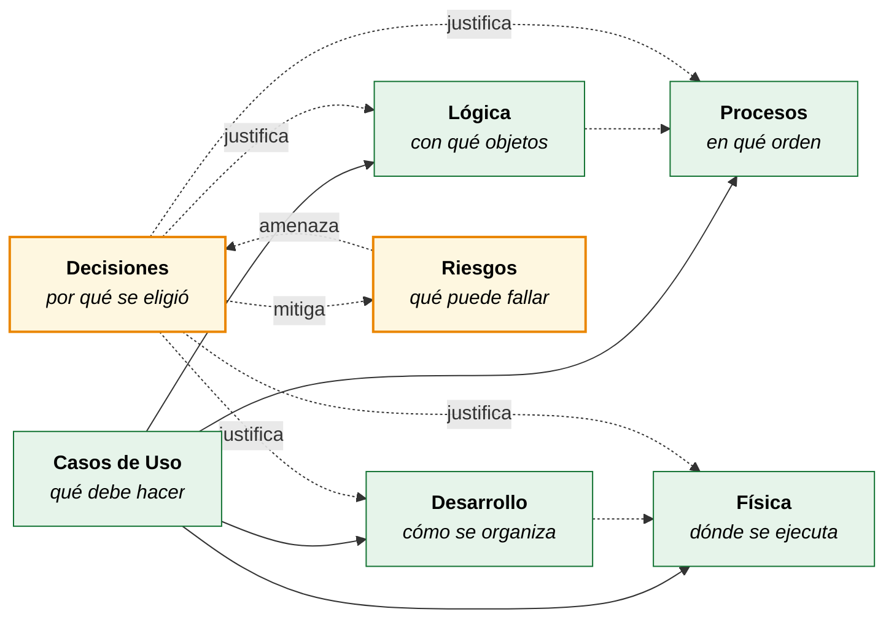
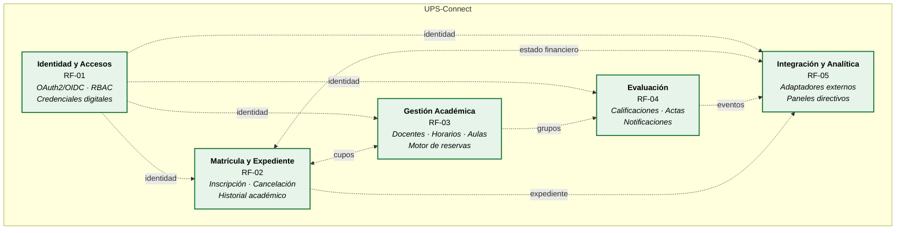

# UPS-Connect — Documentación Arquitectónica (Modelo 4+1)

**Sistema Integral de Gestión Académica para la Universidad Pública del Sur**

| | |
|---|---|
| **Autores** | Miguel Ángel Chavez Barrera · Frank Danilo Marin Cedeño |
| **Asignatura** | Ingeniería de Software 3 |
| **Programa** | Ingeniería de Sistemas |
| **Institución** | Universidad de la Amazonía — Florencia, Caquetá |
| **Fecha** | Julio de 2026 |
| **Notación** | UML 2.5 · Modelo de vistas 4+1 (Kruchten) |
| **Herramienta** | Mermaid.js (renderizado nativo en GitHub) |

---

## Índice

### Vistas arquitectónicas (modelo 4+1)

| Vista | Documento | Diagramas | Pregunta que responde |
|---|---|---|---|
| **+1 · Casos de Uso** | [01-vista-casos-uso.md](docs/01-vista-casos-uso.md) | 7 | ¿Quién usa el sistema y para qué? |
| **1 · Lógica** | [02-vista-logica.md](docs/02-vista-logica.md) | 12 | ¿Qué objetos existen y cómo colaboran? |
| **2 · Procesos** | [03-vista-procesos.md](docs/03-vista-procesos.md) | 13 | ¿Cómo fluye la ejecución y la concurrencia? |
| **3 · Desarrollo** | [04-vista-desarrollo.md](docs/04-vista-desarrollo.md) | 11 | ¿Cómo se organiza el código? |
| **4 · Física** | [05-vista-fisica.md](docs/05-vista-fisica.md) | 6 | ¿Dónde y cómo se despliega? |

### Documentación complementaria

| Documento | Contenido | Pregunta que responde |
|---|---|---|
| **Decisiones Arquitectónicas** | [06-decisiones-arquitectonicas.md](docs/06-decisiones-arquitectonicas.md) | 16 ADR + mapa de dependencias | ¿Por qué se decidió así y qué se descartó? |
| **Riesgos y Mitigación** | [07-riesgos-mitigacion.md](docs/07-riesgos-mitigacion.md) | 18 riesgos + matriz de exposición | ¿Qué puede salir mal y cómo se controla? |

**Total: 55 diagramas.** Todos los módulos del sistema están documentados con el mismo nivel de detalle.

> Los diagramas fueron validados con el parser oficial de Mermaid v11 antes de su publicación: 55 válidos, 0 con error.

### Cómo se relacionan los documentos



Las cinco vistas describen **qué es** el sistema. El registro de decisiones explica **por qué es así** y qué alternativas se descartaron. El registro de riesgos identifica **qué lo amenaza** y vincula cada amenaza con la decisión que la contiene.

---

## Nota sobre la herramienta

Toda la documentación usa **Mermaid.js exclusivamente**. La razón es de compatibilidad: GitHub renderiza bloques ` ```mermaid ` de forma nativa dentro de archivos Markdown, mientras que **PlantUML no se visualiza en GitHub** sin servicios externos o imágenes pre-renderizadas.

Consecuencia asumida: Mermaid no implementa nativamente los diagramas UML de **casos de uso**, **componentes** ni **despliegue**. En esos tres casos se emplea `flowchart` con una convención de notación estricta y documentada al inicio de cada sección, preservando la semántica UML (actores, relaciones `<<include>>`/`<<extend>>`, interfaces provided/required, nodos y artefactos) aunque la forma gráfica sea aproximada.

Los diagramas de **clases**, **secuencia** y **estados** sí usan la sintaxis UML nativa de Mermaid (`classDiagram`, `sequenceDiagram`, `stateDiagram-v2`).

### Cómo visualizar

- **GitHub** — se renderiza automáticamente al abrir cualquier `.md` de este repositorio.
- **VS Code** — extensión *Markdown Preview Mermaid Support*, luego `Ctrl+Shift+V`.
- **Exportar a imagen** — pegar el bloque (sin las comillas) en <https://mermaid.live> y usar *Actions → PNG/SVG*.

---

## Contexto del sistema

UPS-Connect es la plataforma de gestión académica de la Universidad Pública del Sur. Sustituye un sistema monolítico obsoleto mediante una **arquitectura modular en capas orientada a servicios (SOA)** desplegada sobre una plataforma cloud **PaaS multi-zona**.

### Los cinco módulos de negocio



**Regla arquitectónica central:** cada módulo es una unidad desplegable independiente con su propia base de datos. Toda comunicación entre módulos ocurre por API REST o por cola de mensajes — **nunca** por acceso compartido a datos.

---

## Problemas del sistema heredado que la arquitectura resuelve

| Problema heredado | Decisión arquitectónica | Decisión registrada | Vista |
|---|---|---|---|
| Acoplamiento estructural | Módulos desplegables por separado | [ADR-001](docs/06-decisiones-arquitectonicas.md#adr-001--arquitectura-soa-modular-en-lugar-de-microservicios-completos) | [Desarrollo](docs/04-vista-desarrollo.md) |
| Fragilidad ante picos | Autoescalado independiente por módulo | [ADR-002](docs/06-decisiones-arquitectonicas.md#adr-002--plataforma-paas-gestionada-en-lugar-de-orquestación-propia) | [Física](docs/05-vista-fisica.md) |
| Superficie de seguridad concentrada | Gateway único, segmentación de red, BD por módulo | [ADR-003](docs/06-decisiones-arquitectonicas.md#adr-003--una-base-de-datos-por-módulo) · [ADR-013](docs/06-decisiones-arquitectonicas.md#adr-013--segmentación-de-red-en-tres-niveles) | [Física](docs/05-vista-fisica.md) |
| Desconexión académico-financiera | Verificación financiera obligatoria en la matrícula | [ADR-007](docs/06-decisiones-arquitectonicas.md#adr-007--verificación-financiera-obligatoria-en-el-flujo-de-matrícula) | [Procesos](docs/03-vista-procesos.md) |
| Rigidez para integrar terceros | Adaptadores desacoplados tras puertos del dominio | [ADR-006](docs/06-decisiones-arquitectonicas.md#adr-006--arquitectura-hexagonal-uniforme-en-los-cinco-módulos) | [Desarrollo](docs/04-vista-desarrollo.md) |
| Costos fijos de infraestructura | PaaS con escalado elástico | [ADR-002](docs/06-decisiones-arquitectonicas.md#adr-002--plataforma-paas-gestionada-en-lugar-de-orquestación-propia) | [Física](docs/05-vista-fisica.md) |

---

## Requisitos documentados

### Funcionales

| Código | Requisito |
|---|---|
| **RF-01** | Autenticación y autorización centralizada mediante OAuth2/OpenID Connect y RBAC |
| **RF-02** | Gestión integral de matrícula y expediente, con verificación del estado financiero |
| **RF-03** | Administración de docentes, asignaturas, carga académica, horarios y aulas sin conflictos |
| **RF-04** | Registro, consulta y publicación de calificaciones con notificación a interesados |
| **RF-05** | Integración desacoplada con servicios externos y paneles de control directivos |

### No funcionales

| Código | Requisito | Atributo (ISO/IEC 25010) |
|---|---|---|
| **RNF-01** | Disponibilidad ≥ 99,9 % en módulos críticos | Disponibilidad |
| **RNF-02** | Soporte de 15.000 usuarios concurrentes con degradación ≤ 20 % | Escalabilidad |
| **RNF-03** | HTTPS/TLS 1.2+, OAuth2/OIDC, RBAC — Ley 1581 de 2012 | Seguridad |
| **RNF-04** | Circuit Breaker y reintentos; RTO < 30 min, RPO < 15 min | Resiliencia |
| **RNF-05** | Observabilidad centralizada; detección de incidentes < 5 min | Mantenibilidad |

---

## Actores del sistema

| Actor | Tipo | Módulos que utiliza |
|---|---|---|
| Estudiante | Humano · primario | RF-01, RF-02, RF-04, RF-05 |
| Docente | Humano · primario | RF-01, RF-03, RF-04, RF-05 |
| Coordinador Académico | Humano · primario | RF-01, RF-03, RF-05 |
| Personal de Tesorería | Humano · primario | RF-01, RF-02, RF-05 |
| Administrador de Identidad y Seguridad | Humano · primario | RF-01 |
| Equipo de Plataforma | Humano · primario | RNF-05 (todos) |
| Alta Dirección | Humano · primario | RF-05 |
| Proveedor de Identidad OAuth2/OIDC | Sistema · secundario | RF-01 |
| Pasarela de Pagos | Sistema · secundario | RF-02, RF-05 |
| Biblioteca Digital | Sistema · secundario | RF-05 |
| Gestión Documental | Sistema · secundario | RF-05 |

---

## Matriz de trazabilidad global

| Req. | Casos de Uso | Lógica | Procesos | Desarrollo | Física |
|---|---|---|---|---|---|
| RF-01 | UC-01…UC-06 | `Usuario`, `Rol`, `Permiso`, `TokenOIDC` | Autenticación, gestión de roles | `ups.identidad` | Pool Identidad |
| RF-02 | UC-07…UC-13 | `Matricula`, `Expediente`, `EstadoFinanciero` | Inscripción, cancelación, reconciliación | `ups.matricula` | Pool Matrícula |
| RF-03 | UC-14…UC-21 | `Grupo`, `Aula`, `ReservaAula`, `CargaAcademica` | Programación, reserva, detección de conflictos | `ups.academico` | Pool Académico |
| RF-04 | UC-22…UC-28 | `Calificacion`, `ActaNotas`, `EventoNota` | Registro, publicación, cierre de actas | `ups.evaluacion` | Pool Evaluación |
| RF-05 | UC-29…UC-36 | Adaptadores, `TransaccionPago`, `PanelIndicadores` | Pago, conciliación, generación documental | `ups.integracion` | Pool Integración |
| RNF-01 | — | — | — | — | Multi-AZ activo-activo |
| RNF-02 | — | `Grupo.reservarCupo()` | Proceso de autoescalado | — | Autoescalado por módulo |
| RNF-03 | UC-02, UC-06 | `Permiso`, `RegistroAuditoria` | Flujo de autorización | `gateway.security` | Segmentación de red |
| RNF-04 | UC-12 | `CircuitBreaker` | Reconciliación asíncrona | `shared.rest` | Réplica síncrona |
| RNF-05 | UC-36 | — | Bucle de observabilidad | `shared.observability` | Servicio regional |

### Trazabilidad hacia decisiones y riesgos

| Requisito | Decisiones que lo sustentan | Riesgos que lo amenazan |
|---|---|---|
| RF-01 | ADR-004, ADR-013 | R-08, R-16 |
| RF-02 | ADR-007, ADR-008, ADR-009, ADR-010 | R-01, R-02, R-04 |
| RF-03 | ADR-001, ADR-003, ADR-010 | R-15 |
| RF-04 | ADR-005 | R-17 |
| RF-05 | ADR-006, ADR-011, ADR-015, ADR-016 | R-02, R-03, R-09 |
| RNF-01 | ADR-002, ADR-008, ADR-011, ADR-012 | R-01, R-02, R-16 |
| RNF-02 | ADR-001, ADR-002, ADR-010, ADR-015 | R-01, R-12 |
| RNF-03 | ADR-003, ADR-004, ADR-013 | R-07, R-08 |
| RNF-04 | ADR-005, ADR-008, ADR-009, ADR-011, ADR-012 | R-03, R-11, R-17 |
| RNF-05 | ADR-006, ADR-014 | R-05, R-06, R-13, R-18 |

**Verificación:** los diez requisitos tienen al menos una decisión que los sustenta y al menos un riesgo identificado. No hay decisiones huérfanas ni riesgos sin vínculo con un requisito.

---

## Estructura del repositorio

```
doc-caso-estudio/
├── README.md                            ← este documento
├── CASO_DE_ESTUDIO (1).md               ← documento fuente (SAD)
└── docs/
    ├── 01-vista-casos-uso.md            ← Vista +1
    ├── 02-vista-logica.md               ← Vista 1
    ├── 03-vista-procesos.md             ← Vista 2
    ├── 04-vista-desarrollo.md           ← Vista 3
    ├── 05-vista-fisica.md               ← Vista 4
    ├── 06-decisiones-arquitectonicas.md ← Registro de decisiones (ADR)
    └── 07-riesgos-mitigacion.md         ← Registro de riesgos
```

---

## Referencias

- Bass, L., Clements, P., & Kazman, R. (2021). *Software architecture in practice* (4.ª ed.). Addison-Wesley.
- Erl, T. (2016). *Service-oriented architecture: Analysis and design for services and microservices* (2.ª ed.). Prentice Hall.
- Fowler, M. (2002). *Patterns of enterprise application architecture*. Addison-Wesley.
- ISO/IEC. (2011). *ISO/IEC 25010:2011 — Systems and software Quality Requirements and Evaluation (SQuaRE)*.
- Kleppmann, M. (2017). *Designing data-intensive applications*. O'Reilly Media.
- Kruchten, P. (1995). Architectural blueprints — The 4+1 view model of software architecture. *IEEE Software, 12*(6), 42–50.
- Microsoft. (2023). *Azure well-architected framework*.
- Richardson, C. (2018). *Microservices patterns: With examples in Java*. Manning.
- Congreso de la República de Colombia. (2009). *Ley 1273 de 2009*.
- Congreso de la República de Colombia. (2012). *Ley 1581 de 2012*.
- MinTIC. (2018). *Decreto 1008 de 2018 — Política de Gobierno Digital*.
- OWASP Foundation. (2023). *OWASP Top 10*.
