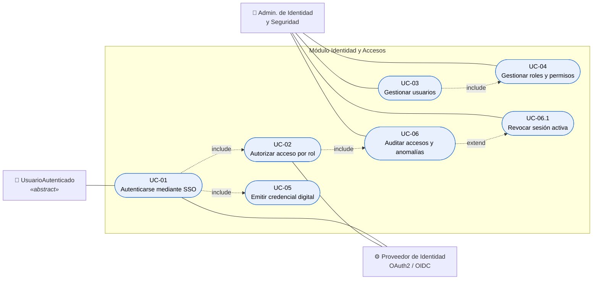
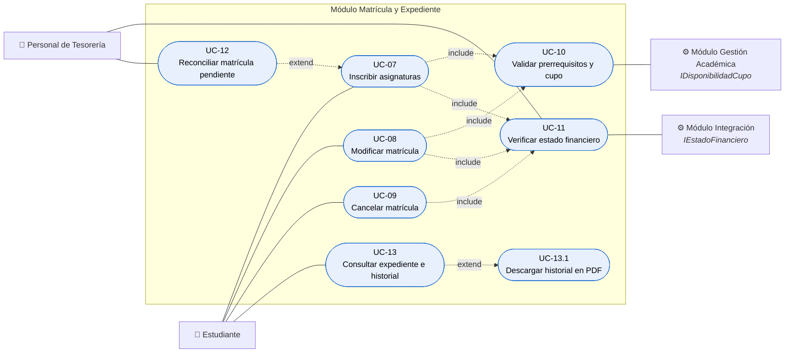
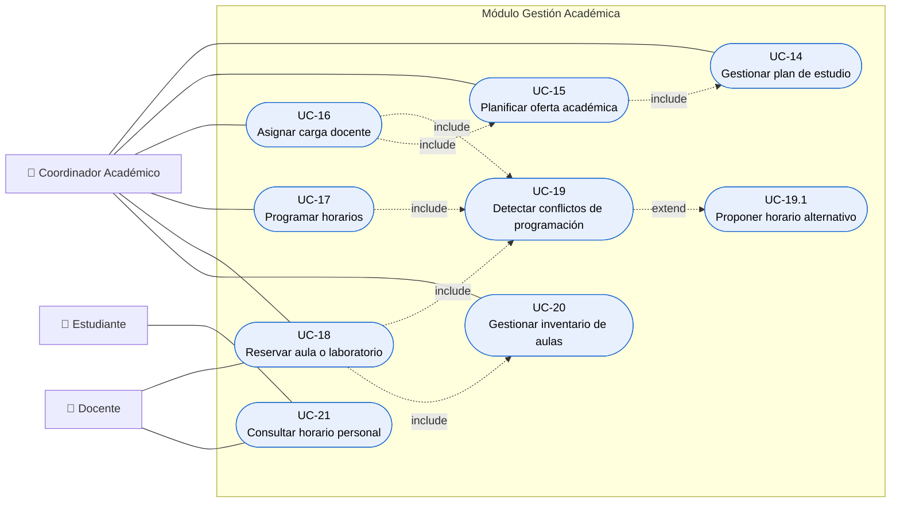
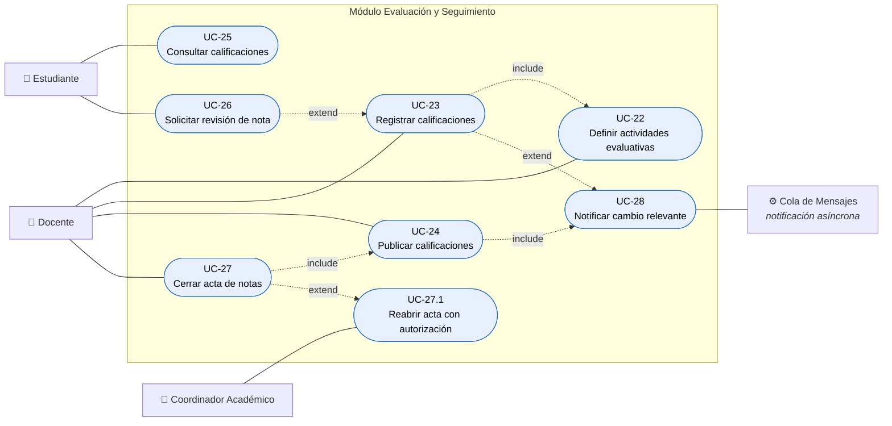
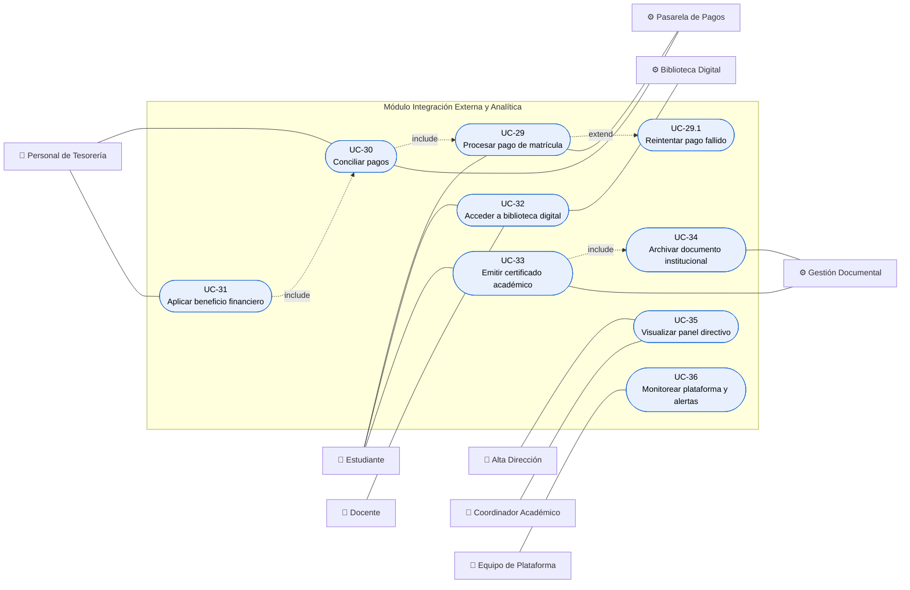

# Vista +1 — Casos de Uso

> **Modelo 4+1 · Vista central.** Describe el comportamiento del sistema desde la perspectiva de sus actores. Es la vista que unifica y valida a las otras cuatro: todo elemento de las vistas Lógica, de Procesos, de Desarrollo y Física debe existir para satisfacer al menos un caso de uso de esta vista.

**Cobertura:** 36 casos de uso · 11 actores · 5 módulos de negocio.

---

## Convención de notación

Mermaid.js no implementa el diagrama UML de casos de uso. Se emplea `flowchart` con la siguiente convención estricta, que preserva la semántica UML:

| Elemento UML | Representación en este documento |
|---|---|
| Actor humano (primario) | Rectángulo con prefijo `👤` |
| Actor sistema (secundario) | Rectángulo con prefijo `⚙️` |
| Caso de uso | Forma estadio `([ ])` — equivalente a la elipse UML |
| Frontera del sistema | `subgraph` con el nombre del módulo |
| Asociación actor–caso de uso | Línea continua `───` |
| Relación `<<include>>` | Línea punteada etiquetada `include` |
| Relación `<<extend>>` | Línea punteada etiquetada `extend` |
| Generalización de actores | Línea continua etiquetada `generaliza` |

---

## 1. Jerarquía de actores

```mermaid
flowchart TD
    UA["👤 <b>UsuarioAutenticado</b><br/><i>«abstract»</i>"]

    EST["👤 Estudiante"]
    DOC["👤 Docente"]
    COO["👤 Coordinador Académico"]
    TES["👤 Personal de Tesorería"]
    IAM["👤 Admin. de Identidad<br/>y Seguridad"]
    OPS["👤 Equipo de Plataforma"]
    DIR["👤 Alta Dirección"]

    EST -->|generaliza| UA
    DOC -->|generaliza| UA
    COO -->|generaliza| UA
    TES -->|generaliza| UA
    IAM -->|generaliza| UA
    OPS -->|generaliza| UA
    DIR -->|generaliza| UA

    SEC1["⚙️ Proveedor de Identidad<br/>OAuth2 / OIDC"]
    SEC2["⚙️ Pasarela de Pagos"]
    SEC3["⚙️ Biblioteca Digital"]
    SEC4["⚙️ Gestión Documental"]

    classDef abs fill:#FEF7E0,stroke:#EA8600,stroke-width:3px,color:#000
    classDef hum fill:#E6F4EA,stroke:#137333,color:#000
    classDef sys fill:#FCE8E6,stroke:#C5221F,color:#000
    class UA abs
    class EST,DOC,COO,TES,IAM,OPS,DIR hum
    class SEC1,SEC2,SEC3,SEC4 sys
```

**Justificación.** El actor abstracto `UsuarioAutenticado` factoriza el comportamiento común a los siete perfiles humanos: todos se autentican por el mismo mecanismo (RF-01). Sin esta generalización, el caso de uso *UC-01 Autenticarse* recibiría siete asociaciones idénticas, y el diagrama global resultaría ilegible. Además comunica una decisión arquitectónica: **existe un único punto de autenticación para toda la plataforma**, no uno por módulo.

Los cuatro actores secundarios son sistemas externos. Se modelan como actores —y no como casos de uso ni componentes internos— porque están **fuera de la frontera del sistema**: UPS-Connect los alcanza mediante adaptadores desacoplados (RF-05), y su indisponibilidad no debe propagarse al núcleo académico.

---

## 2. Diagrama global de casos de uso

```mermaid
flowchart LR
    EST["👤 Estudiante"]
    DOC["👤 Docente"]
    COO["👤 Coordinador"]
    TES["👤 Tesorería"]
    IAM["👤 Admin. Seguridad"]
    OPS["👤 Equipo Plataforma"]
    DIR["👤 Alta Dirección"]

    subgraph SYS["UPS-Connect"]
        direction TB

        subgraph RF1["Módulo Identidad y Accesos · RF-01"]
            U01(["UC-01<br/>Autenticarse"])
            U02(["UC-02<br/>Autorizar por rol"])
            U03(["UC-03<br/>Gestionar usuarios"])
            U04(["UC-04<br/>Gestionar roles<br/>y permisos"])
            U05(["UC-05<br/>Emitir credencial<br/>digital"])
            U06(["UC-06<br/>Auditar accesos"])
        end

        subgraph RF2["Módulo Matrícula y Expediente · RF-02"]
            U07(["UC-07<br/>Inscribir<br/>asignaturas"])
            U08(["UC-08<br/>Modificar<br/>matrícula"])
            U09(["UC-09<br/>Cancelar<br/>matrícula"])
            U10(["UC-10<br/>Validar prerrequisitos<br/>y cupo"])
            U11(["UC-11<br/>Verificar estado<br/>financiero"])
            U12(["UC-12<br/>Reconciliar<br/>matrícula pendiente"])
            U13(["UC-13<br/>Consultar<br/>expediente"])
        end

        subgraph RF3["Módulo Gestión Académica · RF-03"]
            U14(["UC-14<br/>Gestionar plan<br/>de estudio"])
            U15(["UC-15<br/>Planificar oferta<br/>académica"])
            U16(["UC-16<br/>Asignar carga<br/>docente"])
            U17(["UC-17<br/>Programar<br/>horarios"])
            U18(["UC-18<br/>Reservar aula<br/>o laboratorio"])
            U19(["UC-19<br/>Detectar conflictos<br/>de programación"])
            U20(["UC-20<br/>Gestionar inventario<br/>de aulas"])
            U21(["UC-21<br/>Consultar horario<br/>personal"])
        end

        subgraph RF4["Módulo Evaluación · RF-04"]
            U22(["UC-22<br/>Definir actividades<br/>evaluativas"])
            U23(["UC-23<br/>Registrar<br/>calificaciones"])
            U24(["UC-24<br/>Publicar<br/>calificaciones"])
            U25(["UC-25<br/>Consultar<br/>calificaciones"])
            U26(["UC-26<br/>Solicitar revisión<br/>de nota"])
            U27(["UC-27<br/>Cerrar acta<br/>de notas"])
            U28(["UC-28<br/>Notificar cambio<br/>relevante"])
        end

        subgraph RF5["Módulo Integración y Analítica · RF-05"]
            U29(["UC-29<br/>Procesar pago<br/>de matrícula"])
            U30(["UC-30<br/>Conciliar pagos"])
            U31(["UC-31<br/>Aplicar beneficio<br/>financiero"])
            U32(["UC-32<br/>Acceder a<br/>biblioteca digital"])
            U33(["UC-33<br/>Emitir certificado<br/>académico"])
            U34(["UC-34<br/>Archivar documento<br/>institucional"])
            U35(["UC-35<br/>Visualizar panel<br/>directivo"])
            U36(["UC-36<br/>Monitorear<br/>plataforma"])
        end
    end

    IDP["⚙️ Proveedor OIDC"]
    PAY["⚙️ Pasarela de Pagos"]
    BIB["⚙️ Biblioteca Digital"]
    GDO["⚙️ Gestión Documental"]

    EST --- U01
    EST --- U07
    EST --- U08
    EST --- U09
    EST --- U13
    EST --- U21
    EST --- U25
    EST --- U26
    EST --- U29
    EST --- U32
    EST --- U33

    DOC --- U01
    DOC --- U18
    DOC --- U21
    DOC --- U22
    DOC --- U23
    DOC --- U24
    DOC --- U27
    DOC --- U32

    COO --- U01
    COO --- U14
    COO --- U15
    COO --- U16
    COO --- U17
    COO --- U18
    COO --- U20
    COO --- U35

    TES --- U01
    TES --- U11
    TES --- U30
    TES --- U31

    IAM --- U01
    IAM --- U03
    IAM --- U04
    IAM --- U06

    OPS --- U36
    DIR --- U35

    U01 -.-> IDP
    U02 -.-> IDP
    U11 -.-> PAY
    U29 -.-> PAY
    U30 -.-> PAY
    U32 -.-> BIB
    U33 -.-> GDO
    U34 -.-> GDO

    classDef uc fill:#E8F0FE,stroke:#1967D2,color:#000
    classDef act fill:#E6F4EA,stroke:#137333,color:#000
    classDef sys fill:#FCE8E6,stroke:#C5221F,color:#000
    class U01,U02,U03,U04,U05,U06,U07,U08,U09,U10,U11,U12,U13,U14,U15,U16,U17,U18,U19,U20,U21,U22,U23,U24,U25,U26,U27,U28,U29,U30,U31,U32,U33,U34,U35,U36 uc
    class EST,DOC,COO,TES,IAM,OPS,DIR act
    class IDP,PAY,BIB,GDO sys
```

Vista de conjunto del sistema completo. Los diagramas por módulo (secciones 3 a 7) detallan las relaciones `<<include>>` y `<<extend>>` internas.

**Justificación de la agrupación.** Cada `subgraph` corresponde uno a uno con un módulo desplegable del sistema. No es una decisión cosmética: en el modelo 4+1 la Vista de Casos de Uso debe ser trazable hacia las demás vistas, y este agrupamiento permite derivar la Vista de Desarrollo y la Vista Física sin volver a particionar el sistema. Un caso de uso que quedara a caballo entre dos módulos indicaría una descomposición incorrecta; no se presenta ninguno.

---

## 3. Módulo Identidad y Accesos — RF-01

### Especificación de casos de uso — RF-01

| ID | Caso de uso | Actor primario | Precondición | Postcondición |
|---|---|---|---|---|
| UC-01 | Autenticarse mediante SSO | UsuarioAutenticado | Cuenta activa | Token OIDC emitido con scopes del rol |
| UC-02 | Autorizar acceso por rol | Sistema (Gateway) | Token válido | Solicitud permitida o rechazada con registro |
| UC-03 | Gestionar usuarios | Admin. Identidad | Sesión con rol IAM | Usuario creado, modificado o desactivado |
| UC-04 | Gestionar roles y permisos | Admin. Identidad | Sesión con rol IAM | Matriz RBAC actualizada |
| UC-05 | Emitir credencial digital | Sistema | Autenticación exitosa | Credencial firmada y vigente |
| UC-06 | Auditar accesos y anomalías | Admin. Identidad | Registros disponibles | Reporte de auditoría generado |

**Decisión de diseño.** *UC-02 Autorizar* incluye obligatoriamente a *UC-06 Auditar*. Modelarlo como `<<include>>` —y no como una acción discrecional del administrador— garantiza que **todo intento de acceso, autorizado o rechazado, genere registro automático**. Es el mecanismo que sostiene el requisito de trazabilidad de la Ley 1581 de 2012 (RNF-03) y hace verificable el escenario de seguridad: el evento de un acceso denegado queda disponible para auditoría sin intervención humana.

---

## 4. Módulo Matrícula y Expediente — RF-02

### Especificación de casos de uso — RF-02

| ID | Caso de uso | Actor primario | Precondición | Postcondición |
|---|---|---|---|---|
| UC-07 | Inscribir asignaturas | Estudiante | Periodo de matrícula abierto, estudiante activo | Matrícula en estado `CONFIRMADA` o `PENDIENTE_PAGO` |
| UC-08 | Modificar matrícula | Estudiante | Matrícula confirmada, dentro de plazo | Matrícula recalculada y reverificada |
| UC-09 | Cancelar matrícula | Estudiante | Matrícula vigente, dentro de plazo | Cupos liberados, nota crédito generada |
| UC-10 | Validar prerrequisitos y cupo | Sistema | Asignaturas seleccionadas | Resultado de validación académica |
| UC-11 | Verificar estado financiero | Sistema / Tesorería | Estudiante identificado | Estado financiero obtenido o marcado degradado |
| UC-12 | Reconciliar matrícula pendiente | Sistema / Tesorería | Matrícula en `PENDIENTE_PAGO` | Matrícula confirmada o expirada |
| UC-13 | Consultar expediente e historial | Estudiante | Sesión activa | Historial académico presentado |

**Decisión de diseño clave.** *UC-11 Verificar estado financiero* es un `<<include>>` de UC-07, UC-08 y UC-09, no un `<<extend>>`. La diferencia es sustancial: `<<include>>` declara que la verificación es **parte obligatoria e incondicional** del flujo — no existe camino de ejecución que confirme una matrícula sin pasar por ella. Esto elimina por diseño la validación manual del sistema heredado y resuelve el problema de *Desconexión Académico-Financiera*.

En contraste, *UC-12 Reconciliar* es `<<extend>>` de UC-07 porque es un flujo **condicional**: solo ocurre cuando la pasarela de pagos no respondió durante la inscripción. La asimetría `include`/`extend` es lo que permite representar la resiliencia de RNF-04 sin contaminar el flujo principal: la matrícula base es completa por sí misma aunque el pago no se haya confirmado.

---

## 5. Módulo Gestión Académica — RF-03

### Especificación de casos de uso — RF-03

| ID | Caso de uso | Actor primario | Precondición | Postcondición |
|---|---|---|---|---|
| UC-14 | Gestionar plan de estudio | Coordinador | Programa académico registrado | Plan versionado con asignaturas y prerrequisitos |
| UC-15 | Planificar oferta académica | Coordinador | Plan de estudio vigente | Grupos creados con cupo y periodo |
| UC-16 | Asignar carga docente | Coordinador | Docentes disponibles | Carga asignada sin exceder tope contractual |
| UC-17 | Programar horarios | Coordinador | Grupos definidos | Franjas horarias asignadas sin solapamiento |
| UC-18 | Reservar aula o laboratorio | Coordinador / Docente | Espacio disponible en la franja | Reserva confirmada |
| UC-19 | Detectar conflictos | Sistema | Programación propuesta | Lista de conflictos o confirmación |
| UC-20 | Gestionar inventario de aulas | Coordinador | Sesión con rol coordinador | Catálogo de espacios actualizado |
| UC-21 | Consultar horario personal | Docente / Estudiante | Programación publicada | Horario individual presentado |

**Decisión de diseño.** *UC-19 Detectar conflictos* es un `<<include>>` de los tres casos de uso que modifican la programación (UC-16, UC-17, UC-18). Esto materializa el requisito de RF-03 de **evitar conflictos mediante un motor de reservas dedicado**: la detección no es un chequeo opcional posterior sino una precondición de escritura. Ningún camino permite persistir una asignación conflictiva.

*UC-19.1 Proponer horario alternativo* se modela como `<<extend>>` porque solo se activa cuando efectivamente hay conflicto, y su ausencia no invalida el caso base.

---

## 6. Módulo Evaluación y Seguimiento — RF-04

### Especificación de casos de uso — RF-04

| ID | Caso de uso | Actor primario | Precondición | Postcondición |
|---|---|---|---|---|
| UC-22 | Definir actividades evaluativas | Docente | Grupo asignado al docente | Actividades con porcentajes que suman 100 % |
| UC-23 | Registrar calificaciones | Docente | Actividad vigente, acta abierta | Nota persistida en estado `REGISTRADA` |
| UC-24 | Publicar calificaciones | Docente | Notas registradas | Notas visibles al estudiante, evento emitido |
| UC-25 | Consultar calificaciones | Estudiante | Notas publicadas | Calificaciones presentadas |
| UC-26 | Solicitar revisión de nota | Estudiante | Nota publicada, dentro de plazo | Solicitud registrada y notificada al docente |
| UC-27 | Cerrar acta de notas | Docente | Todas las notas registradas | Acta inmutable, expediente actualizado |
| UC-28 | Notificar cambio relevante | Sistema | Evento de dominio emitido | Notificación entregada al interesado |

**Decisión de diseño.** *UC-28 Notificar* está vinculado a la cola de mensajes y no directamente al docente o al estudiante. Esto materializa la decisión de RF-04 de **desacoplar el registro de notas del envío de notificaciones**: el módulo de Evaluación publica un evento y termina su transacción; quién consuma ese evento y por qué canal es irrelevante para él. La consecuencia práctica es que un fallo del servicio de notificaciones nunca impide que un docente registre calificaciones.

---

## 7. Módulo Integración Externa y Analítica — RF-05

### Especificación de casos de uso — RF-05

| ID | Caso de uso | Actor primario | Precondición | Postcondición |
|---|---|---|---|---|
| UC-29 | Procesar pago de matrícula | Estudiante | Orden de pago generada | Transacción registrada con clave idempotente |
| UC-30 | Conciliar pagos | Tesorería / Sistema | Transacciones pendientes | Estados sincronizados con la pasarela |
| UC-31 | Aplicar beneficio financiero | Tesorería | Beneficio aprobado | Saldo del estudiante ajustado |
| UC-32 | Acceder a biblioteca digital | Estudiante / Docente | Sesión activa, matrícula vigente | Acceso federado otorgado |
| UC-33 | Emitir certificado académico | Estudiante | Paz y salvo verificado | Documento firmado y archivado |
| UC-34 | Archivar documento institucional | Sistema | Documento generado | Documento persistido con identificador |
| UC-35 | Visualizar panel directivo | Alta Dirección / Coordinador | Datos consolidados | Indicadores presentados |
| UC-36 | Monitorear plataforma y alertas | Equipo de Plataforma | Telemetría disponible | Incidentes detectados en menos de 5 minutos |

**Decisión de diseño.** Los tres sistemas externos se conectan exclusivamente a casos de uso de este módulo. Ningún caso de uso de RF-02, RF-03 o RF-04 se asocia directamente a la Pasarela de Pagos, la Biblioteca Digital o la Gestión Documental. Esta concentración deliberada es lo que resuelve el problema de *Rigidez para Integrar Terceros*: sustituir un proveedor externo afecta a un único módulo, y la superficie de exposición hacia terceros queda reducida a un componente auditable.

*UC-33 Emitir certificado* incluye a *UC-34 Archivar*: todo documento emitido queda persistido, lo que garantiza trazabilidad institucional y permite reemitir sin volver a generar.

---

## 8. Matriz de cobertura

### Casos de uso por requisito funcional

| RF | Casos de uso | Cantidad | Estado |
|---|---|---|---|
| RF-01 | UC-01 … UC-06 | 6 + 1 extensión | ✅ Completo |
| RF-02 | UC-07 … UC-13 | 7 + 1 extensión | ✅ Completo |
| RF-03 | UC-14 … UC-21 | 8 + 1 extensión | ✅ Completo |
| RF-04 | UC-22 … UC-28 | 7 + 1 extensión | ✅ Completo |
| RF-05 | UC-29 … UC-36 | 8 + 1 extensión | ✅ Completo |
| | **Total** | **36 + 5 extensiones** | |

### Casos de uso por actor

| Actor | Casos de uso asociados | Total |
|---|---|---|
| Estudiante | UC-01, 07, 08, 09, 13, 21, 25, 26, 29, 32, 33 | 11 |
| Docente | UC-01, 18, 21, 22, 23, 24, 27, 32 | 8 |
| Coordinador Académico | UC-01, 14, 15, 16, 17, 18, 20, 35 | 8 |
| Personal de Tesorería | UC-01, 11, 12, 30, 31 | 5 |
| Admin. de Identidad y Seguridad | UC-01, 03, 04, 06 | 4 |
| Equipo de Plataforma | UC-36 | 1 |
| Alta Dirección | UC-35 | 1 |

**Verificación:** ningún requisito funcional queda sin casos de uso, y ningún actor identificado en la tabla de stakeholders queda sin interacción modelada.

---

## 9. Fuera de alcance de esta fase

Los siguientes elementos **no se modelan** porque el documento fuente los declara explícitamente fuera del alcance de la primera fase:

- Migración histórica de información anterior a cinco años.
- Aplicaciones móviles nativas.

Ambos podrán abordarse en fases posteriores mediante módulos que consuman las mismas APIs ya definidas, sin modificar la arquitectura.

Tampoco se modelan como casos de uso el **autoescalado**, el **balanceo de carga** ni la **replicación de base de datos**: son comportamientos automáticos de infraestructura sin actor iniciador. Su lugar correcto es la [Vista de Procesos](03-vista-procesos.md) y la [Vista Física](05-vista-fisica.md). Incluirlos aquí mezclaría niveles de abstracción.

---

| ← Anterior | Índice | Siguiente → |
|---|---|---|
| [README](../README.md) | [README](../README.md) | [Vista Lógica](02-vista-logica.md) |
