# Vista 1 — Lógica

> **Modelo 4+1 · Vista Lógica.** Describe la estructura estática del dominio —clases, atributos, operaciones, asociaciones y cardinalidades— y la colaboración dinámica entre objetos mediante diagramas de secuencia. Su destinatario es el equipo de desarrollo y los analistas funcionales.

**Cobertura:** 6 diagramas de clases (mapa de dominio + 5 módulos) · 5 diagramas de secuencia · 1 mapa de referencias inter-módulo. **Total: 12 diagramas.**

---

## Principio rector de esta vista

El documento arquitectónico establece **una base de datos por módulo**. Esa decisión impone una restricción que gobierna todo el modelo de clases: el sistema **no puede** representarse como un único modelo entidad-relación con claves foráneas cruzadas. Hacerlo contradiría la arquitectura en el mismo documento que pretende describirla.

En consecuencia se aplican dos reglas verificables:

| Ámbito | Relación permitida | Notación |
|---|---|---|
| **Dentro de un módulo** | Asociación navegable, composición, agregación, herencia | `-->` `*--` `o--` `<|--` |
| **Entre módulos** | Únicamente dependencia hacia referencias por identificador | `..>` con etiqueta del identificador |

Esto se conoce como **frontera de agregado**: es la traducción de la decisión "base de datos por módulo" al nivel de clases. Ninguna asociación navegable cruza un límite modular en toda esta vista.

---

## 1. Mapa de dominio — agregados y fronteras

Vista de conjunto de los agregados raíz de cada módulo y sus referencias cruzadas.

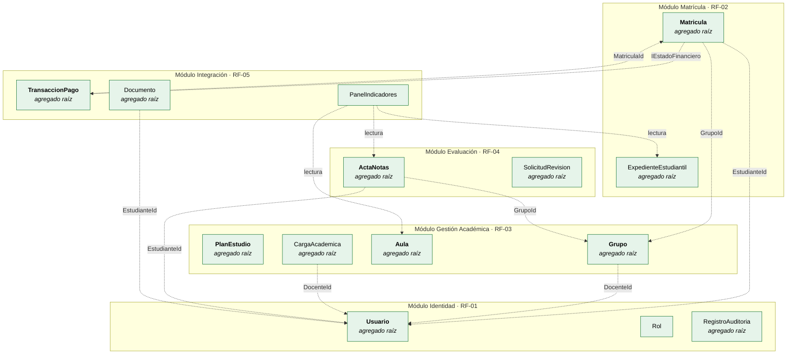

**Justificación.** Todas las flechas inter-módulo son punteadas y llevan como etiqueta un **identificador**, no una referencia a objeto. `Matricula` almacena un `GrupoId` de tipo `UUID`, no un puntero a la instancia de `Grupo`. Esta es la propiedad que permite que las cinco bases de datos sean físicamente independientes y que un módulo se despliegue sin requerir la presencia del otro.

---

## 2. Diagrama de clases — Módulo Identidad y Accesos (RF-01)

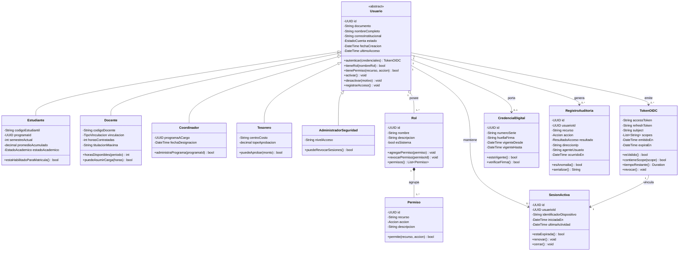

### Decisiones de diseño — RF-01

| Decisión | Justificación |
|---|---|
| Herencia en `Usuario` con cinco subclases | Los cinco perfiles comparten identidad, credenciales y ciclo de vida, y difieren solo en atributos propios. Es el único punto del sistema donde la generalización es apropiada. |
| `Rol` en agregación (`o--`) y `Permiso` en composición (`*--`) | Un rol existe independientemente del usuario que lo porta; un permiso no tiene sentido fuera del rol que lo agrupa y muere con él. |
| `TokenOIDC` como entidad, no como cadena | Permite modelar expiración, revocación y scopes de forma explícita, y hace verificable el corte de acceso del escenario de seguridad. |
| `RegistroAuditoria` como agregado raíz independiente | La auditoría debe sobrevivir a la eliminación de un usuario. Si fuera parte del agregado `Usuario`, desactivar una cuenta borraría su rastro — inaceptable bajo la Ley 1581 de 2012. |
| `SesionActiva` separada de `TokenOIDC` | Permite revocación centralizada (UC-06.1) sin esperar la expiración natural del token. |

---

## 3. Diagrama de clases — Módulo Matrícula y Expediente (RF-02)

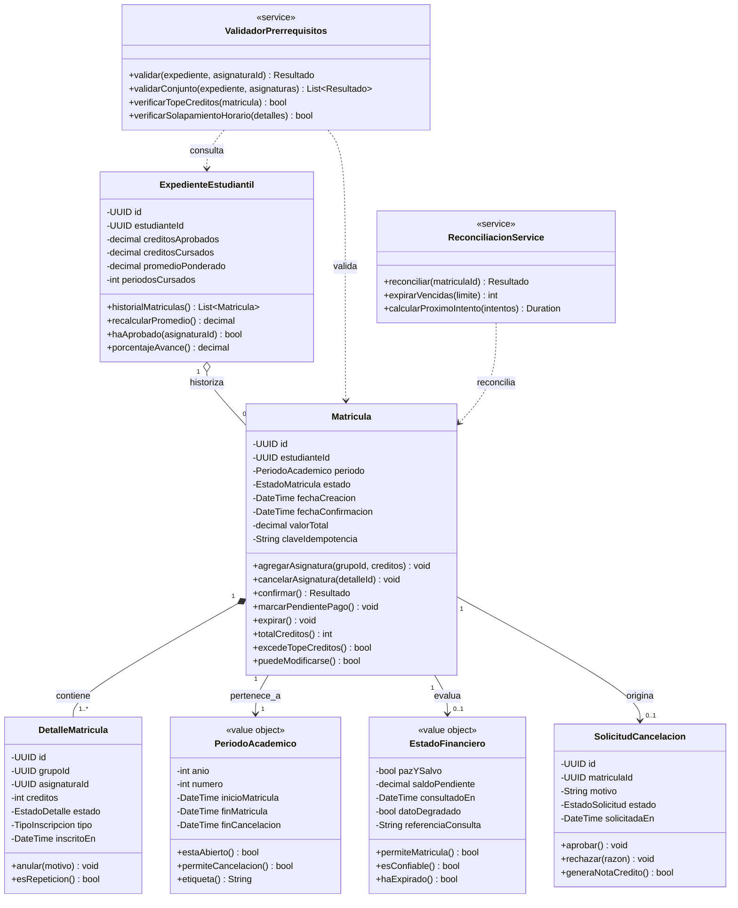

### Decisiones de diseño — RF-02

| Decisión | Justificación |
|---|---|
| `EstadoFinanciero` como *value object* con `datoDegradado` | El módulo de Matrícula **no posee** el dato financiero: lo consulta y lo trata como fotografía inmutable con marca temporal. El indicador `datoDegradado` permite distinguir "verificado y aprobado" de "no se pudo verificar". Sin él, una caída de la pasarela sería indistinguible de un paz y salvo confirmado — un fallo simultáneo de seguridad y de negocio. |
| `claveIdempotencia` en `Matricula` | Durante el pico de inscripciones el doble clic y el reintento del navegador son masivos. Esta clave garantiza que N envíos idénticos produzcan una sola matrícula. Es la contrapartida obligatoria de la política de reintentos de RNF-04. |
| `DetalleMatricula` en composición | Un detalle no existe fuera de su matrícula: su ciclo de vida está totalmente contenido. La composición lo expresa formalmente. |
| `PeriodoAcademico` como *value object* con reglas de fecha | Concentra las reglas temporales —¿está abierta la matrícula?, ¿se permite cancelar?— en un objeto inmutable reutilizable, en lugar de dispersarlas en condicionales por todo el servicio. |
| `ValidadorPrerrequisitos` y `ReconciliacionService` como servicios sin estado | Son reglas que involucran varias entidades y no pertenecen naturalmente a ninguna. Ubicarlas dentro de `Matricula` produciría el antipatrón de entidad-Dios. |

---

## 4. Diagrama de clases — Módulo Gestión Académica (RF-03)

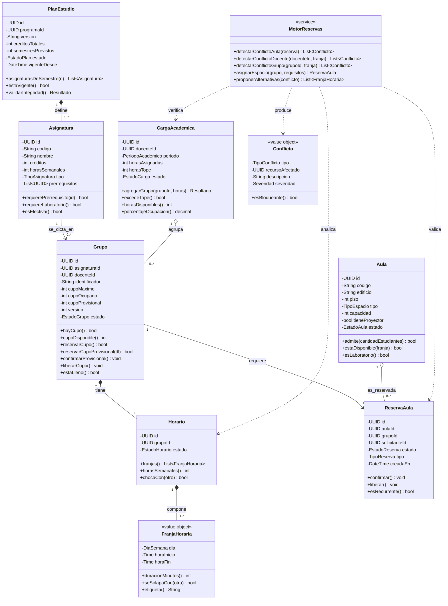

### Decisiones de diseño — RF-03

| Decisión | Justificación |
|---|---|
| `Grupo` concentra el control de cupo con `version` | Es el recurso escaso disputado por miles de usuarios simultáneos. Aislar allí la exclusión mutua permite bloqueo optimista sobre un objeto pequeño en vez de sobre el agregado completo de matrícula. Si el cupo viviera en `Asignatura`, toda la asignatura sería un punto de serialización global. |
| `cupoProvisional` separado de `cupoOcupado` | Permite retener un lugar mientras se resuelve el pago, sin contarlo como confirmado. Es el soporte estructural de la resiliencia de RNF-04. |
| `Aula` con atributo `TipoEspacio` en lugar de subclases | Una universidad agrega tipos de espacio con frecuencia. El tipo como dato es evolutivo; como subclase exigiría redespliegue. |
| `MotorReservas` como servicio con tres detectores de conflicto | RF-03 nombra explícitamente el "motor de reservas dedicado". Los tres tipos de conflicto —aula ocupada, docente con choque, grupo con solapamiento— son independientes y deben poder evaluarse en paralelo. |
| `Conflicto` como *value object* con severidad | Distingue conflictos bloqueantes de advertencias, permitiendo que el coordinador tome decisiones informadas en lugar de recibir un rechazo binario. |

---

## 5. Diagrama de clases — Módulo Evaluación y Seguimiento (RF-04)

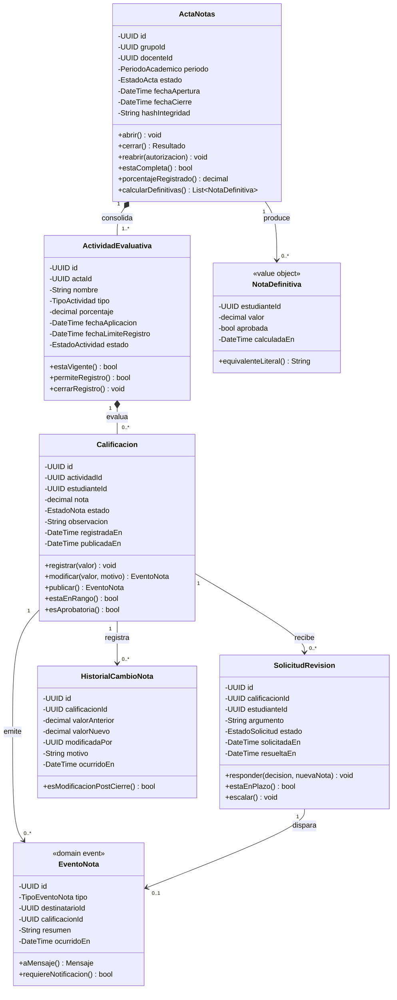

### Decisiones de diseño — RF-04

| Decisión | Justificación |
|---|---|
| `EventoNota` como *domain event* en lugar de llamada directa a notificaciones | RF-04 exige desacoplar el registro de notas del envío de notificaciones mediante cola gestionada. El evento es la representación lógica de esa cola: `Calificacion` lo produce y termina su transacción; quién lo consuma es irrelevante para el módulo. |
| `HistorialCambioNota` como entidad separada | Una calificación modificada tras la publicación tiene implicaciones académicas y legales. El historial inmutable garantiza trazabilidad y hace auditables las modificaciones extemporáneas. |
| `ActaNotas` con `hashIntegridad` y estados de cierre/reapertura | El cierre convierte el acta en documento inmutable. La reapertura requiere autorización explícita y queda registrada. Sin esta frontera, un docente podría calificar a un grupo cuya composición cambia simultáneamente. |
| `NotaDefinitiva` como *value object* calculado, no almacenado como entidad | Se deriva de las calificaciones y sus porcentajes. Persistirla como entidad independiente crearía dos fuentes de verdad susceptibles de divergir. |
| Suma de `porcentaje` de actividades validada en `ActaNotas` | La regla "los porcentajes deben sumar 100 %" es una invariante del agregado, no de la actividad individual. Reside en el agregado raíz. |

---

## 6. Diagrama de clases — Módulo Integración Externa y Analítica (RF-05)

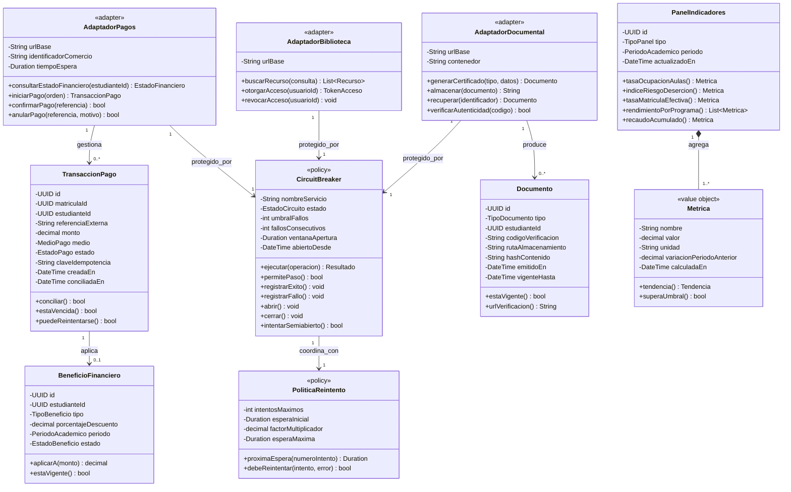

### Decisiones de diseño — RF-05

| Decisión | Justificación |
|---|---|
| `CircuitBreaker` como clase de primer nivel compartida por los tres adaptadores | Elevarlo a clase del modelo lógico —en lugar de dejarlo como detalle invisible de infraestructura— hace explícito que los tres adaptadores externos están protegidos por la misma política, y da un lugar concreto donde parametrizar umbrales por proveedor. |
| `claveIdempotencia` en `TransaccionPago` | Sin ella, la política de reintentos con retroceso exponencial de RNF-04 produciría **doble cobro** al estudiante. Es un caso donde un requisito de resiliencia genera, implementado ingenuamente, un defecto financiero grave. |
| Estado `SEMIABIERTO` en `CircuitBreaker` | Permite probar la recuperación del servicio externo con una sola petición en lugar de reabrir el tráfico completo de golpe, evitando reabrir el circuito y saturar un servicio que apenas se está restableciendo. |
| `PoliticaReintento` separada de `CircuitBreaker` | Son mecanismos distintos con responsabilidades distintas: el primero decide *cuándo volver a intentar*, el segundo decide *si vale la pena intentar*. Acoplarlos impediría configurarlos independientemente. |
| `Documento` con `codigoVerificacion` y `hashContenido` | Permite verificación pública de autenticidad de certificados sin exponer la base de datos, requisito habitual en trámites académicos. |
| `Metrica` como *value object* con variación | Un indicador sin comparación temporal no soporta la toma de decisiones directiva que exige RF-05. |

---

## 7. Diagrama de secuencia — RF-01 · Autenticación y autorización

**Flujo:** UC-01 Autenticarse + UC-02 Autorizar acceso por rol, incluyendo el intento de acceso no autorizado.

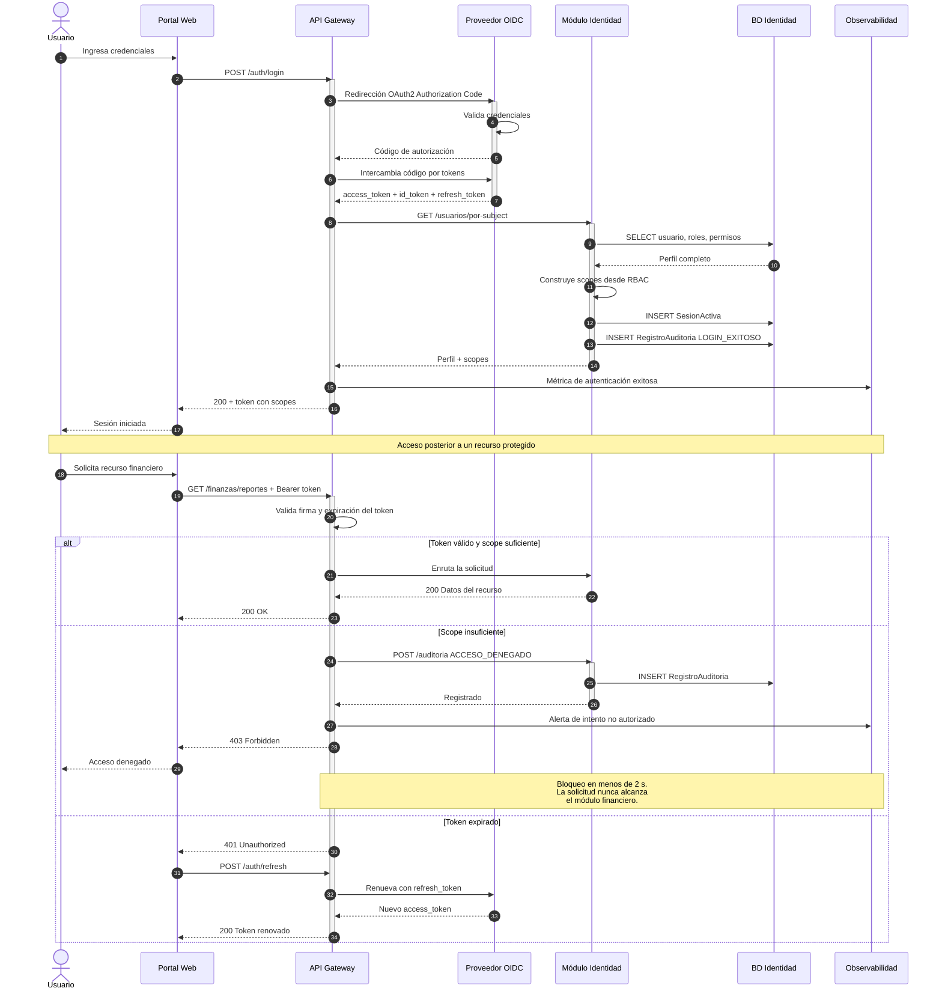

**Justificación.** El corte de autorización ocurre **en el Gateway, antes del primer participante de negocio**. La barra de activación del módulo financiero ni siquiera se abre en la rama de rechazo. Esta posición del `alt` en el diagrama comunica visualmente lo que exige el requisito de seguridad: bloqueo rápido sin exponer datos. Adicionalmente, el registro de auditoría se emite **antes** de responder al cliente, garantizando que no exista una ventana donde el rechazo ocurra sin dejar rastro.

---

## 8. Diagrama de secuencia — RF-02 · Inscripción con fallo de la pasarela

**Flujo:** UC-07 Inscribir asignaturas cuando el servicio de pagos externo no responde. Es el flujo más complejo del sistema: atraviesa cuatro módulos y ejercita Circuit Breaker, cola de mensajes, idempotencia y reconciliación.

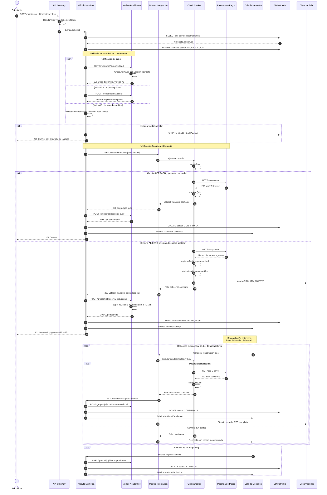

**Justificación de las decisiones críticas:**

1. **La matrícula se persiste antes de consultar a la pasarela.** Si se consultara primero y el servicio estuviera caído, la solicitud del estudiante se perdería por completo. Al persistir un estado intermedio, el sistema siempre tiene un registro sobre el cual reconciliar.

2. **Respuesta `202 Accepted`, no `500`.** El fallo de un tercero no se propaga como fallo al usuario. Devolver `500` acoplaría la disponibilidad percibida de UPS-Connect a la de la pasarela de pagos, anulando el objetivo de 99,9 %.

3. **Cupo provisional con vencimiento de 72 horas.** Si el cupo se confirmara sin verificar el pago, un estudiante moroso bloquearía un lugar indefinidamente. Si no se retuviera nada, el estudiante perdería el cupo por un fallo ajeno. El cupo provisional con expiración protege a ambas partes, y la rama de expiración cierra el ciclo de vida evitando fuga de cupos.

4. **La clave de idempotencia atraviesa las tres fases.** Se recibe en la petición inicial, se verifica contra la base de datos antes de crear nada, y se reenvía en cada reintento de reconciliación. Un estudiante que pulse el botón cinco veces durante el pico genera una sola matrícula y un solo cobro.

---

## 9. Diagrama de secuencia — RF-03 · Reserva de aula con detección de conflictos

**Flujo:** UC-18 Reservar aula + UC-19 Detectar conflictos de programación.

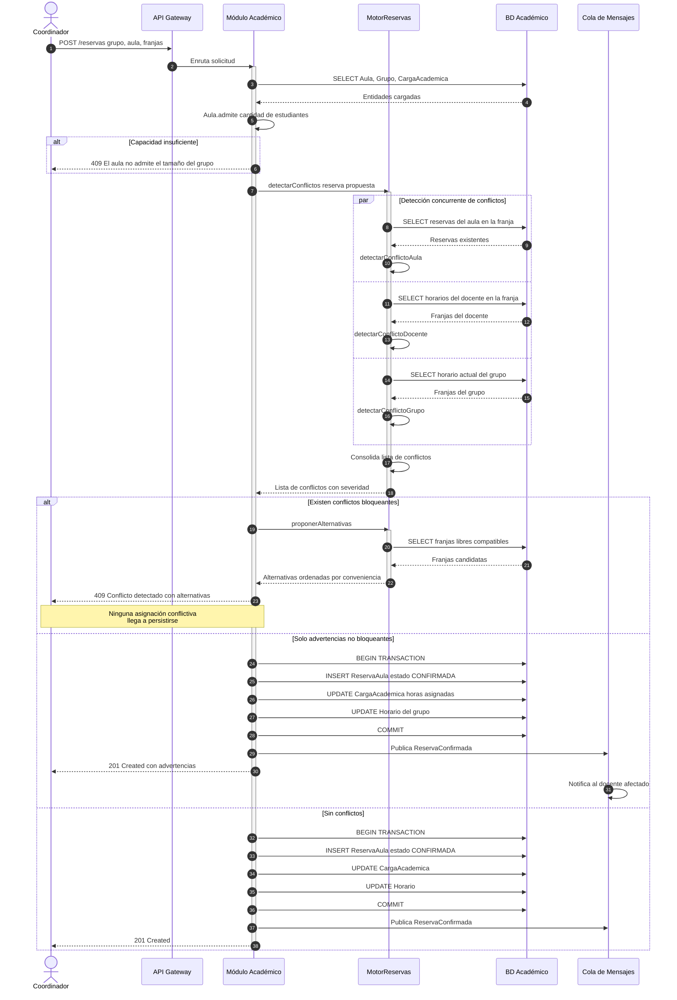

**Justificación.** La detección de conflictos ocurre **dentro de la misma transacción** que la escritura, y los tres detectores se ejecutan concurrentemente porque son independientes entre sí. La rama de conflicto bloqueante retorna sin persistir nada: el motor de reservas actúa como precondición de escritura, no como validación posterior. Esto es lo que hace cumplible el requisito de RF-03 de evitar conflictos de programación.

La propuesta de alternativas convierte un rechazo en una acción constructiva, reduciendo los ciclos de ensayo y error del coordinador durante la planificación semestral.

---

## 10. Diagrama de secuencia — RF-04 · Registro, publicación y notificación de notas

**Flujo:** UC-23 Registrar + UC-24 Publicar + UC-28 Notificar, incluyendo modificación posterior a la publicación.

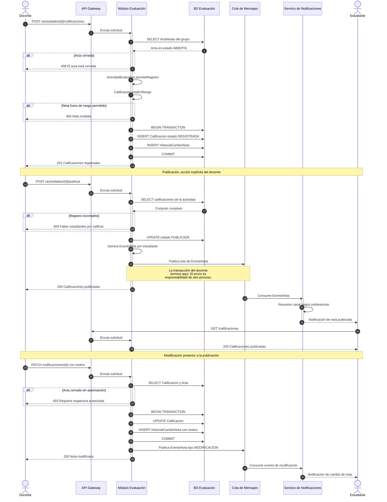

**Justificación.** El registro y la publicación son operaciones **separadas y explícitas**. Un docente puede registrar notas progresivamente sin que los estudiantes vean resultados parciales; la publicación es un acto deliberado que dispara las notificaciones. Fusionar ambas obligaría al docente a completar todo el grupo en una sola sesión.

La transacción del docente termina al publicar el evento en la cola. Si el servicio de notificaciones estuviera caído, las notas quedan igualmente publicadas y consultables: **el desacople protege la operación académica de los fallos del canal de comunicación**, que es exactamente lo que RF-04 persigue.

---

## 11. Diagrama de secuencia — RF-05 · Emisión de certificado académico

**Flujo:** UC-33 Emitir certificado + UC-34 Archivar documento, con verificación de paz y salvo.

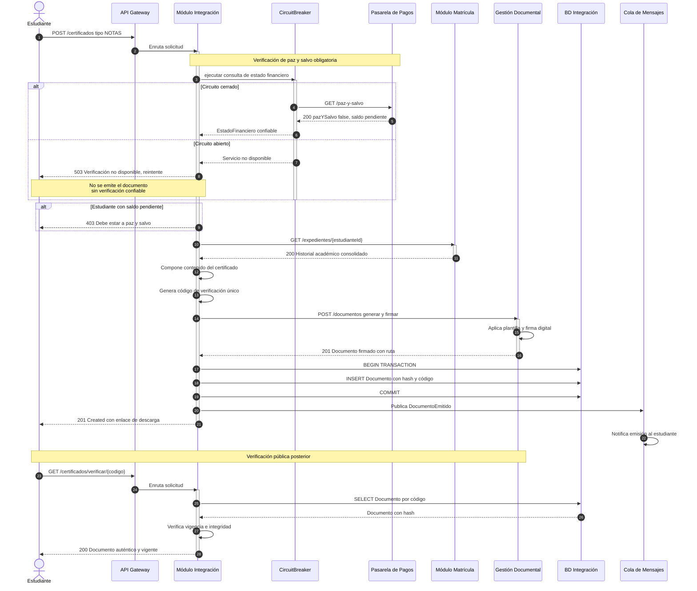

**Justificación.** La verificación de paz y salvo es **bloqueante** para la emisión de certificados: a diferencia de la matrícula, aquí no existe modo degradado. Si el estado financiero no puede verificarse con confianza, el sistema responde `503` en lugar de emitir un documento oficial sobre información no confirmada. Esta asimetría deliberada respecto al flujo de matrícula refleja que **el costo del error es distinto**: una matrícula provisional se reconcilia; un certificado emitido indebidamente ya circuló.

El código de verificación permite a terceros validar la autenticidad del documento sin acceso al sistema, requisito habitual en trámites académicos e institucionales.

---

## 12. Mapa de referencias inter-módulo

Resumen de todas las dependencias entre módulos y su mecanismo de comunicación.

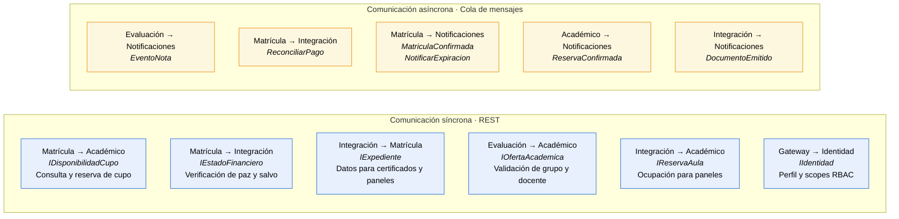

### Criterio de elección entre síncrono y asíncrono

| Situación | Mecanismo | Razón |
|---|---|---|
| El emisor **necesita la respuesta** para continuar | REST síncrono | Verificar cupo o paz y salvo determina si la operación puede proceder |
| El emisor **no depende** del resultado | Cola de mensajes | Notificar al estudiante no condiciona el registro de la nota |
| La operación **debe sobrevivir** a la caída del receptor | Cola de mensajes | La reconciliación de pago debe ejecutarse aunque el módulo estuviera caído al fallar la pasarela |
| Se requiere **consistencia inmediata** | REST síncrono | La reserva de cupo no admite ventanas de inconsistencia bajo alta concurrencia |

**Regla verificable:** el diagrama contiene **cero** dependencias circulares síncronas. Matrícula llama a Integración y Integración llama a Matrícula, pero sobre interfaces distintas y en flujos distintos, nunca dentro de una misma cadena de llamadas — lo que evita interbloqueos y cascadas de tiempo de espera.

---

| ← Anterior | Índice | Siguiente → |
|---|---|---|
| [Casos de Uso](01-vista-casos-uso.md) | [README](../README.md) | [Vista de Procesos](03-vista-procesos.md) |
