# Vista 2 — Procesos

> **Modelo 4+1 · Vista de Procesos.** Describe el comportamiento dinámico en tiempo de ejecución: flujos de control, puntos de decisión, validaciones, concurrencia, sincronización y contención por recursos compartidos. Su destinatario es el equipo de desarrollo y el equipo de plataforma.

**Cobertura:** 6 diagramas de actividades (uno por módulo, más el proceso asíncrono de reconciliación) · 5 máquinas de estado · 2 procesos de infraestructura. **Total: 13 diagramas.**

---

## Convención de notación

Mermaid.js no implementa carriles (*swimlanes*) en diagramas de actividad. Se emplea `flowchart` con **codificación por color** según el proceso responsable, que preserva la información esencial: qué unidad de ejecución realiza cada acción y dónde el control cruza un límite de red.

| Color | Proceso responsable |
|---|---|
| 🔵 Azul | API Gateway — capa de borde |
| 🟢 Verde | Módulo de negocio propietario del flujo |
| 🟡 Amarillo | Otro módulo invocado por REST |
| 🔴 Rojo | Sistema externo o ruta de error |
| 🟣 Morado | Proceso asíncrono dirigido por cola |

| Símbolo | Significado UML |
|---|---|
| `([ ])` | Nodo inicial / final |
| `[ ]` | Acción |
| `{ }` | Nodo de decisión o fusión |
| Barra `═══` | Nodo `fork` / `join` de concurrencia |

---

## 1. Proceso de autenticación y autorización — RF-01

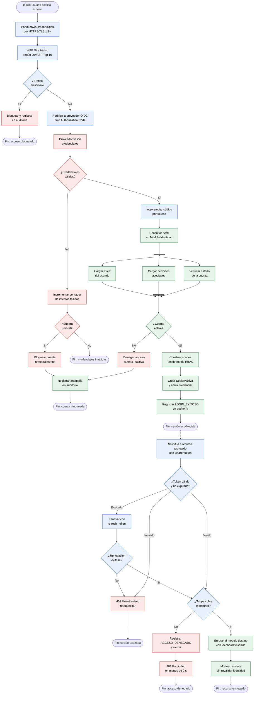

### Justificación — RF-01

**El módulo destino no revalida la identidad.** La validación ocurre exclusivamente en el Gateway; los módulos reciben la identidad ya verificada y confían en el borde. Esto evita cinco implementaciones divergentes de RBAC y concentra la política de seguridad en un punto auditable. La contrapartida obligatoria —que ningún módulo sea alcanzable directamente desde Internet— se garantiza mediante segmentación de red en la [Vista Física](05-vista-fisica.md).

**La carga de roles, permisos y estado de cuenta se ejecuta en paralelo.** Son consultas independientes; serializarlas triplicaría la latencia de una operación que ocurre en cada inicio de sesión de toda la comunidad universitaria.

**El bloqueo por intentos fallidos protege contra fuerza bruta**, y toda anomalía se registra antes de responder, garantizando que no exista ninguna ventana donde un rechazo ocurra sin dejar rastro auditable.

---

## 2. Proceso de matrícula — RF-02

Proceso crítico del negocio. Integra validación académica concurrente, verificación financiera obligatoria, manejo de fallo del servicio externo y reconciliación asíncrona.

```mermaid
flowchart TD
    INI([Inicio: estudiante confirma selección]) --> A1

    A1["Generar clave de idempotencia<br/>y enviar solicitud"]:::gw
    A1 --> D0{"¿Supera límite<br/>de tasa?"}:::gw
    D0 -->|Sí| E0["429 Too Many Requests<br/>con Retry-After"]:::err
    E0 --> FIN0([Fin: reintentar más tarde])
    D0 -->|No| A2["Validar token y rol<br/>en Gateway"]:::gw
    A2 --> A3["Enrutar a Módulo Matrícula"]:::mod

    A3 --> D1{"¿Clave de idempotencia<br/>ya procesada?"}:::mod
    D1 -->|Sí| A4["Recuperar respuesta<br/>original"]:::mod
    A4 --> FIN1([Fin: respuesta idéntica sin duplicar])
    D1 -->|No| D2{"¿Periodo de matrícula<br/>abierto?"}:::mod
    D2 -->|No| E1["409 Fuera del periodo<br/>de matrícula"]:::err
    E1 --> FIN2([Fin: rechazada])
    D2 -->|Sí| A5["Crear Matricula<br/>estado EN_VALIDACION"]:::mod

    A5 --> FK1[" "]:::fork
    FK1 --> A6["Verificar cupo del grupo<br/>con versión optimista"]:::otro
    FK1 --> A7["Validar prerrequisitos<br/>contra el expediente"]:::otro
    FK1 --> A8["Verificar tope<br/>de créditos"]:::mod
    FK1 --> A9["Detectar solapamiento<br/>de horarios"]:::mod
    A6 --> JN1[" "]:::fork
    A7 --> JN1
    A8 --> JN1
    A9 --> JN1

    JN1 --> A10["Consolidar todos<br/>los resultados"]:::mod
    A10 --> D3{"¿Todas las validaciones<br/>son correctas?"}:::mod
    D3 -->|No| E2["Marcar RECHAZADA<br/>con el detalle de cada regla"]:::err
    E2 --> FIN3([Fin: 409 con motivos])

    D3 -->|Sí| A11["Solicitar verificación<br/>financiera"]:::otro
    A11 --> D4{"¿Circuit Breaker<br/>permite el paso?"}:::otro
    D4 -->|No, circuito abierto| A12["Fallo rápido sin<br/>intentar la llamada"]:::err
    D4 -->|Sí| A13["Invocar pasarela<br/>tiempo de espera 3 s"]:::ext
    A13 --> D5{"¿Respuesta<br/>exitosa?"}:::ext
    D5 -->|No| A14["Registrar fallo<br/>en el contador"]:::err
    A14 --> D6{"¿Supera umbral<br/>de fallos?"}:::err
    D6 -->|Sí| A15["Abrir circuito<br/>y emitir alerta"]:::err
    A15 --> A12
    D6 -->|No| A12
    D5 -->|Sí| A16["Obtener EstadoFinanciero<br/>confiable"]:::otro

    A12 --> A17["EstadoFinanciero<br/>marcado degradado"]:::err
    A17 --> A18["Reservar cupo PROVISIONAL<br/>con vencimiento 72 h"]:::otro
    A18 --> A19["Marcar PENDIENTE_PAGO"]:::mod
    A19 --> A20["Publicar ReconciliarPago<br/>en la cola"]:::mod
    A20 --> FIN4([Fin: 202 pago en verificación])

    A16 --> D7{"¿Estudiante a<br/>paz y salvo?"}:::mod
    D7 -->|No| A21["Generar orden de pago"]:::mod
    A21 --> A18
    D7 -->|Sí| A22["Reservar cupo<br/>en firme"]:::otro
    A22 --> D8{"¿Conflicto de<br/>versión optimista?"}:::otro
    D8 -->|Sí| A23["Releer estado<br/>actual del grupo"]:::otro
    A23 --> D9{"¿Aún hay<br/>cupo?"}:::otro
    D9 -->|No| E3["Marcar RECHAZADA<br/>cupo agotado"]:::err
    E3 --> FIN5([Fin: 409 cupo agotado])
    D9 -->|Sí| A22
    D8 -->|No| A24["Marcar CONFIRMADA"]:::mod
    A24 --> A25["Actualizar expediente<br/>y publicar evento"]:::mod
    A25 --> FIN6([Fin: 201 matrícula confirmada])

    classDef gw fill:#E8F0FE,stroke:#1967D2,color:#000
    classDef mod fill:#E6F4EA,stroke:#137333,color:#000
    classDef otro fill:#FEF7E0,stroke:#EA8600,color:#000
    classDef ext fill:#FCE8E6,stroke:#C5221F,color:#000
    classDef err fill:#FCE8E6,stroke:#C5221F,color:#000
    classDef fork fill:#5F6368,stroke:#202124,color:#fff,height:6px
```

### Proceso asíncrono de reconciliación

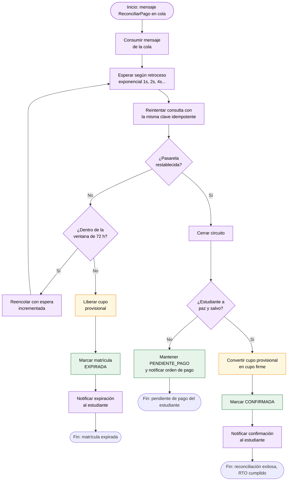

### Justificación — RF-02

| Decisión | Razón |
|---|---|
| **Verificación de idempotencia antes de crear cualquier registro** | Durante el pico, el doble clic y el reintento del navegador son masivos. Si la verificación estuviera después de la creación, existiría una ventana de carrera que produciría matrículas duplicadas precisamente cuando el sistema está más cargado — el fallo aparecería solo bajo la condición en que más daño hace. |
| **Fallo rápido cuando el circuito está abierto** | No se intenta la llamada. Sin esto, miles de peticiones esperarían tiempos de espera de 3 s, agotando el pool de conexiones del módulo y afectando a estudiantes que solo querían consultar notas. El Circuit Breaker no protege a la pasarela: protege a UPS-Connect de la pasarela. |
| **Cuatro validaciones concurrentes con `join` obligatorio** | Ninguna validación se omite aunque otra ya haya fallado: el estudiante debe recibir todos los motivos de rechazo de una vez, no uno por intento. |
| **Reconciliador con nodo inicial propio** | Es un proceso autónomo dirigido por cola. Puede ejecutarse minutos u horas después, en otra instancia, incluso tras un redespliegue del módulo. Dibujarlo como continuación del flujo síncrono sugeriría que el usuario espera. |
| **Manejo explícito del conflicto de versión optimista** | Entre la lectura del cupo y la reserva en firme transcurre tiempo real, y otro estudiante pudo tomar el lugar. Omitir esta rama produciría un diagrama que solo funciona con un usuario a la vez. |

---

## 3. Proceso de programación académica — RF-03

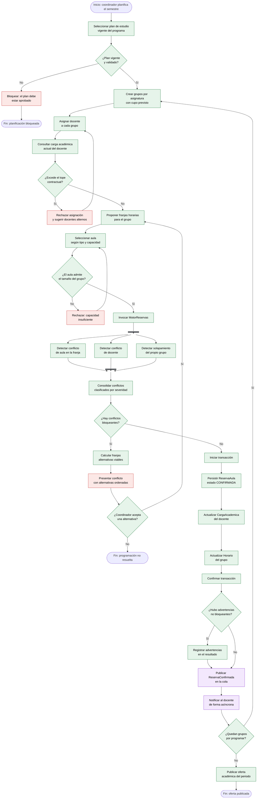

### Justificación — RF-03

**La detección de conflictos ocurre antes de la transacción de escritura, y los tres detectores se ejecutan concurrentemente.** El motor de reservas actúa como precondición, no como validación posterior. Ningún camino del diagrama permite persistir una asignación conflictiva, lo que hace cumplible el requisito de RF-03 de evitar conflictos de programación.

**Las cuatro escrituras van en una sola transacción.** Reserva, carga docente y horario deben confirmarse atómicamente: una reserva persistida sin actualizar la carga del docente permitiría sobreasignarlo en la siguiente iteración.

**Los conflictos se clasifican por severidad.** Un conflicto bloqueante detiene el flujo; una advertencia lo permite pero queda registrada. Un rechazo binario obligaría al coordinador a resolver manualmente situaciones que el sistema puede tolerar de forma informada.

**El bucle de programación permite procesar todos los grupos del semestre** sin abandonar el proceso ante cada conflicto individual.

---

## 4. Proceso de evaluación académica — RF-04

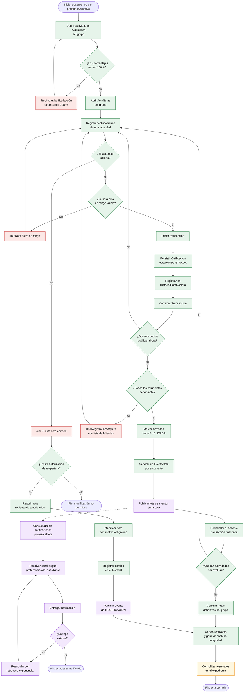

### Justificación — RF-04

**El registro y la publicación son operaciones separadas.** Un docente registra notas progresivamente sin que los estudiantes vean resultados parciales; publicar es un acto deliberado. Fusionarlas obligaría a completar todo el grupo en una sola sesión.

**La transacción del docente termina al publicar el evento en la cola.** El flujo de notificación se muestra como rama desprendida (línea punteada) para indicar que corre en un proceso independiente. Si el servicio de notificaciones estuviera caído, las notas quedan igualmente publicadas y consultables: **el desacople protege la operación académica de los fallos del canal de comunicación**.

**La validación de suma 100 % es una precondición de apertura del acta**, no un chequeo al cierre. Detectarlo al final obligaría a rehacer toda la evaluación.

**La modificación posterior al cierre exige autorización y motivo**, y queda registrada en el historial inmutable. Es un requisito de trazabilidad académica y legal.

---

## 5. Proceso de integración externa y analítica — RF-05

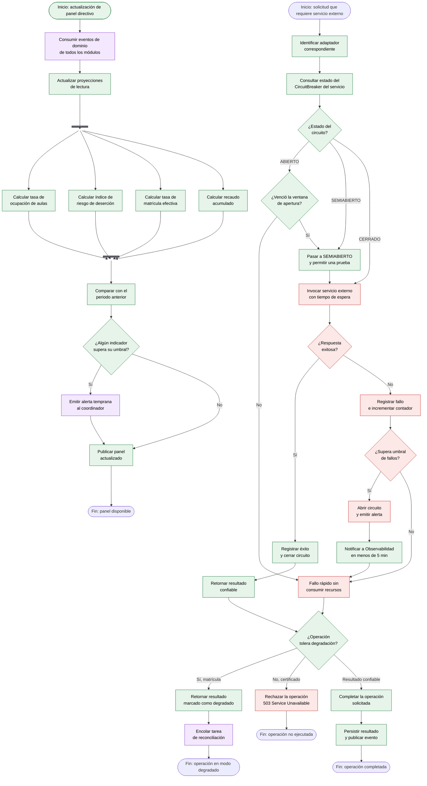

### Justificación — RF-05

**La decisión "¿la operación tolera degradación?" es el corazón de este proceso.** No todas las operaciones deben comportarse igual ante un fallo externo:

| Operación | Comportamiento ante fallo | Razón |
|---|---|---|
| Verificación financiera para matrícula | Continúa en modo degradado | Una matrícula provisional se reconcilia después sin daño |
| Emisión de certificado | Se rechaza con `503` | Un documento oficial emitido sobre información no confirmada ya circuló y no puede retractarse |

Esta asimetría deliberada es una decisión arquitectónica, no una inconsistencia: **el modo degradado se concede en función del costo del error, no de la conveniencia técnica**.

**El estado `SEMIABIERTO` prueba la recuperación con una sola petición** antes de reabrir el tráfico completo, evitando saturar un servicio que apenas se está restableciendo y provocar una reapertura inmediata del circuito.

**El panel directivo consume eventos y mantiene proyecciones de lectura**, en lugar de consultar en línea las bases de datos de los otros módulos. Esto evita que la analítica compita por recursos con la operación transaccional durante el periodo de matrícula.

---

## 6. Máquina de estados — Sesión de usuario (RF-01)

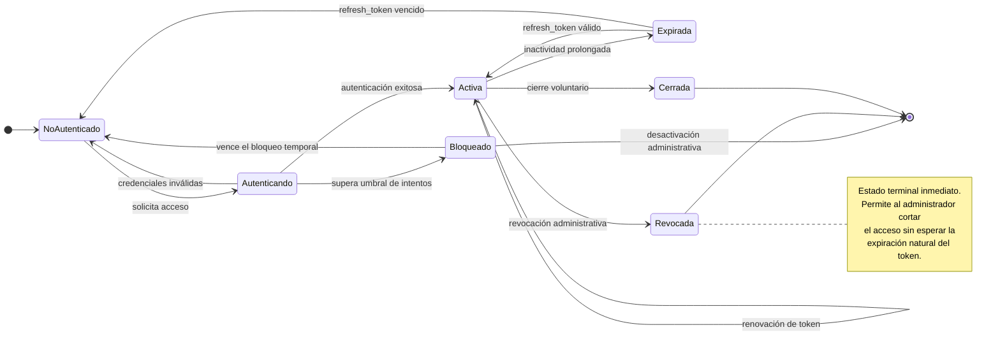

**Justificación.** La separación entre `Expirada` y `Revocada` es lo que hace posible el caso de uso UC-06.1: `Expirada` es recuperable mediante `refresh_token`; `Revocada` es terminal e irreversible. Sin esta distinción, un administrador que detecte una cuenta comprometida no tendría forma de cortar el acceso antes del vencimiento natural del token.

---

## 7. Máquina de estados — Matrícula (RF-02)

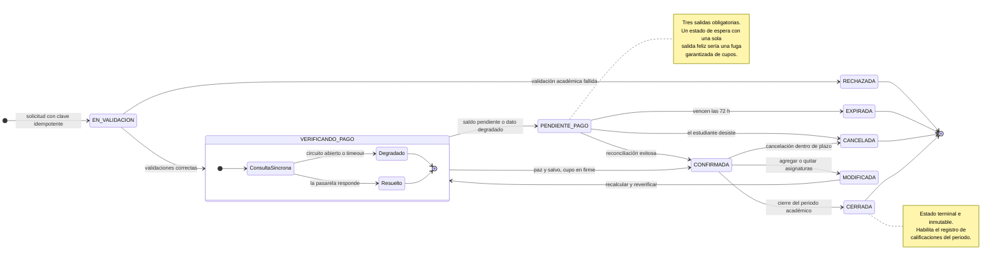

**Justificación.** `MODIFICADA` retorna a `VERIFICANDO_PAGO` y nunca directo a `CONFIRMADA`. Si un estudiante agrega asignaturas, el valor cambia y **el paz y salvo previo deja de ser válido**. Permitir el salto directo reabriría por la puerta de atrás la desconexión académico-financiera que el proyecto busca eliminar. Es una regla que solo se hace visible en la máquina de estados: ni el diagrama de clases ni el de secuencia la revelan.

La separación entre `CONFIRMADA` y `CERRADA` establece la frontera de inmutabilidad. Sin ella, un docente podría estar calificando a un grupo cuya composición cambia simultáneamente.

---

## 8. Máquina de estados — Reserva de aula (RF-03)

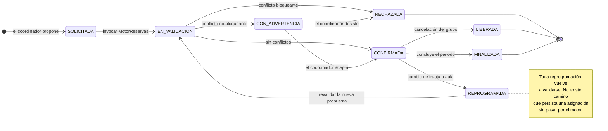

**Justificación.** El estado `REPROGRAMADA` obliga a revalidar. Es el punto donde suelen introducirse conflictos en los sistemas académicos: un cambio de aula aparentemente inocuo genera un choque de horario para el docente. Al forzar el retorno a `EN_VALIDACION`, ningún camino evade el motor de reservas.

`CON_ADVERTENCIA` es un estado real, no un mensaje: permite que el coordinador tome una decisión informada sobre conflictos tolerables sin que el sistema imponga un rechazo binario.

---

## 9. Máquina de estados — Acta de notas (RF-04)

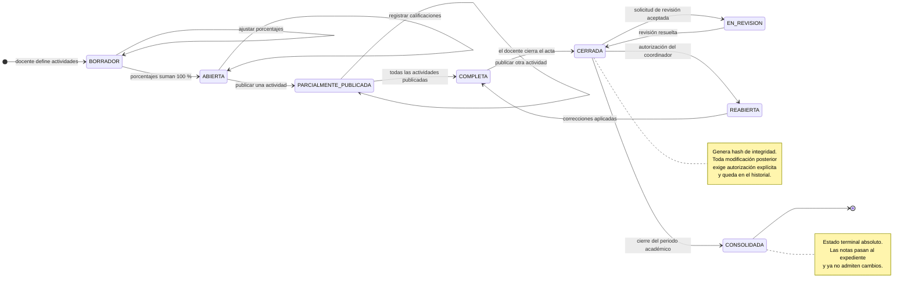

**Justificación.** `PARCIALMENTE_PUBLICADA` refleja la realidad operativa: un docente publica el primer parcial mucho antes que el examen final. Modelar solo `ABIERTA` y `CERRADA` obligaría a mantener todo oculto hasta el final del semestre, algo que ningún docente aceptaría y que contradice la expectativa del estudiante de "consulta oportuna de calificaciones".

La cadena `CERRADA → REABIERTA → COMPLETA → CERRADA` permite corregir errores legítimos sin destruir la trazabilidad, mientras `CONSOLIDADA` establece un punto de no retorno definitivo al cierre del periodo.

---

## 10. Máquina de estados — Transacción de pago (RF-05)

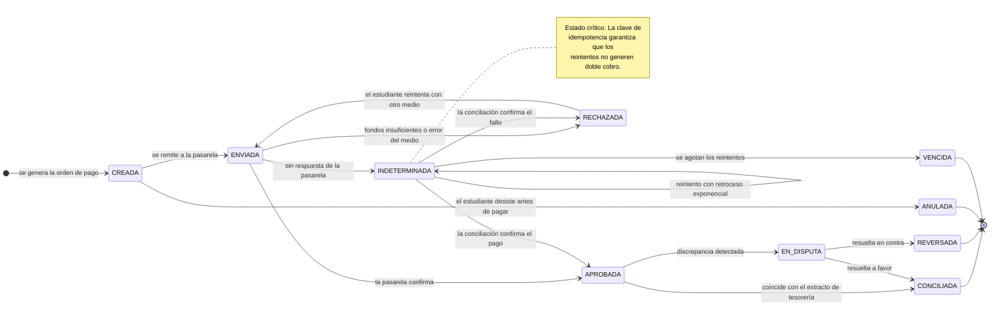

**Justificación.** `INDETERMINADA` es el estado que la mayoría de los diseños omite y el que más incidentes produce en producción: la pasarela no respondió, pero el cargo pudo haberse aplicado. Modelarlo explícitamente obliga a resolverlo mediante conciliación, y la clave de idempotencia garantiza que los reintentos consulten el estado real en lugar de generar un segundo cobro.

`EN_DISPUTA` y `REVERSADA` dan soporte al requisito de trazabilidad de cada transacción para efectos de auditoría que expresa el personal de tesorería.

---

## 11. Proceso de escalado bajo demanda (RNF-02)

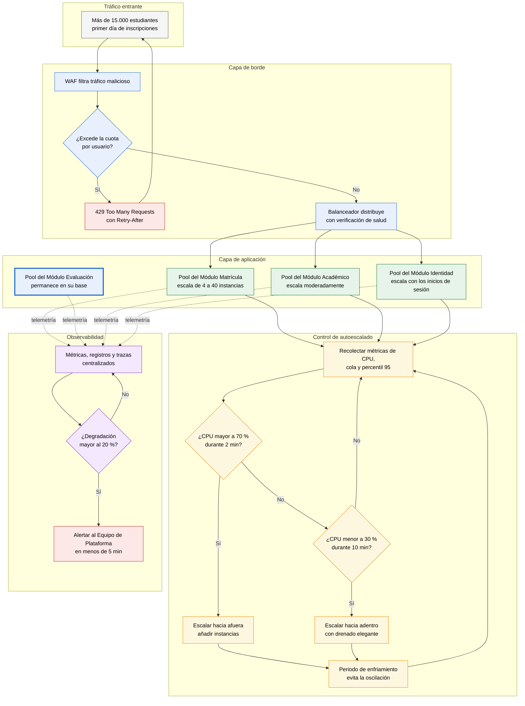

### Justificación — RNF-02

| Decisión | Razón |
|---|---|
| **Limitación de tasa antes del autoescalado, no en su lugar** | Son mecanismos complementarios con tiempos de reacción distintos: la limitación actúa en milisegundos; el autoescalado tarda decenas de segundos en aprovisionar. Sin el primero, el pico inicial tumba el módulo antes de que el segundo reaccione. |
| **Umbrales asimétricos: 70 % / 2 min para crecer, 30 % / 10 min para reducir** | Escalar hacia arriba debe ser agresivo (el costo de sub-aprovisionar es la caída en el día más visible del año); escalar hacia abajo debe ser conservador (el costo de sobre-aprovisionar unos minutos es marginal frente al riesgo de un segundo pico). |
| **Periodo de enfriamiento obligatorio** | Impide la oscilación, donde el sistema crea y destruye instancias sin cesar y termina peor que sin autoescalado. |
| **Drenado elegante al reducir** | Retirar una instancia con peticiones en vuelo dejaría matrículas a medio procesar en estados inconsistentes. |
| **El Módulo Evaluación aparece sin escalar** | Está en el diagrama precisamente para mostrar que **no cambia**. Es la refutación gráfica del problema heredado de *Fragilidad Ante Picos de Demanda*: en el monolito, saturar la matrícula degradaba la consulta de notas. |

---

## 12. Proceso de contención por cupo bajo alta concurrencia

Situación crítica: N estudiantes compiten simultáneamente por el último cupo de un grupo.

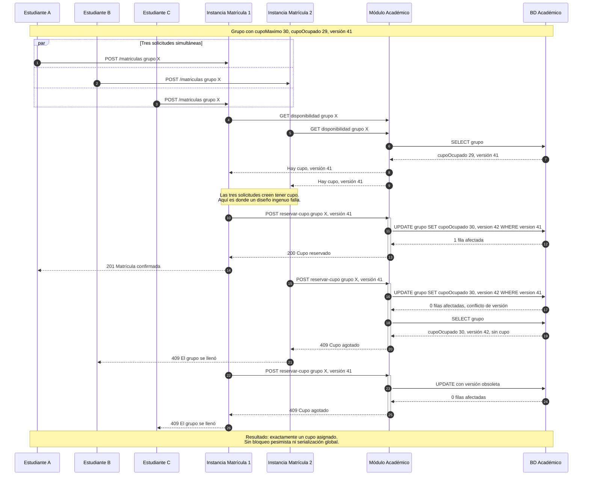

### Justificación — control de concurrencia

**Se usa bloqueo optimista, no pesimista.** Un bloqueo pesimista sobre el grupo serializaría a todos los estudiantes que intentan matricular esa asignatura: con 15.000 usuarios concurrentes, la fila de espera haría inviable el requisito de degradación ≤ 20 %.

El bloqueo optimista permite que todas las lecturas ocurran en paralelo y solo serializa la escritura final, que es una operación de milisegundos. El conflicto se detecta por el contador de versión: `UPDATE ... WHERE version = 41` afecta cero filas si otra transacción ya incrementó la versión.

**El conflicto no es un error del sistema, es información válida de negocio.** El estudiante recibe un `409` claro —"el grupo se llenó"— en lugar de un tiempo de espera agotado o un error genérico. La rama de reintento del [proceso de matrícula](#2-proceso-de-matrícula--rf-02) relee el estado antes de rendirse, cubriendo el caso en que otro estudiante haya cancelado en el intervalo.

**Este mecanismo es la razón por la cual `Grupo` concentra el cupo** en la [Vista Lógica](02-vista-logica.md): si el contador viviera en `Asignatura`, toda la asignatura sería un punto único de serialización global en lugar de un grupo individual.

---

## Trazabilidad de la Vista de Procesos

| Requisito / Atributo | Elemento que lo materializa |
|---|---|
| RF-01 · Autenticación centralizada | Proceso 1 · Máquina de estados de sesión |
| RF-02 · Verificación financiera obligatoria | Proceso 2 · Máquina de estados de matrícula |
| RF-03 · Sin conflictos de programación | Proceso 3 · Máquina de estados de reserva |
| RF-04 · Notificación desacoplada | Proceso 4 · Máquina de estados de acta |
| RF-05 · Integración desacoplada | Proceso 5 · Máquina de estados de pago |
| RNF-01 · Disponibilidad | Fallo rápido y modo degradado en procesos 2 y 5 |
| RNF-02 · 15.000 concurrentes | Proceso 11 · Proceso 12 |
| RNF-03 · Seguridad y auditoría | Proceso 1, ramas de rechazo y registro |
| RNF-04 · Circuit Breaker y reintentos | Proceso 2 asíncrono · Proceso 5 |
| RNF-05 · Detección en menos de 5 min | Bucle de observabilidad del proceso 11 |

---

| ← Anterior | Índice | Siguiente → |
|---|---|---|
| [Vista Lógica](02-vista-logica.md) | [README](../README.md) | [Vista de Desarrollo](04-vista-desarrollo.md) |
