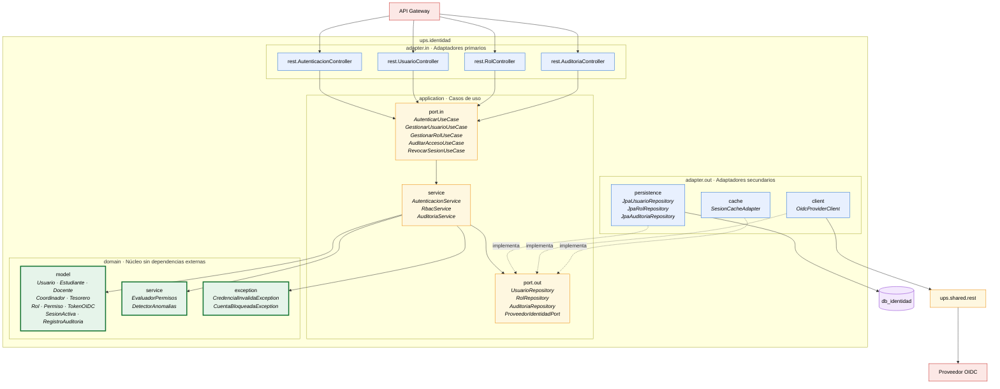
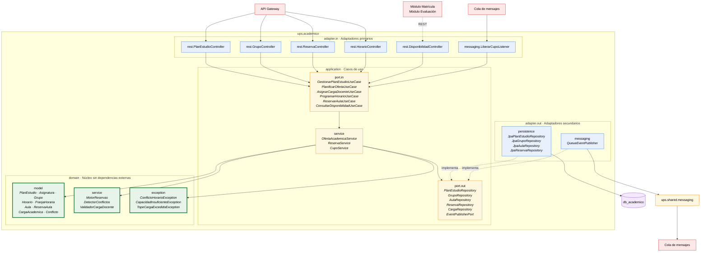
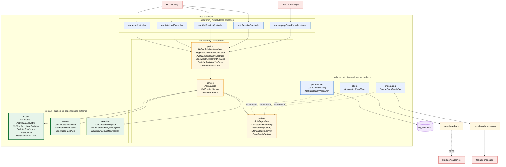
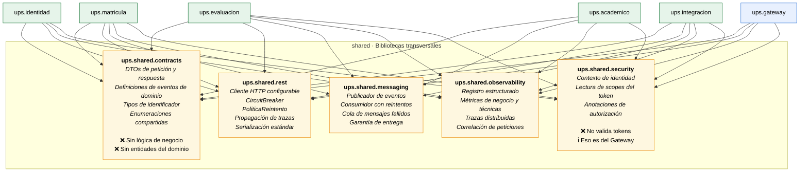

# Vista 3 — Desarrollo

> **Modelo 4+1 · Vista de Desarrollo.** Describe la organización estática del código: paquetes, componentes, interfaces, bibliotecas compartidas y dependencias de compilación. Su destinatario es el equipo de desarrollo y los ingenieros de plataforma.

**Cobertura:** 1 diagrama de capas · 5 estructuras internas de módulo · 1 diagrama de componentes · 1 de bibliotecas compartidas · 1 de reglas de dependencia. **Total: 9 diagramas.**

---

## Regla de oro de esta vista

Toda la organización del código está gobernada por una única regla verificable:

> **Ninguna dependencia de compilación cruza horizontalmente entre módulos de negocio, y ninguna dependencia apunta desde el dominio hacia la infraestructura.**

Si esa regla se rompe en un solo punto, el sistema deja de ser una arquitectura modular orientada a servicios y vuelve a ser el monolito acoplado que el caso de estudio describe como problema. Los nueve diagramas de esta vista existen para hacer esa regla auditable, y la [sección 9](#9-reglas-de-dependencia-verificables-en-integración-continua) la convierte en pruebas automáticas del pipeline.

---

## Convención de notación

Mermaid.js no implementa el diagrama UML de componentes. Se emplea `flowchart` con esta convención:

| Elemento UML | Representación |
|---|---|
| Paquete / capa | `subgraph` |
| Componente | Rectángulo con estereotipo en cursiva |
| Interfaz provista | Nodo hexagonal `{{ }}` con prefijo `I` |
| Dependencia de compilación | Flecha continua `-->` |
| Dependencia de ejecución (REST/cola) | Flecha punteada `-.->` con etiqueta del protocolo |
| Base de datos | Nodo cilíndrico `[( )]` |

---

## 1. Diagrama de capas y paquetes

Organización global del código en las cuatro capas definidas por la arquitectura.

```mermaid
flowchart TB
    subgraph L1["CAPA 1 · Presentación y Borde"]
        direction LR
        WEB["ups.web.spa<br/><i>Portal web</i>"]:::c1
        subgraph GWP["ups.gateway"]
            direction TB
            G1["gateway.routing"]:::c1
            G2["gateway.security<br/><i>OAuth2/OIDC · RBAC</i>"]:::c1
            G3["gateway.ratelimit"]:::c1
            G4["gateway.waf"]:::c1
            G5["gateway.audit"]:::c1
        end
    end

    subgraph L2["CAPA 2 · Aplicación — Módulos de negocio"]
        direction LR
        M1["ups.identidad<br/><b>RF-01</b>"]:::c2
        M2["ups.matricula<br/><b>RF-02</b>"]:::c2
        M3["ups.academico<br/><b>RF-03</b>"]:::c2
        M4["ups.evaluacion<br/><b>RF-04</b>"]:::c2
        M5["ups.integracion<br/><b>RF-05</b>"]:::c2
    end

    subgraph L3["CAPA 3 · Comunicación"]
        direction LR
        S1["ups.shared.rest<br/><i>Cliente HTTP · CircuitBreaker · Reintentos</i>"]:::c3
        S2["ups.shared.messaging<br/><i>Publicador · Consumidor</i>"]:::c3
        S3["ups.shared.contracts<br/><i>DTOs · Eventos · Identificadores</i>"]:::c3
        S4["ups.shared.observability<br/><i>Registros · Métricas · Trazas</i>"]:::c3
        S5["ups.shared.security<br/><i>Contexto de identidad</i>"]:::c3
    end

    subgraph L4["CAPA 4 · Datos"]
        direction LR
        D1[("db_identidad")]:::c4
        D2[("db_matricula")]:::c4
        D3[("db_academico")]:::c4
        D4[("db_evaluacion")]:::c4
        D5[("db_integracion")]:::c4
        MQ["Cola de mensajes<br/><i>servicio gestionado</i>"]:::c4
    end

    subgraph EXT["Sistemas externos"]
        direction LR
        E1["Pasarela de Pagos"]:::ce
        E2["Biblioteca Digital"]:::ce
        E3["Gestión Documental"]:::ce
        E4["Proveedor OIDC"]:::ce
    end

    WEB --> GWP
    GWP --> M1
    GWP --> M2
    GWP --> M3
    GWP --> M4
    GWP --> M5
    G2 -.valida token.-> E4

    M1 --> S1
    M1 --> S3
    M1 --> S4
    M1 --> S5
    M2 --> S1
    M2 --> S2
    M2 --> S3
    M2 --> S4
    M2 --> S5
    M3 --> S1
    M3 --> S3
    M3 --> S4
    M3 --> S5
    M4 --> S2
    M4 --> S3
    M4 --> S4
    M4 --> S5
    M5 --> S1
    M5 --> S2
    M5 --> S3
    M5 --> S4
    M5 --> S5

    M1 --> D1
    M2 --> D2
    M3 --> D3
    M4 --> D4
    M5 --> D5
    S2 --> MQ

    M5 --> E1
    M5 --> E2
    M5 --> E3

    M2 -.REST.-> M3
    M2 -.REST.-> M5
    M4 -.REST.-> M3
    M5 -.REST.-> M2

    classDef c1 fill:#E8F0FE,stroke:#1967D2,color:#000
    classDef c2 fill:#E6F4EA,stroke:#137333,color:#000
    classDef c3 fill:#FEF7E0,stroke:#EA8600,color:#000
    classDef c4 fill:#F3E8FD,stroke:#8430CE,color:#000
    classDef ce fill:#FCE8E6,stroke:#C5221F,color:#000
```



### Justificación

**Las cuatro capas corresponden exactamente a las definidas en la arquitectura**, sin fusionarlas ni inventar nuevas. La capa de Comunicación es la más fácil de omitir y la más importante: es la que materializa la decisión de combinar REST síncrono con cola de mensajes. Sin ella, cada módulo implementaría su propio cliente HTTP y su propia política de reintentos, y el Circuit Breaker sería inconsistente entre módulos.

**Las flechas entre módulos de negocio son punteadas y llevan etiqueta de protocolo.** `ups.matricula ⇢ ups.academico` es una dependencia **de ejecución**, no de compilación. En el repositorio, `ups.matricula` no declara a `ups.academico` en su archivo de dependencias: declara `ups.shared.contracts` y `ups.shared.rest`. Esta distinción es lo que permite que los cinco módulos se compilen, prueben y desplieguen por separado.

**La seguridad vive en el Gateway.** `gateway.security` es el único paquete que valida tokens contra el proveedor OIDC. Los módulos reciben la identidad ya validada mediante `ups.shared.security`, que solo transporta el contexto — no lo verifica.

---

## 2. Estructura interna — Módulo Identidad y Accesos (RF-01)



**Decisión propia del módulo.** `SesionCacheAdapter` implementa un puerto de salida hacia caché distribuida. La validación de sesión ocurre en cada petición de toda la plataforma; resolverla contra la base de datos relacional convertiría al módulo de Identidad en el cuello de botella de todo el sistema. El puerto permite que el dominio ignore por completo que existe una caché.

`DetectorAnomalias` reside en el dominio, no en el adaptador: identificar un patrón de acceso sospechoso es una regla de negocio de seguridad, no un detalle técnico.

---

## 3. Estructura interna — Módulo Matrícula y Expediente (RF-02)

```mermaid
flowchart TB
    subgraph MOD["ups.matricula"]
        direction TB

        subgraph AIN["adapter.in · Adaptadores primarios"]
            direction LR
            A1["rest.MatriculaController"]:::adp
            A2["rest.ExpedienteController"]:::adp
            A3["messaging.ReconciliarPagoListener"]:::adp
            A4["messaging.ExpirarMatriculaListener"]:::adp
            A5["scheduler.ExpiracionScheduler"]:::adp
        end

        subgraph APP["application · Casos de uso"]
            direction LR
            P1["port.in<br/><i>InscribirAsignaturasUseCase</i><br/><i>ModificarMatriculaUseCase</i><br/><i>CancelarMatriculaUseCase</i><br/><i>ConsultarExpedienteUseCase</i><br/><i>ReconciliarMatriculaUseCase</i>"]:::app
            S1["service<br/><i>MatriculaService</i><br/><i>ExpedienteService</i><br/><i>ReconciliacionService</i>"]:::app
            P2["port.out<br/><i>MatriculaRepository</i><br/><i>ExpedienteRepository</i><br/><i>EstadoFinancieroPort</i><br/><i>DisponibilidadCupoPort</i><br/><i>EventPublisherPort</i>"]:::app
        end

        subgraph DOM["domain · Núcleo sin dependencias externas"]
            direction LR
            N1["model<br/><i>Matricula · DetalleMatricula</i><br/><i>ExpedienteEstudiantil</i><br/><i>EstadoFinanciero · PeriodoAcademico</i><br/><i>SolicitudCancelacion</i>"]:::dom
            N2["service<br/><i>ValidadorPrerrequisitos</i><br/><i>CalculadoraCreditos</i>"]:::dom
            N3["exception<br/><i>CupoAgotadoException</i><br/><i>PrerrequisitoException</i><br/><i>FueraDePlazoException</i>"]:::dom
        end

        subgraph AOUT["adapter.out · Adaptadores secundarios"]
            direction LR
            B1["persistence<br/><i>JpaMatriculaRepository</i><br/><i>JpaExpedienteRepository</i>"]:::adp
            B2["client<br/><i>IntegracionRestClient</i>"]:::adp
            B3["client<br/><i>AcademicoRestClient</i>"]:::adp
            B4["messaging<br/><i>QueueEventPublisher</i>"]:::adp
        end
    end

    GW["API Gateway"]:::ext --> A1
    GW --> A2
    Q1["Cola de mensajes"]:::ext --> A3
    Q1 --> A4

    A1 --> P1
    A2 --> P1
    A3 --> P1
    A4 --> P1
    A5 --> P1
    P1 --> S1
    S1 --> N1
    S1 --> N2
    S1 --> N3
    S1 --> P2

    B1 -.implementa.-> P2
    B2 -.implementa.-> P2
    B3 -.implementa.-> P2
    B4 -.implementa.-> P2

    B1 --> DB[("db_matricula")]:::db
    B2 --> SH1["ups.shared.rest<br/>CircuitBreaker"]:::sh
    B3 --> SH1
    B4 --> SH2["ups.shared.messaging"]:::sh
    SH1 -.REST.-> OTROS["Módulo Integración<br/>Módulo Académico"]:::ext
    SH2 --> Q2["Cola de mensajes"]:::ext

    classDef dom fill:#E6F4EA,stroke:#137333,stroke-width:3px,color:#000
    classDef app fill:#FEF7E0,stroke:#EA8600,color:#000
    classDef adp fill:#E8F0FE,stroke:#1967D2,color:#000
    classDef db fill:#F3E8FD,stroke:#8430CE,color:#000
    classDef sh fill:#FEF7E0,stroke:#EA8600,color:#000
    classDef ext fill:#FCE8E6,stroke:#C5221F,color:#000
```



**Decisiones propias del módulo.**

`ReconciliarPagoListener` es un adaptador de entrada, exactamente igual que un controlador REST. La reconciliación entra al módulo por la misma puerta (`port.in`) que una petición del usuario, reutilizando el mismo caso de uso, las mismas validaciones y las mismas transiciones de estado. Si la reconciliación tuviera su propio camino escribiendo directo a la base de datos, existirían dos rutas capaces de confirmar una matrícula con reglas divergentes.

`EstadoFinancieroPort` es una interfaz del **dominio**, y `IntegracionRestClient` su implementación en el adaptador. Esta inversión de dependencia se aplica precisamente donde el caso de estudio identifica *Rigidez para Integrar Terceros*: cambiar de proveedor de pagos significa escribir una clase nueva en `adapter.out.client` sin tocar una línea del núcleo.

`ExpiracionScheduler` es un tercer tipo de adaptador de entrada —disparado por tiempo— que ejecuta la expiración de matrículas vencidas. Los tres tipos de disparador (HTTP, cola, reloj) convergen en el mismo conjunto de casos de uso.

---

## 4. Estructura interna — Módulo Gestión Académica (RF-03)



**Decisiones propias del módulo.**

Este es el único módulo **sin adaptadores de salida REST**: no llama a ningún otro módulo ni a ningún servicio externo. Solo persiste y publica eventos. Esta ausencia es deliberada y valiosa: convierte a Gestión Académica en un módulo hoja del grafo de dependencias, lo que significa que puede desplegarse y probarse en aislamiento total.

`DisponibilidadController` está separado de `GrupoController` porque expone una interfaz distinta con un consumidor distinto: los otros módulos consultan disponibilidad de cupo, mientras el coordinador administra grupos. La segregación permite aplicar políticas de acceso y de escalado diferenciadas.

`MotorReservas` y sus dos colaboradores viven en el **dominio**, no en la capa de aplicación. La detección de conflictos de horario es la regla de negocio central de RF-03; ubicarla en el dominio permite probarla exhaustivamente sin base de datos, lo que resulta indispensable dada la combinatoria de casos.

---

## 5. Estructura interna — Módulo Evaluación y Seguimiento (RF-04)



**Decisiones propias del módulo.**

`GeneradorHashActa` reside en el dominio porque el sello de integridad del acta cerrada es una regla académica —garantizar que las notas consolidadas no fueron alteradas—, no un detalle criptográfico de infraestructura.

Este módulo **no consume ninguna interfaz síncrona salvo `OfertaAcademicaPort`**, usada únicamente para validar que el grupo existe y que el docente es su titular. Todo lo demás sale por cola. Es el módulo con menor acoplamiento síncrono del sistema, lo que explica por qué en la [Vista de Procesos](03-vista-procesos.md) permanece operativo mientras el módulo de Matrícula soporta el pico de inscripciones.

`ValidadorPorcentajes` implementa la invariante de que las actividades sumen 100 %. Reside en el dominio y se ejecuta como precondición de apertura del acta.

---

## 6. Estructura interna — Módulo Integración Externa y Analítica (RF-05)

```mermaid
flowchart TB
    subgraph MOD["ups.integracion"]
        direction TB

        subgraph AIN["adapter.in · Adaptadores primarios"]
            direction LR
            A1["rest.PagoController"]:::adp
            A2["rest.EstadoFinancieroController"]:::adp
            A3["rest.CertificadoController"]:::adp
            A4["rest.BibliotecaController"]:::adp
            A5["rest.PanelController"]:::adp
            A6["messaging.ReconciliarPagoListener"]:::adp
            A7["messaging.ProyeccionListener"]:::adp
        end

        subgraph APP["application · Casos de uso"]
            direction LR
            P1["port.in<br/><i>ProcesarPagoUseCase</i><br/><i>ConciliarPagoUseCase</i><br/><i>AplicarBeneficioUseCase</i><br/><i>EmitirCertificadoUseCase</i><br/><i>AccederBibliotecaUseCase</i><br/><i>ConsultarPanelUseCase</i>"]:::app
            S1["service<br/><i>PagoService</i><br/><i>ConciliacionService</i><br/><i>DocumentoService</i><br/><i>AnaliticaService</i>"]:::app
            P2["port.out<br/><i>TransaccionRepository</i><br/><i>DocumentoRepository</i><br/><i>ProyeccionRepository</i><br/><i>PasarelaPagoPort</i><br/><i>BibliotecaPort</i><br/><i>DocumentalPort</i><br/><i>ExpedientePort</i>"]:::app
        end

        subgraph DOM["domain · Núcleo sin dependencias externas"]
            direction LR
            N1["model<br/><i>TransaccionPago · BeneficioFinanciero</i><br/><i>Documento · PanelIndicadores</i><br/><i>Metrica · EstadoFinanciero</i>"]:::dom
            N2["service<br/><i>CalculadoraIndicadores</i><br/><i>EvaluadorRiesgoDesercion</i><br/><i>GeneradorCodigoVerificacion</i>"]:::dom
            N3["exception<br/><i>PagoDuplicadoException</i><br/><i>ServicioExternoException</i><br/><i>SaldoPendienteException</i>"]:::dom
        end

        subgraph AOUT["adapter.out · Adaptadores secundarios"]
            direction LR
            B1["persistence<br/><i>JpaTransaccionRepository</i><br/><i>JpaDocumentoRepository</i><br/><i>JpaProyeccionRepository</i>"]:::adp
            B2["client<br/><i>PasarelaPagoAdapter</i>"]:::adp
            B3["client<br/><i>BibliotecaAdapter</i>"]:::adp
            B4["client<br/><i>DocumentalAdapter</i>"]:::adp
            B5["client<br/><i>MatriculaRestClient</i>"]:::adp
            B6["messaging<br/><i>QueueEventPublisher</i>"]:::adp
        end
    end

    GW["API Gateway"]:::ext --> A1
    GW --> A3
    GW --> A4
    GW --> A5
    OTR["Módulo Matrícula"]:::ext -.REST.-> A2
    Q1["Cola de mensajes"]:::ext --> A6
    Q1 --> A7

    A1 --> P1
    A2 --> P1
    A3 --> P1
    A4 --> P1
    A5 --> P1
    A6 --> P1
    A7 --> P1
    P1 --> S1
    S1 --> N1
    S1 --> N2
    S1 --> N3
    S1 --> P2

    B1 -.implementa.-> P2
    B2 -.implementa.-> P2
    B3 -.implementa.-> P2
    B4 -.implementa.-> P2
    B5 -.implementa.-> P2
    B6 -.implementa.-> P2

    B1 --> DB[("db_integracion")]:::db
    B2 --> SH1["ups.shared.rest<br/>CircuitBreaker"]:::sh
    B3 --> SH1
    B4 --> SH1
    B5 --> SH1
    B6 --> SH2["ups.shared.messaging"]:::sh
    SH1 --> EXT1["Pasarela de Pagos"]:::ext
    SH1 --> EXT2["Biblioteca Digital"]:::ext
    SH1 --> EXT3["Gestión Documental"]:::ext
    SH2 --> Q2["Cola de mensajes"]:::ext

    classDef dom fill:#E6F4EA,stroke:#137333,stroke-width:3px,color:#000
    classDef app fill:#FEF7E0,stroke:#EA8600,color:#000
    classDef adp fill:#E8F0FE,stroke:#1967D2,color:#000
    classDef db fill:#F3E8FD,stroke:#8430CE,color:#000
    classDef sh fill:#FEF7E0,stroke:#EA8600,color:#000
    classDef ext fill:#FCE8E6,stroke:#C5221F,color:#000
```



**Decisiones propias del módulo.**

Es el **único módulo con adaptadores hacia sistemas externos**, y esa concentración es deliberada. `ups.matricula` no llama a la pasarela de pagos: consume la interfaz `IEstadoFinanciero` que este módulo provee. Los beneficios son concretos: cambiar de proveedor toca un solo módulo; el Circuit Breaker y las credenciales viven en un solo lugar; y la superficie de exposición hacia terceros queda reducida a un componente auditable.

`ProyeccionListener` mantiene proyecciones de lectura alimentadas por eventos de los otros módulos. Esto permite que los paneles directivos consulten datos consolidados **sin ejecutar consultas en línea contra las bases de datos de los demás módulos**, evitando que la analítica compita por recursos con la operación transaccional durante el periodo de matrícula.

`EvaluadorRiesgoDesercion` reside en el dominio: el algoritmo que determina qué estudiantes están en riesgo es una regla de negocio institucional, no un reporte.

---

## 7. Diagrama de componentes e interfaces

Vista de las interfaces provistas y requeridas por cada componente del sistema.

```mermaid
flowchart TB
    USR["Estudiante · Docente · Coordinador<br/>Tesorería · Directivos"]:::act
    SPA["Portal Web SPA<br/><i>componente</i>"]:::c1
    GW["API Gateway<br/><i>componente</i>"]:::c1

    subgraph IF1[" "]
        I1{{"IIdentidad"}}:::itf
        I2{{"IAuditoria"}}:::itf
    end
    MID["Módulo Identidad<br/><i>RF-01</i>"]:::c2

    subgraph IF2[" "]
        I3{{"IMatricula"}}:::itf
        I4{{"IExpediente"}}:::itf
    end
    MMAT["Módulo Matrícula<br/><i>RF-02</i>"]:::c2

    subgraph IF3[" "]
        I5{{"IOfertaAcademica"}}:::itf
        I6{{"IDisponibilidadCupo"}}:::itf
        I7{{"IReservaAula"}}:::itf
    end
    MACA["Módulo Gestión Académica<br/><i>RF-03</i>"]:::c2

    subgraph IF4[" "]
        I8{{"ICalificaciones"}}:::itf
        I9{{"IActas"}}:::itf
    end
    MEVA["Módulo Evaluación<br/><i>RF-04</i>"]:::c2

    subgraph IF5[" "]
        I10{{"IEstadoFinanciero"}}:::itf
        I11{{"IDocumentos"}}:::itf
        I12{{"IBiblioteca"}}:::itf
        I13{{"IAnalitica"}}:::itf
    end
    MINT["Módulo Integración<br/><i>RF-05</i>"]:::c2

    MQ["Cola de Mensajes<br/><i>servicio gestionado</i>"]:::c3
    OBS["Observabilidad<br/><i>servicio gestionado</i>"]:::c3

    E1["Proveedor OIDC"]:::ce
    E2["Pasarela de Pagos"]:::ce
    E3["Biblioteca Digital"]:::ce
    E4["Gestión Documental"]:::ce

    USR --> SPA
    SPA -->|HTTPS/TLS| GW

    MID --- I1
    MID --- I2
    MMAT --- I3
    MMAT --- I4
    MACA --- I5
    MACA --- I6
    MACA --- I7
    MEVA --- I8
    MEVA --- I9
    MINT --- I10
    MINT --- I11
    MINT --- I12
    MINT --- I13

    GW -.usa.-> I1
    GW -.usa.-> I3
    GW -.usa.-> I4
    GW -.usa.-> I5
    GW -.usa.-> I7
    GW -.usa.-> I8
    GW -.usa.-> I9
    GW -.usa.-> I11
    GW -.usa.-> I12
    GW -.usa.-> I13
    GW -.valida.-> E1

    MMAT -.usa.-> I6
    MMAT -.usa.-> I10
    MEVA -.usa.-> I5
    MINT -.usa.-> I4
    MINT -.usa.-> I7

    MMAT -.publica y consume.-> MQ
    MEVA -.publica.-> MQ
    MACA -.publica.-> MQ
    MINT -.publica y consume.-> MQ

    MID -.telemetría.-> OBS
    MMAT -.telemetría.-> OBS
    MACA -.telemetría.-> OBS
    MEVA -.telemetría.-> OBS
    MINT -.telemetría.-> OBS
    GW -.telemetría.-> OBS

    MINT --> E2
    MINT --> E3
    MINT --> E4

    classDef act fill:#F5F5F5,stroke:#5F6368,color:#000
    classDef c1 fill:#E8F0FE,stroke:#1967D2,color:#000
    classDef c2 fill:#E6F4EA,stroke:#137333,color:#000
    classDef c3 fill:#F3E8FD,stroke:#8430CE,color:#000
    classDef itf fill:#FEF7E0,stroke:#EA8600,color:#000
    classDef ce fill:#FCE8E6,stroke:#C5221F,color:#000
```



### Catálogo de interfaces

| Interfaz | Provista por | Consumida por | Operaciones principales |
|---|---|---|---|
| `IIdentidad` | Identidad | Gateway | Autenticar, obtener perfil y scopes |
| `IAuditoria` | Identidad | Gateway, todos los módulos | Registrar evento de acceso |
| `IMatricula` | Matrícula | Gateway | Inscribir, modificar, cancelar |
| `IExpediente` | Matrícula | Gateway, Integración | Consultar historial, promedio, avance |
| `IOfertaAcademica` | Académico | Gateway, Evaluación | Consultar planes, grupos, docente titular |
| `IDisponibilidadCupo` | Académico | Matrícula | Verificar, reservar, liberar cupo |
| `IReservaAula` | Académico | Gateway, Integración | Reservar espacio, consultar ocupación |
| `ICalificaciones` | Evaluación | Gateway | Registrar, publicar, consultar notas |
| `IActas` | Evaluación | Gateway | Abrir, cerrar, reabrir acta |
| `IEstadoFinanciero` | Integración | Matrícula | Verificar paz y salvo, saldo |
| `IDocumentos` | Integración | Gateway | Emitir, archivar, verificar certificados |
| `IBiblioteca` | Integración | Gateway | Buscar recursos, otorgar acceso |
| `IAnalitica` | Integración | Gateway | Consultar indicadores directivos |

### Justificación

**Las interfaces se nombran por capacidad de negocio, no por entidad.** `IDisponibilidadCupo` en lugar de `IGrupoCRUD`. Una interfaz orientada a capacidad expone la operación mínima que el consumidor necesita y oculta el modelo interno del proveedor. `IGrupoCRUD` filtraría la estructura de datos de Gestión Académica hacia Matrícula y reconstruiría el acoplamiento que la arquitectura busca evitar.

**Un componente provee varias interfaces segregadas.** El módulo de Matrícula provee `IMatricula` (escritura, consumida por el estudiante) e `IExpediente` (lectura, consumida por los paneles). Segregarlas permite aplicar políticas RBAC distintas en el Gateway y escalar o cachear la lectura sin tocar la escritura.

**La cola aparece como componente, no como flecha.** Esto muestra que el módulo de Evaluación publica eventos sin conocer a ningún consumidor. Ese anonimato es la definición operativa del desacople de RF-04: agregar un consumidor de analítica que reaccione a las notas no requiere modificar ni redesplegar Evaluación.

**El Gateway también reporta telemetría.** Es el componente cuya telemetría más importa —contiene los rechazos 403 y 429— y el más fácil de olvidar.

---

## 8. Bibliotecas compartidas



### Justificación

**`ups.shared.contracts` contiene únicamente tipos de datos serializables.** Es el riesgo clásico de las bibliotecas compartidas: crecen hasta convertirse en un monolito distribuido. Si llegara a contener la clase `Matricula` con sus métodos de negocio, los cinco módulos quedarían acoplados a los cambios del dominio de matrícula y se perdería el despliegue independiente. La restricción está expresada en el diagrama y verificada por la regla R5 del pipeline.

**El Circuit Breaker vive en `ups.shared.rest`, no en los adaptadores.** Los adaptadores declaran *qué* llaman; la biblioteca compartida decide *cómo* se protege esa llamada. Así, la política de resiliencia de RNF-04 se configura y audita en un solo lugar, y un desarrollador no puede olvidarse de aplicarla.

**`ups.shared.security` transporta el contexto de identidad pero no lo valida.** Es una distinción crítica: si validara tokens, cada módulo tendría su propia implementación de verificación y la política de seguridad dejaría de ser única. Su única responsabilidad es leer los scopes ya validados por el Gateway.

---

## 9. Reglas de dependencia verificables en integración continua

```mermaid
flowchart LR
    subgraph PIPE["Pipeline de integración continua"]
        direction TB
        P1["Compilación<br/>de los 5 módulos"]:::st
        P2["Pruebas unitarias<br/>del dominio"]:::st
        P3["<b>Verificación de reglas<br/>arquitectónicas</b>"]:::arch
        P4["Pruebas de integración<br/>por módulo"]:::st
        P5["Pruebas de contrato<br/>entre módulos"]:::st
        P6["Análisis de seguridad<br/>de dependencias"]:::st
        P7["Publicación de artefactos"]:::st
        P8["Despliegue"]:::st

        P1 --> P2 --> P3
        P3 -->|✅ Cumple| P4 --> P5 --> P6 --> P7 --> P8
        P3 -->|❌ Viola una regla| FAIL["Build fallido<br/>despliegue bloqueado"]:::err
    end

    subgraph RULES["Reglas verificadas"]
        direction TB
        R1["<b>R1</b> · domain sin dependencias externas"]:::r
        R2["<b>R2</b> · Ningún módulo depende de otro en compilación"]:::r
        R3["<b>R3</b> · Solo integracion referencia SDKs de terceros"]:::r
        R4["<b>R4</b> · Todo cliente HTTP pasa por shared.rest"]:::r
        R5["<b>R5</b> · shared.contracts sin lógica de negocio"]:::r
        R6["<b>R6</b> · Cada módulo accede solo a su BD"]:::r
        R7["<b>R7</b> · Ningún módulo expone puerto público"]:::r
        R8["<b>R8</b> · adapter no es referenciado por domain"]:::r
    end

    P3 -.evalúa.-> RULES

    classDef st fill:#E8F0FE,stroke:#1967D2,color:#000
    classDef arch fill:#FEF7E0,stroke:#EA8600,stroke-width:3px,color:#000
    classDef r fill:#E6F4EA,stroke:#137333,color:#000
    classDef err fill:#FCE8E6,stroke:#C5221F,color:#000
```



### Tabla de reglas

| # | Regla | Requisito que protege | Herramienta |
|---|---|---|---|
| **R1** | `modules.*.domain` no depende de ningún paquete externo al propio dominio | Testabilidad, mantenibilidad | ArchUnit |
| **R2** | `modules.X` no declara dependencia de compilación hacia `modules.Y` | Despliegue independiente | ArchUnit / análisis de dependencias |
| **R3** | Solo `modules.integracion` referencia SDKs o clientes de terceros | RF-05, seguridad | ArchUnit |
| **R4** | Todo cliente HTTP saliente pasa por `shared.rest` | RNF-04 · Circuit Breaker consistente | ArchUnit |
| **R5** | `shared.contracts` no contiene clases con métodos de negocio | Prevención de monolito distribuido | ArchUnit |
| **R6** | Cada módulo accede exclusivamente a su propia base de datos | Base de datos por módulo | Revisión de configuración + pruebas |
| **R7** | Ningún módulo expone puerto público; solo el Gateway | RNF-03 | Infraestructura como código |
| **R8** | `domain` nunca referencia clases de `adapter` | Inversión de dependencia | ArchUnit |

### Justificación

**Estas reglas se ejecutan como pruebas automáticas, no como recomendaciones en un documento.** La erosión arquitectónica ocurre por atajos razonables bajo presión de entrega, y el periodo de matrícula es exactamente ese tipo de presión. Un test que falla es la única barrera que sobrevive a un viernes por la tarde.

**La verificación arquitectónica se ubica antes de las pruebas de integración**, no al final. Detectar una violación estructural después de ejecutar la suite completa desperdicia tiempo de pipeline y, sobre todo, permite que el desarrollador siga construyendo sobre una base incorrecta.

**Las pruebas de contrato entre módulos** verifican que un cambio en `IDisponibilidadCupo` no rompa a su consumidor sin que nadie lo note. Con cinco módulos desplegándose de forma independiente, es el mecanismo que sustituye a la garantía que daba la compilación única del monolito.

---

## 10. Organización del repositorio

```
ups-connect/
│
├── gateway/                             # Artefacto desplegable independiente
│   └── src/main/java/ups/gateway/
│       ├── routing/
│       ├── security/                    # Única validación de tokens
│       ├── ratelimit/
│       ├── waf/
│       └── audit/
│
├── modules/
│   ├── identidad/                       # RF-01
│   ├── matricula/                       # RF-02
│   ├── academico/                       # RF-03
│   ├── evaluacion/                      # RF-04
│   └── integracion/                     # RF-05
│       └── src/main/java/ups/<modulo>/
│           ├── adapter/
│           │   ├── in/
│           │   │   ├── rest/            # Controladores HTTP
│           │   │   ├── messaging/       # Consumidores de cola
│           │   │   └── scheduler/       # Disparadores por tiempo
│           │   └── out/
│           │       ├── persistence/     # Repositorios JPA
│           │       ├── client/          # Clientes REST
│           │       └── messaging/       # Publicadores
│           ├── application/
│           │   ├── port/in/             # Interfaces de casos de uso
│           │   ├── port/out/            # Interfaces requeridas
│           │   └── service/             # Orquestación
│           └── domain/                  # Núcleo sin dependencias
│               ├── model/
│               ├── service/
│               └── exception/
│
├── shared/
│   ├── contracts/                       # DTOs, eventos, identificadores
│   ├── rest/                            # Cliente HTTP, CircuitBreaker
│   ├── messaging/                       # Publicador y consumidor
│   ├── observability/                   # Registros, métricas, trazas
│   └── security/                        # Contexto de identidad
│
├── infra/                               # Infraestructura como código
│   ├── network/                         # Subredes, grupos de seguridad
│   ├── compute/                         # Planes de servicio, autoescalado
│   ├── data/                            # Bases de datos, réplicas, respaldos
│   └── observability/                   # Consola, alertas, paneles
│
├── .github/workflows/                   # Pipeline de integración continua
│   └── ci.yml
│
└── docs/architecture/                   # Este conjunto de vistas
```

### Justificación

**Los cinco módulos usan una plantilla interna idéntica.** Un desarrollador que se mueva de `evaluacion` a `matricula` encuentra la misma estructura de carpetas, los mismos nombres de paquete y la misma ubicación para cada tipo de clase. Con siete grupos de interesados y un equipo que rota, la uniformidad estructural reduce el costo de incorporación más que cualquier documento. Es una decisión de mantenibilidad (RNF-05), no de estética.

**`infra/` está versionada junto al código.** La infraestructura como código garantiza que la [Vista Física](05-vista-fisica.md) sea reproducible y que las reglas R6 y R7 —imposibles de verificar con ArchUnit— se auditen en la definición de red y de bases de datos.

---

## Trazabilidad de la Vista de Desarrollo

| Elemento arquitectónico | Materialización en el código |
|---|---|
| Cuatro capas | Diagrama 1 |
| Cinco módulos con API REST propia | 13 interfaces provistas, diagrama 7 |
| Base de datos por módulo | Regla R6, ausencia de aristas cruzadas |
| Adaptadores desacoplados (RF-05) | Puertos de salida en los 5 módulos, regla R3 |
| Circuit Breaker (RNF-04) | `shared.rest`, regla R4 |
| Cola para casos puntuales | `shared.messaging`, diagrama 8 |
| Observabilidad centralizada (RNF-05) | `shared.observability`, 6 consumidores |
| Autenticación centralizada (RF-01) | `gateway.security` como único validador |
| Fin del acoplamiento heredado | Reglas R1, R2, R5, R8 verificadas en CI |

---

| ← Anterior | Índice | Siguiente → |
|---|---|---|
| [Vista de Procesos](03-vista-procesos.md) | [README](../README.md) | [Vista Física](05-vista-fisica.md) |
