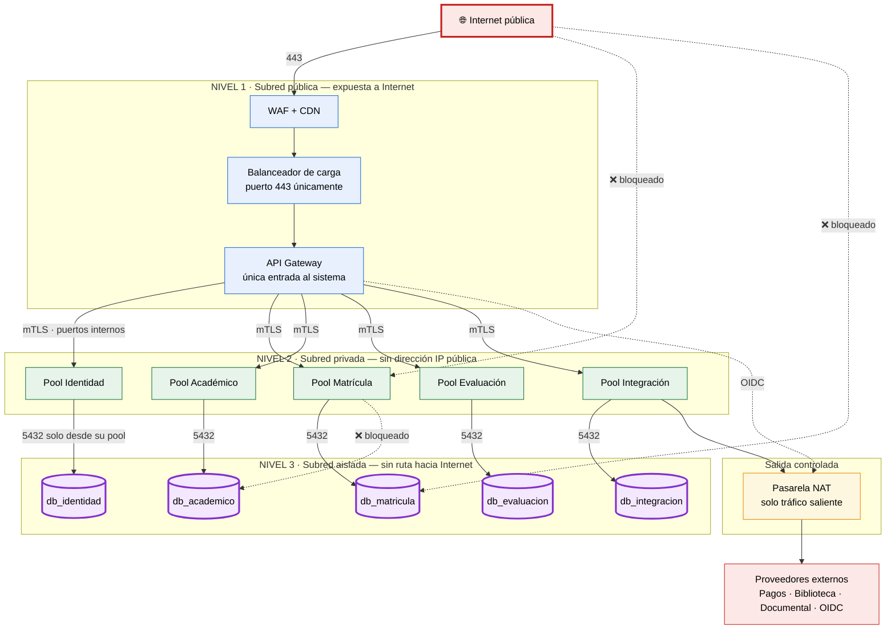
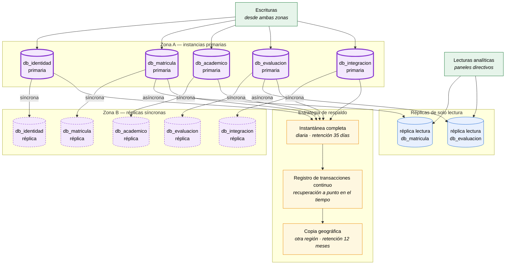
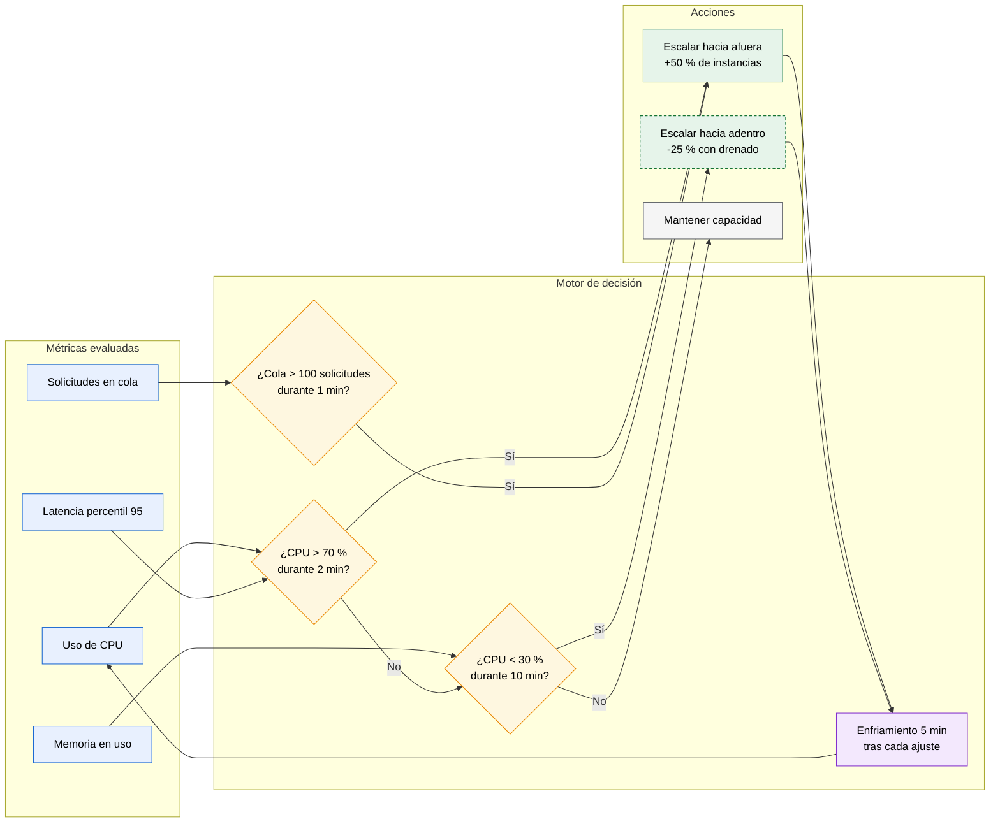
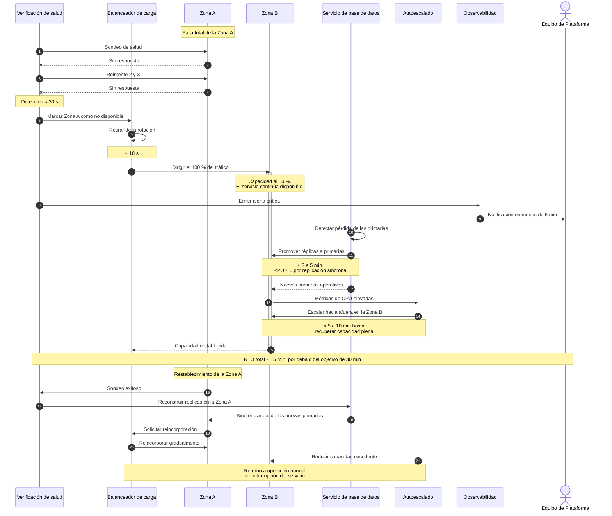

# Vista 4 — Física (Despliegue)

> **Modelo 4+1 · Vista Física.** Mapea los artefactos de software sobre nodos de infraestructura reales: servidores, zonas de disponibilidad, redes, bases de datos, servicios gestionados y clientes. Es la única vista que puede demostrar el cumplimiento de los requisitos de disponibilidad, escalabilidad y resiliencia. Su destinatario es el equipo de plataforma y operaciones.

**Cobertura:** despliegue multi-zona · segmentación de red · topología de datos · autoescalado · canalización de despliegue · recuperación ante fallos. **Total: 6 diagramas.**

---

## Convención de notación

Mermaid.js no implementa el diagrama UML de despliegue. Se emplea `flowchart` con esta convención:

| Elemento UML | Representación |
|---|---|
| Nodo de ejecución | `subgraph` con estereotipo |
| Artefacto desplegado | Rectángulo con extensión de archivo |
| Base de datos | Nodo cilíndrico `[( )]` |
| Servicio gestionado | Rectángulo con estereotipo *managed* |
| Canal de comunicación | Flecha etiquetada con el protocolo |
| Frontera de red | `subgraph` anidado con color según nivel de exposición |

---

## 1. Diagrama de despliegue general

```mermaid
flowchart TB
    subgraph CLI["Nodos cliente"]
        direction LR
        N1["Navegador de escritorio<br/><i>SPA · HTTPS/TLS 1.2+</i>"]:::cli
        N2["Navegador móvil<br/><i>web adaptativa</i>"]:::cli
        N3["Estación administrativa<br/><i>Tesorería · Seguridad</i>"]:::cli
    end

    INET["Internet pública"]:::net

    subgraph EDGE["Nodo de borde global · servicio gestionado"]
        direction LR
        E1["CDN<br/><i>recursos estáticos de la SPA</i>"]:::edge
        E2["WAF<br/><i>reglas OWASP Top 10</i>"]:::edge
        E3["Certificado TLS gestionado<br/><i>renovación automática</i>"]:::edge
        E4["Protección contra denegación<br/>de servicio"]:::edge
    end

    subgraph REG["Región cloud · Colombia / LATAM"]
        direction TB

        subgraph PUB["Subred pública"]
            direction LR
            LB["Balanceador de carga<br/><i>gestionado · multizona</i><br/>verificación de salud cada 10 s<br/>terminación TLS"]:::pub
            GWN["Nodo API Gateway<br/><i>PaaS · autoescalado 2-8</i><br/><b>gateway.jar</b>"]:::pub
        end

        subgraph AZA["Zona de Disponibilidad A"]
            direction TB
            subgraph APPA["Plan de servicio · subred privada A"]
                direction LR
                PA1["Pool Identidad<br/><b>identidad.jar</b><br/><i>2 a 6 instancias</i>"]:::app
                PA2["Pool Matrícula<br/><b>matricula.jar</b><br/><i>4 a 40 instancias</i>"]:::app
                PA3["Pool Académico<br/><b>academico.jar</b><br/><i>2 a 10 instancias</i>"]:::app
                PA4["Pool Evaluación<br/><b>evaluacion.jar</b><br/><i>2 a 12 instancias</i>"]:::app
                PA5["Pool Integración<br/><b>integracion.jar</b><br/><i>2 a 10 instancias</i>"]:::app
            end
            subgraph DBA["Subred aislada A"]
                direction LR
                DA1[("db_identidad<br/><i>primaria</i>")]:::dbp
                DA2[("db_matricula<br/><i>primaria</i>")]:::dbp
                DA3[("db_academico<br/><i>primaria</i>")]:::dbp
                DA4[("db_evaluacion<br/><i>primaria</i>")]:::dbp
                DA5[("db_integracion<br/><i>primaria</i>")]:::dbp
            end
        end

        subgraph AZB["Zona de Disponibilidad B"]
            direction TB
            subgraph APPB["Plan de servicio · subred privada B"]
                direction LR
                PB1["Pool Identidad<br/><b>identidad.jar</b><br/><i>2 a 6 instancias</i>"]:::app
                PB2["Pool Matrícula<br/><b>matricula.jar</b><br/><i>4 a 40 instancias</i>"]:::app
                PB3["Pool Académico<br/><b>academico.jar</b><br/><i>2 a 10 instancias</i>"]:::app
                PB4["Pool Evaluación<br/><b>evaluacion.jar</b><br/><i>2 a 12 instancias</i>"]:::app
                PB5["Pool Integración<br/><b>integracion.jar</b><br/><i>2 a 10 instancias</i>"]:::app
            end
            subgraph DBB["Subred aislada B"]
                direction LR
                DB1[("db_identidad<br/><i>réplica síncrona</i>")]:::dbr
                DB2[("db_matricula<br/><i>réplica síncrona</i>")]:::dbr
                DB3[("db_academico<br/><i>réplica síncrona</i>")]:::dbr
                DB4[("db_evaluacion<br/><i>réplica síncrona</i>")]:::dbr
                DB5[("db_integracion<br/><i>réplica síncrona</i>")]:::dbr
            end
        end

        subgraph SVC["Servicios gestionados regionales"]
            direction LR
            MQ["Cola de mensajes<br/><i>replicada entre zonas</i>"]:::svc
            OBS["Consola de observabilidad<br/><i>registros · métricas · alertas</i>"]:::svc
            VLT["Gestor de secretos<br/><i>credenciales · claves</i>"]:::svc
            BKP["Almacenamiento de respaldos<br/><i>cifrado · recuperación puntual</i>"]:::svc
        end
    end

    subgraph EXTP["Proveedores externos"]
        direction LR
        X1["Proveedor OIDC"]:::ext
        X2["Pasarela de Pagos"]:::ext
        X3["Biblioteca Digital"]:::ext
        X4["Gestión Documental"]:::ext
    end

    N1 --> INET
    N2 --> INET
    N3 --> INET
    INET -->|HTTPS 443| EDGE
    EDGE -->|HTTPS| LB
    LB --> GWN
    GWN -->|REST interno mTLS| APPA
    GWN -->|REST interno mTLS| APPB
    GWN -.valida token.-> X1

    PA1 --> DA1
    PA2 --> DA2
    PA3 --> DA3
    PA4 --> DA4
    PA5 --> DA5

    PB1 -.escritura a primaria.-> DA1
    PB2 -.escritura a primaria.-> DA2
    PB3 -.escritura a primaria.-> DA3
    PB4 -.escritura a primaria.-> DA4
    PB5 -.escritura a primaria.-> DA5

    DA1 <-->|replicación síncrona| DB1
    DA2 <-->|replicación síncrona| DB2
    DA3 <-->|replicación síncrona| DB3
    DA4 <-->|replicación síncrona| DB4
    DA5 <-->|replicación síncrona| DB5

    APPA --> MQ
    APPB --> MQ
    APPA -.telemetría.-> OBS
    APPB -.telemetría.-> OBS
    GWN -.telemetría.-> OBS
    APPA -.credenciales.-> VLT
    APPB -.credenciales.-> VLT
    DBA -.respaldo continuo.-> BKP
    DBB -.respaldo continuo.-> BKP

    PA5 -->|REST + CircuitBreaker| X2
    PA5 --> X3
    PA5 --> X4
    PB5 -->|REST + CircuitBreaker| X2
    PB5 --> X3
    PB5 --> X4

    classDef cli fill:#F5F5F5,stroke:#5F6368,color:#000
    classDef net fill:#FFFFFF,stroke:#5F6368,color:#000
    classDef edge fill:#E8F0FE,stroke:#1967D2,color:#000
    classDef pub fill:#E8F0FE,stroke:#1967D2,stroke-width:2px,color:#000
    classDef app fill:#E6F4EA,stroke:#137333,color:#000
    classDef dbp fill:#F3E8FD,stroke:#8430CE,stroke-width:2px,color:#000
    classDef dbr fill:#F3E8FD,stroke:#8430CE,stroke-dasharray:4 3,color:#000
    classDef svc fill:#FEF7E0,stroke:#EA8600,color:#000
    classDef ext fill:#FCE8E6,stroke:#C5221F,color:#000
```

### Justificación

**Dos zonas de disponibilidad en configuración activo-activo, no activo-pasivo.** Ambas zonas reciben tráfico permanentemente a través del balanceador. Un esquema activo-pasivo dejaría capacidad ociosa pagada durante todo el año y, más grave, la zona pasiva estaría fría y no probada el día que se necesite. Con activo-activo, la falla de una zona reduce la capacidad a la mitad pero **no produce indisponibilidad**, que es lo que exige el objetivo de 99,9 %.

**Escritura siempre contra la instancia primaria; la réplica existe para promoción.** Se descarta deliberadamente una configuración multi-maestro. Un sistema de cupos limitados con escritura en dos maestros produce conflictos de reserva irresolubles: dos estudiantes obtendrían el mismo último lugar. La primaria única preserva la consistencia que RF-02 exige, y la replicación síncrona ofrece un RPO cercano a cero sin sacrificarla. El costo aceptado es latencia de escritura entre zonas, del orden de milisegundos dentro de una misma región.

**El mismo artefacto se despliega en ambas zonas.** `matricula.jar` es binariamente idéntico en A y en B; solo cambia la configuración inyectada. Cualquier diferencia entre zonas sería un fallo latente que se manifestaría durante una conmutación — el peor momento posible para descubrirlo.

**Cola y observabilidad son servicios regionales, no por zona.** Si la cola viviera dentro de la zona A, su caída perdería los mensajes de reconciliación de pago y la garantía de resiliencia se rompería justo cuando más se necesita. Lo mismo aplica a la observabilidad: un sistema de monitoreo que muere con la zona que debía vigilar es inútil por definición.

---

## 2. Segmentación de red y superficie de exposición

### Reglas de red aplicadas

| Origen | Destino | Puerto | Estado |
|---|---|---|---|
| Internet | Balanceador | 443 | ✅ Permitido |
| Internet | Pools de aplicación | cualquiera | ❌ Bloqueado |
| Internet | Bases de datos | cualquiera | ❌ Bloqueado |
| API Gateway | Pools de aplicación | interno mTLS | ✅ Permitido |
| Pool X | Base de datos X | 5432 | ✅ Permitido |
| Pool X | Base de datos Y | 5432 | ❌ Bloqueado |
| Pool Integración | NAT → Internet | 443 saliente | ✅ Permitido |
| Otros pools | NAT → Internet | cualquiera | ❌ Bloqueado |
| Bases de datos | Internet | cualquiera | ❌ Bloqueado |

### Justificación

**Los tres niveles de red convierten reglas de código en imposibilidades físicas.** La regla R7 de la [Vista de Desarrollo](04-vista-desarrollo.md) —"ningún módulo expone puerto público"— es una convención que un desarrollador podría violar por descuido. La segmentación de red hace que, aunque alguien publicara accidentalmente un endpoint sin autenticación, **no fuera alcanzable desde fuera**. La seguridad se sostiene por doble barrera: control de acceso en el Gateway y aislamiento de red por debajo.

**La regla R6 —una base de datos por módulo— también se aplica a nivel de red.** El pool de Matrícula no puede alcanzar `db_academico` ni siquiera si su código lo intentara. Esto elimina la vía más común de erosión arquitectónica: la consulta cruzada "temporal" que nunca se retira.

**Solo el pool de Integración tiene salida a Internet.** Los demás módulos no pueden contactar servicios externos aunque su código lo intentara. Esto refuerza a nivel de infraestructura la decisión de RF-05 de concentrar los adaptadores externos en un solo módulo, y reduce drásticamente la superficie de exfiltración en caso de compromiso.

---

## 3. Topología de datos, replicación y respaldo

### Objetivos de continuidad por módulo

| Base de datos | Criticidad | Replicación | RPO objetivo | RTO objetivo |
|---|---|---|---|---|
| `db_identidad` | Crítica — bloquea todo el sistema | Síncrona | ≈ 0 | < 15 min |
| `db_matricula` | Crítica — proceso de negocio central | Síncrona + lectura | ≈ 0 | < 15 min |
| `db_academico` | Alta — bloquea matrícula y evaluación | Síncrona | ≈ 0 | < 20 min |
| `db_evaluacion` | Media — tolera indisponibilidad breve | Síncrona + lectura | ≈ 0 | < 30 min |
| `db_integracion` | Alta — afecta pagos y certificados | Síncrona | ≈ 0 | < 20 min |

### Justificación

**Réplicas de lectura solo para Matrícula y Evaluación.** Son las dos bases con mayor volumen de consultas analíticas: expedientes para paneles directivos e históricos de calificaciones. Dirigir esas lecturas a una réplica asíncrona evita que la analítica compita por recursos con la operación transaccional durante el periodo de inscripciones. Las demás bases no justifican el costo adicional.

**Replicación síncrona para la réplica de conmutación, asíncrona para las de lectura.** La distinción es deliberada: la conmutación exige RPO cercano a cero y acepta el costo de latencia; la analítica tolera perfectamente unos segundos de retraso y no debe penalizar las escrituras.

**Copia geográfica en otra región con retención de 12 meses.** Protege contra la pérdida completa de una región y contra la corrupción lógica descubierta tardíamente —por ejemplo, una migración defectuosa detectada semanas después—. La replicación síncrona no protege contra este segundo caso: replica fielmente el error.

---

## 4. Configuración de autoescalado

### Parámetros por módulo

| Módulo | Mínimo | Máximo | Umbral de crecimiento | Justificación del rango |
|---|---|---|---|---|
| **API Gateway** | 2 | 8 | CPU 60 % | Toda petición pasa por él; umbral más bajo para anticiparse |
| **Identidad** | 2 | 6 | CPU 70 % | Picos en inicio de sesión, resueltos con caché de sesión |
| **Matrícula** | 4 | 40 | CPU 70 % o cola > 100 | Módulo del pico estacional; rango más amplio del sistema |
| **Académico** | 2 | 10 | CPU 70 % | Consultado por Matrícula durante el pico, con carga proporcional |
| **Evaluación** | 2 | 12 | CPU 70 % | Su pico es el cierre de notas, desfasado del de matrícula |
| **Integración** | 2 | 10 | CPU 70 % | Limitado además por la capacidad de los proveedores externos |

### Justificación

**Los rangos son deliberadamente asimétricos, y esa asimetría es la refutación del problema heredado.** En el sistema monolítico, escalar significaba replicar la aplicación completa por culpa de un solo módulo saturado. Aquí, el primer día de inscripciones el pool de Matrícula crece hasta diez veces mientras Evaluación permanece en su base — y un docente consultando notas no percibe ninguna degradación.

**El mínimo de 2 instancias en todos los pools no es capacidad, es tolerancia a fallo.** Garantiza al menos una instancia viva por zona de disponibilidad: si una zona cae, el servicio continúa.

**Umbrales asimétricos entre crecer y reducir.** Escalar hacia arriba es agresivo (70 % durante 2 minutos) porque el costo de sub-aprovisionar es la caída del servicio en el día más visible del año. Escalar hacia abajo es conservador (30 % durante 10 minutos) porque el costo de mantener capacidad extra unos minutos es marginal frente al riesgo de un segundo pico.

**El drenado elegante al reducir es obligatorio.** Retirar una instancia con peticiones en vuelo dejaría matrículas a medio procesar en estados inconsistentes. El procedimiento —dejar de recibir tráfico nuevo, terminar lo en curso, luego apagar— es lo que hace seguro el escalado para un proceso transaccional.

**El módulo de Integración está limitado también por terceros.** Escalarlo a 40 instancias no aumentaría el rendimiento si la pasarela de pagos solo admite un número acotado de conexiones concurrentes; solo provocaría que el Circuit Breaker se abriera antes.

---

## 5. Canalización de despliegue

```mermaid
flowchart LR
    subgraph DEV["Desarrollo"]
        direction TB
        D1["Rama de característica"]:::dev
        D2["Solicitud de integración"]:::dev
    end

    subgraph CI["Integración continua"]
        direction TB
        C1["Compilar módulo<br/>afectado"]:::ci
        C2["Pruebas unitarias<br/>del dominio"]:::ci
        C3["Reglas arquitectónicas<br/>R1 a R8"]:::arch
        C4["Pruebas de integración"]:::ci
        C5["Pruebas de contrato"]:::ci
        C6["Análisis de seguridad"]:::ci
        C7["Publicar artefacto<br/>versionado"]:::ci
    end

    subgraph ENV["Ambientes"]
        direction TB
        E1["Desarrollo<br/><i>zona única</i>"]:::env
        E2["Preproducción<br/><i>espejo de producción</i>"]:::env
        E3["Producción<br/><i>multizona</i>"]:::prod
    end

    subgraph DEP["Estrategia de despliegue en producción"]
        direction TB
        P1["Despliegue azul-verde<br/>por módulo"]:::dep
        P2["Verificación de salud<br/>del nuevo conjunto"]:::dep
        P3{"¿Métricas<br/>correctas?"}:::dec
        P4["Conmutar tráfico<br/>gradualmente"]:::dep
        P5["Reversión automática<br/>al conjunto anterior"]:::err
    end

    D1 --> D2 --> C1 --> C2 --> C3
    C3 -->|Cumple| C4 --> C5 --> C6 --> C7
    C3 -->|Viola| FAIL["Build fallido"]:::err
    C7 --> E1 --> E2 --> E3
    E3 --> P1 --> P2 --> P3
    P3 -->|Sí| P4
    P3 -->|No| P5

    classDef dev fill:#F5F5F5,stroke:#5F6368,color:#000
    classDef ci fill:#E8F0FE,stroke:#1967D2,color:#000
    classDef arch fill:#FEF7E0,stroke:#EA8600,stroke-width:3px,color:#000
    classDef env fill:#E6F4EA,stroke:#137333,color:#000
    classDef prod fill:#E6F4EA,stroke:#137333,stroke-width:3px,color:#000
    classDef dep fill:#F3E8FD,stroke:#8430CE,color:#000
    classDef dec fill:#FEF7E0,stroke:#EA8600,color:#000
    classDef err fill:#FCE8E6,stroke:#C5221F,color:#000
```

### Justificación

**Solo se compila y despliega el módulo afectado.** Es el beneficio operativo directo de la arquitectura modular: un cambio en Evaluación no requiere probar ni redesplegar Matrícula. Esto resuelve el problema heredado de *Acoplamiento Estructural*, donde cualquier cambio obligaba a validar la aplicación completa.

**Despliegue azul-verde por módulo con reversión automática.** Se levanta el conjunto nuevo en paralelo, se verifica su salud y solo entonces se conmuta el tráfico gradualmente. Si las métricas se degradan, la reversión es inmediata porque el conjunto anterior sigue activo. Durante el periodo de matrícula esta capacidad es indispensable: un despliegue defectuoso a las 8 de la mañana del primer día de inscripciones debe poder revertirse en segundos, no en el tiempo de un redespliegue.

**Las credenciales nunca viajan en el artefacto.** Se inyectan desde el gestor de secretos en tiempo de ejecución. Los artefactos son idénticos entre ambientes; solo cambia la configuración. Esto permite rotar credenciales sin redesplegar y cumple los requisitos de protección de datos de la normativa aplicable.

---

## 6. Procedimiento de conmutación ante falla de zona

### Verificación de objetivos de continuidad

| Etapa | Tiempo estimado |
|---|---|
| Detección de la falla por verificación de salud | ≈ 30 s |
| Retiro de la zona de la rotación del balanceador | ≈ 10 s |
| Promoción de réplicas a primarias | 3 – 5 min |
| Recuperación de capacidad por autoescalado | 5 – 10 min |
| **RTO total** | **≈ 15 min** ✅ (objetivo < 30 min) |
| **RPO** por replicación síncrona | **≈ 0** ✅ (objetivo < 15 min) |

### Justificación

**El servicio nunca queda indisponible, solo degradado.** Entre la detección y la promoción de réplicas, la Zona B sigue atendiendo tráfico con capacidad reducida. Esta es la diferencia práctica entre una arquitectura activo-activo y una activo-pasivo: en la segunda, los mismos 15 minutos habrían sido de caída total.

**La reincorporación de la zona restablecida es gradual.** Devolver el 50 % del tráfico de golpe a instancias recién levantadas, con cachés vacías y conexiones frías, produciría una degradación visible. La reincorporación progresiva permite que las instancias se calienten.

**El procedimiento no requiere intervención humana para ejecutarse.** El equipo de plataforma recibe la alerta para supervisar y diagnosticar la causa raíz, pero la conmutación es automática. Un procedimiento que dependa de que alguien esté disponible a las 3 de la mañana no puede sustentar un objetivo de 99,9 %.

---

## Mapeo artefacto → nodo → requisito

| Artefacto | Nodo de despliegue | Instancias | Requisitos que satisface |
|---|---|---|---|
| `gateway.jar` | Subred pública, ambas zonas | 2 – 8 | RF-01, RNF-03 |
| `identidad.jar` | Subred privada A y B | 2 – 6 | RF-01 |
| `matricula.jar` | Subred privada A y B | 4 – 40 | RF-02, RNF-02 |
| `academico.jar` | Subred privada A y B | 2 – 10 | RF-03 |
| `evaluacion.jar` | Subred privada A y B | 2 – 12 | RF-04 |
| `integracion.jar` | Subred privada A y B | 2 – 10 | RF-05, RNF-04 |
| 5 bases de datos gestionadas | Subred aislada, primaria + réplica | 1 + 1 cada una | RNF-01, RNF-04 |
| Cola de mensajes | Servicio regional replicado | — | RF-04, RNF-04 |
| Consola de observabilidad | Servicio regional | — | RNF-05 |
| Gestor de secretos | Servicio regional | — | RNF-03 |
| WAF y CDN | Borde global | — | RNF-03 |

---

## Trazabilidad de la Vista Física

| Requisito | Elemento de infraestructura que lo satisface |
|---|---|
| **RNF-01** · Disponibilidad ≥ 99,9 % | Despliegue activo-activo en dos zonas, balanceador con verificación de salud, mínimo 2 instancias por pool |
| **RNF-02** · 15.000 concurrentes | Autoescalado de Matrícula hasta 40 instancias, limitación de tasa en el Gateway, réplicas de lectura |
| **RNF-03** · Seguridad y protección de datos | Segmentación en tres niveles de red, WAF, TLS gestionado, gestor de secretos, mTLS interno |
| **RNF-04** · RTO < 30 min, RPO < 15 min | Replicación síncrona, promoción automática, respaldo continuo, copia geográfica |
| **RNF-05** · Detección < 5 min | Consola de observabilidad regional con telemetría de los seis componentes |
| **Aislamiento entre módulos** | Pools independientes con autoescalado propio, bases de datos separadas, reglas de red por pool |
| **Costos elásticos** | Escalado hacia adentro fuera de los picos, servicios gestionados sin infraestructura propia |

---

## Cierre

Las cinco vistas del modelo 4+1 quedan documentadas con **48 diagramas** y trazabilidad completa hacia los 5 requisitos funcionales, los 5 requisitos no funcionales y los 11 actores identificados. Cada decisión arquitectónica registrada en el documento fuente tiene al menos una representación gráfica verificable en alguna de las vistas.

---

| ← Anterior | Índice | Siguiente → |
|---|---|---|
| [Vista de Desarrollo](04-vista-desarrollo.md) | [README](../README.md) | — |
