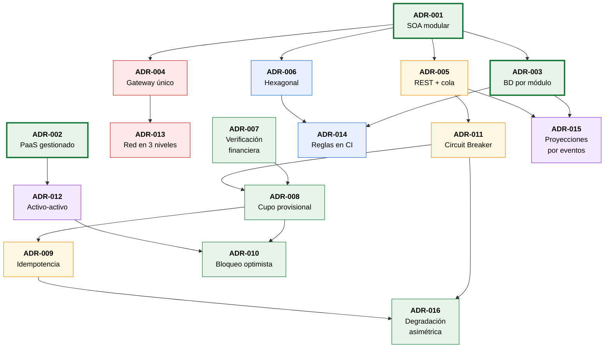

# Decisiones Arquitectónicas (ADR)

> **Architecture Decision Records.** Este documento registra las decisiones arquitectónicas significativas de UPS-Connect siguiendo el formato propuesto por Nygard (2011): qué se decidió, en qué contexto, qué alternativas se descartaron y qué consecuencias —favorables y desfavorables— acarrea cada decisión.

**Cobertura:** 16 decisiones registradas · 1 mapa de dependencias entre decisiones · trazabilidad hacia las cinco vistas.

---

## Propósito

El documento fuente establece que el propósito central de la documentación es *"dejar constancia y trazabilidad de las decisiones arquitectónicas, incluyendo qué se decidió, por qué razón se decidió y qué impacto tiene cada una sobre los requisitos y los atributos de calidad"*. Este registro cumple esa función.

Una decisión arquitectónica se registra aquí cuando es **costosa de revertir**: afecta la estructura del sistema, sus interfaces públicas, su modelo de datos o su topología de despliegue. Las decisiones locales y fácilmente reversibles no se documentan.

### Estados posibles

| Estado | Significado |
|---|---|
| ✅ **Aceptada** | Decisión vigente que gobierna el diseño |
| 🔄 **Sustituida** | Reemplazada por una decisión posterior, se conserva por trazabilidad |
| ⚠️ **En revisión** | Vigente pero con condiciones de reevaluación identificadas |
| ❌ **Rechazada** | Evaluada y descartada, se registra para evitar reabrir el debate |

---

## Tabla 1 · Decisiones arquitectónicas, problema que resuelven y atributos de calidad

Los atributos de calidad se nombran conforme a la norma ISO/IEC 25010:2011, la misma referencia empleada para clasificar los requisitos no funcionales del proyecto.

| ID | Decisión Arquitectónica | Problema que resuelve | Justificación | Atributos de calidad favorecidos |
|---|---|---|---|---|
| **ADR-001** | [Arquitectura SOA modular en lugar de microservicios completos](#adr-001--arquitectura-soa-modular-en-lugar-de-microservicios-completos) | Acoplamiento estructural del sistema heredado: cualquier cambio obliga a probar y desplegar la aplicación completa | La granularidad gruesa (cinco módulos por capacidad de negocio) elimina el acoplamiento sin imponer la complejidad operativa de los microservicios, desproporcionada para el equipo de plataforma de la institución | Modificabilidad · Escalabilidad · Mantenibilidad |
| **ADR-002** | [Plataforma PaaS gestionada en lugar de orquestación propia](#adr-002--plataforma-paas-gestionada-en-lugar-de-orquestación-propia) | Costos fijos de infraestructura dimensionada para el pico máximo y ausencia de escalado elástico | Los mecanismos de alta disponibilidad, autoescalado y replicación se obtienen como servicios gestionados, reduciendo la complejidad operativa sin sacrificar los atributos de calidad prioritarios | Escalabilidad · Disponibilidad · Eficiencia de recursos |
| **ADR-003** | [Una base de datos por módulo](#adr-003--una-base-de-datos-por-módulo) | Superficie de seguridad concentrada en un único esquema con datos académicos, financieros y personales | Fragmentar el almacenamiento acota el impacto de una vulnerabilidad explotada y permite que cada módulo evolucione su esquema sin coordinar con los demás | Seguridad (confidencialidad) · Modificabilidad · Disponibilidad |
| **ADR-004** | [API Gateway como único punto de autenticación](#adr-004--api-gateway-como-único-punto-de-autenticación) | Riesgo de cinco implementaciones divergentes de validación de token y de política RBAC | Una política única y auditable garantiza que la solicitud no autorizada sea rechazada antes de alcanzar el módulo, sin exponer datos y con registro automático de auditoría | Seguridad (autenticidad y responsabilidad) · Mantenibilidad |
| **ADR-005** | [Comunicación híbrida REST síncrono y cola asíncrona](#adr-005--comunicación-híbrida-rest-síncrono-y-cola-asíncrona) | Acoplamiento de disponibilidad entre módulos: un fallo del canal de notificación impediría registrar calificaciones | Cada interacción usa el mecanismo adecuado a su naturaleza: síncrono cuando el emisor necesita la respuesta, asíncrono cuando no depende del resultado | Resiliencia · Disponibilidad · Modificabilidad |
| **ADR-006** | [Arquitectura hexagonal uniforme en los cinco módulos](#adr-006--arquitectura-hexagonal-uniforme-en-los-cinco-módulos) | Rigidez para integrar terceros y heterogeneidad estructural entre módulos desarrollados en paralelo | El dominio sin dependencias externas permite probar las reglas de negocio sin infraestructura, y sustituir un proveedor se reduce a escribir una clase de adaptador | Testabilidad · Modificabilidad · Mantenibilidad |
| **ADR-007** | [Verificación financiera obligatoria en el flujo de matrícula](#adr-007--verificación-financiera-obligatoria-en-el-flujo-de-matrícula) | Desconexión académico-financiera resuelta con validaciones manuales dependientes del personal disponible | Modelarla como relación obligatoria e incondicional elimina por diseño la validación manual: no existe camino de ejecución que confirme una matrícula sin pasar por ella | Corrección funcional · Integridad · Auditabilidad |
| **ADR-008** | [Modo degradado con cupo provisional ante fallo externo](#adr-008--modo-degradado-con-cupo-provisional-ante-fallo-externo) | Dependencia síncrona hacia la pasarela de pagos en el camino crítico de la operación más concurrida del año | El cupo provisional con vencimiento protege al estudiante del fallo ajeno y a la institución del abuso, evitando que la disponibilidad de la plataforma quede acoplada a la de un tercero | Disponibilidad · Resiliencia · Tolerancia a fallos |
| **ADR-009** | [Idempotencia obligatoria en operaciones de escritura](#adr-009--idempotencia-obligatoria-en-operaciones-de-escritura) | La política de reintentos exigida por la resiliencia produce doble cobro y matrículas duplicadas | La clave verificada antes de crear cualquier registro garantiza que N envíos idénticos generen una sola matrícula y un solo cobro, habilitando reintentos seguros en toda la cadena | Integridad · Resiliencia · Corrección funcional |
| **ADR-010** | [Bloqueo optimista para el control de cupos](#adr-010--bloqueo-optimista-para-el-control-de-cupos) | Contención por el último cupo de un grupo bajo 15.000 usuarios concurrentes | Las lecturas ocurren en paralelo y solo la escritura final se serializa, evitando la fila de espera que un bloqueo pesimista impondría a toda la asignatura | Rendimiento · Escalabilidad · Integridad |
| **ADR-011** | [Circuit Breaker centralizado en biblioteca compartida](#adr-011--circuit-breaker-centralizado-en-biblioteca-compartida) | Efecto dominó: los tiempos de espera hacia un tercero caído agotan el pool de conexiones y afectan a funciones no relacionadas | Centralizar la política en una biblioteca compartida la hace uniforme y auditable, e impide que un desarrollador omita la protección; el fail-fast protege a la plataforma del tercero, no al revés | Resiliencia · Disponibilidad · Mantenibilidad |
| **ADR-012** | [Despliegue activo-activo con primaria única de escritura](#adr-012--despliegue-activo-activo-con-primaria-única-de-escritura) | Cumplimiento simultáneo de disponibilidad ≥ 99,9 %, RTO < 30 min y RPO < 15 min sin sacrificar consistencia | La configuración activo-activo evita que la zona de respaldo esté fría y no probada; la primaria única impide los conflictos de reserva irresolubles que produciría un esquema multi-maestro | Disponibilidad · Resiliencia · Recuperabilidad |
| **ADR-013** | [Segmentación de red en tres niveles](#adr-013--segmentación-de-red-en-tres-niveles) | La confianza de los módulos en la identidad validada por el borde solo es segura si ningún módulo es alcanzable desde Internet | Convierte reglas de código en imposibilidades físicas: aunque se publicara un endpoint sin autenticación, no sería alcanzable, y ningún módulo puede acceder a la base de datos de otro | Seguridad (confidencialidad e integridad) |
| **ADR-014** | [Reglas de dependencia verificadas en integración continua](#adr-014--reglas-de-dependencia-verificadas-en-integración-continua) | Erosión arquitectónica por atajos razonables bajo la presión de entrega del periodo de matrícula | Un test que falla es la única barrera que sobrevive a un viernes por la tarde; la arquitectura se vuelve ejecutable y verificable, no solo declarativa | Mantenibilidad · Analizabilidad · Modificabilidad |
| **ADR-015** | [Proyecciones de lectura dirigidas por eventos para analítica](#adr-015--proyecciones-de-lectura-dirigidas-por-eventos-para-analítica) | Los paneles directivos requieren datos de cuatro módulos, pero las consultas cruzadas están prohibidas y competirían con la operación durante el pico | Las proyecciones alimentadas por eventos respetan la frontera de datos por módulo y evitan que la analítica compita por recursos con la operación transaccional | Rendimiento · Escalabilidad · Modificabilidad |
| **ADR-016** | [Modo degradado asimétrico según el costo del error](#adr-016--modo-degradado-asimétrico-según-el-costo-del-error) | Aplicar el modo degradado uniformemente produciría certificados oficiales emitidos sobre información no verificada | El modo degradado se concede según el costo del error: una matrícula provisional se reconcilia sin daño, un documento oficial emitido indebidamente ya circuló y no puede retractarse | Integridad · Corrección funcional · Resiliencia |

---

## Tabla 2 · Decisiones arquitectónicas y requisitos que satisfacen

| Decisión Arquitectónica | Requisitos que satisface |
|---|---|
| **ADR-001** · Arquitectura SOA modular en lugar de microservicios completos | RF-03 · RNF-02 (escalabilidad) · RNF-05 (mantenibilidad) |
| **ADR-002** · Plataforma PaaS gestionada en lugar de orquestación propia | RNF-01 (disponibilidad) · RNF-02 (escalabilidad) |
| **ADR-003** · Una base de datos por módulo | RF-03 · RNF-01 (disponibilidad) · RNF-03 (seguridad) |
| **ADR-004** · API Gateway como único punto de autenticación | RF-01 · RNF-03 (seguridad) |
| **ADR-005** · Comunicación híbrida REST síncrono y cola asíncrona | RF-04 · RNF-04 (resiliencia) |
| **ADR-006** · Arquitectura hexagonal uniforme en los cinco módulos | RF-05 · RNF-05 (mantenibilidad) |
| **ADR-007** · Verificación financiera obligatoria en el flujo de matrícula | RF-02 |
| **ADR-008** · Modo degradado con cupo provisional ante fallo externo | RF-02 · RNF-01 (disponibilidad) · RNF-04 (resiliencia) |
| **ADR-009** · Idempotencia obligatoria en operaciones de escritura | RF-02 · RNF-04 (resiliencia) |
| **ADR-010** · Bloqueo optimista para el control de cupos | RF-02 · RF-03 · RNF-02 (escalabilidad) |
| **ADR-011** · Circuit Breaker centralizado en biblioteca compartida | RF-05 · RNF-01 (disponibilidad) · RNF-04 (resiliencia) |
| **ADR-012** · Despliegue activo-activo con primaria única de escritura | RNF-01 (disponibilidad) · RNF-04 (resiliencia) |
| **ADR-013** · Segmentación de red en tres niveles | RF-01 · RNF-03 (seguridad) |
| **ADR-014** · Reglas de dependencia verificadas en integración continua | RNF-05 (mantenibilidad) |
| **ADR-015** · Proyecciones de lectura dirigidas por eventos para analítica | RF-05 · RNF-02 (escalabilidad) |
| **ADR-016** · Modo degradado asimétrico según el costo del error | RF-05 · RNF-04 (resiliencia) |

**Verificación de cobertura.** Los cinco requisitos funcionales y los cinco no funcionales están cubiertos por al menos una decisión, y las dieciséis decisiones responden a al menos un requisito. No existen decisiones huérfanas ni requisitos sin sustento arquitectónico. La vista inversa —requisito hacia decisiones— se presenta en la [sección de trazabilidad](#trazabilidad-inversa-requisito-hacia-decisiones) al final del documento.

---

## Estado de las decisiones

| ID | Decisión | Estado |
|---|---|---|
| ADR-001 … ADR-016 | Todas las decisiones registradas | ✅ Aceptadas y vigentes |

Ninguna decisión ha sido sustituida ni rechazada hasta la fecha. Las [condiciones de reevaluación](#condiciones-de-reevaluación) que obligarían a revisar decisiones vigentes se detallan al final del documento.

---

## Mapa de dependencias entre decisiones

Una decisión depende de otra cuando su validez presupone que la anterior se mantiene.

**Lectura del mapa.** Las tres decisiones fundacionales —ADR-001, ADR-002 y ADR-003— sostienen a todas las demás. Revertir cualquiera de ellas invalidaría buena parte del registro. Las decisiones periféricas, como ADR-016, pueden reconsiderarse sin efecto sobre el resto.

---

## Registro detallado de decisiones

Las tablas anteriores resumen las dieciséis decisiones. Esta sección desarrolla cada una en formato ADR completo: el contexto que la motivó, **las alternativas evaluadas y el motivo de su descarte**, y las consecuencias tanto favorables como desfavorables que acarrea.

El registro de las alternativas descartadas cumple una función específica: evita que un equipo futuro reabra un debate ya resuelto sin conocer las razones del descarte. El registro de las consecuencias desfavorables cumple otra: ninguna decisión arquitectónica es gratuita, y ocultar su costo impide evaluarla con honestidad.

---

## ADR-001 · Arquitectura SOA modular en lugar de microservicios completos

**Estado:** ✅ Aceptada

### Contexto

La Universidad Pública del Sur opera un sistema monolítico obsoleto cuyos problemas estructurales están documentados: acoplamiento que obliga a desplegar la aplicación completa ante cualquier cambio, fragilidad ante picos donde la saturación de un proceso afecta a los demás, y rigidez para integrar terceros.

La solución evidente es descomponer el sistema. La pregunta real es **hasta qué punto**. Una arquitectura de microservicios completa resolvería estos problemas, pero introduce complejidad operativa considerable: orquestación de contenedores, malla de servicios, descubrimiento dinámico, trazabilidad distribuida y consistencia eventual generalizada.

La institución es una universidad pública con un equipo de plataforma acotado, no una empresa tecnológica con equipos dedicados a infraestructura.

### Decisión

Se adopta una **arquitectura orientada a servicios modular en capas**: cinco módulos de negocio de grano grueso, cada uno con su propia API REST y su propia base de datos, organizados en cuatro capas (Gateway, Aplicación, Comunicación, Datos).

Los módulos se corresponden con capacidades de negocio completas —Identidad, Matrícula, Gestión Académica, Evaluación, Integración— y no con entidades individuales.

### Alternativas consideradas

| Alternativa | Motivo del descarte |
|---|---|
| **Mantener el monolito y refactorizarlo internamente** | No resuelve la fragilidad ante picos ni permite escalar Matrícula sin escalar todo. Los problemas identificados son estructurales, no de calidad interna del código. |
| **Microservicios completos, un servicio por entidad** | Complejidad operativa desproporcionada al contexto institucional. Exigiría orquestación de contenedores, malla de servicios y un equipo de plataforma que la universidad no tiene. Multiplicaría los puntos de fallo sin beneficio proporcional. |
| **Monolito modular con despliegue único** | Preserva la ventaja de simplicidad operativa pero conserva el problema central: no permite escalar ni desplegar módulos de forma independiente. |

### Consecuencias

**Favorables**

- Cada módulo se despliega, prueba y escala de forma independiente, eliminando el acoplamiento estructural heredado.
- El aislamiento por módulo impide que la saturación de Matrícula afecte a Evaluación.
- La granularidad gruesa mantiene un número manejable de unidades desplegables (cinco, no cincuenta).
- Las transacciones que importan quedan contenidas dentro de un módulo, evitando transacciones distribuidas.

**Desfavorables**

- Los módulos son más grandes que un microservicio típico; un cambio dentro de Matrícula sigue requiriendo redesplegar todo el módulo.
- Requiere disciplina para que los módulos no crezcan hasta convertirse en monolitos internos.
- La comunicación entre módulos introduce latencia de red que el monolito no tenía.

### Vistas relacionadas

[Desarrollo](04-vista-desarrollo.md) · [Física](05-vista-fisica.md)

---

## ADR-002 · Plataforma PaaS gestionada en lugar de orquestación propia

**Estado:** ✅ Aceptada

### Contexto

El sistema actual se ejecuta sobre servidores propios dimensionados para el pico máximo de demanda, lo que implica sobrecostos permanentes y dificulta escalar elásticamente. Los objetivos del proyecto exigen disponibilidad ≥ 99,9 %, soporte de 15.000 usuarios concurrentes y RTO < 30 minutos.

Alcanzar esos objetivos con infraestructura propia requeriría construir y operar balanceo de carga, autoescalado, replicación de bases de datos, respaldo continuo y observabilidad centralizada.

### Decisión

Se adopta un modelo **PaaS**: la plataforma cloud gestiona el entorno de ejecución, el autoescalado, el balanceo, la replicación de bases de datos y la cola de mensajes. El equipo de plataforma opera módulos y configuración, no servidores.

### Alternativas consideradas

| Alternativa | Motivo del descarte |
|---|---|
| **IaaS con orquestador de contenedores autogestionado** | Otorga control máximo pero exige operar el plano de control del orquestador, la red de contenedores y el almacenamiento persistente. El costo operativo no se justifica frente al beneficio marginal. |
| **Mantener servidores propios con virtualización** | No resuelve el sobrecosto de dimensionar para el pico ni permite el escalado elástico exigido por el objetivo 3. |
| **Modelo sin servidor puro (FaaS)** | Inadecuado para procesos transaccionales de larga duración y con estado de conexión a base de datos. El arranque en frío degradaría la experiencia justo durante el pico de matrícula. |

### Consecuencias

**Favorables**

- Los mecanismos de disponibilidad y escalabilidad se obtienen como servicios gestionados, reduciendo significativamente la complejidad operativa.
- El costo se vuelve proporcional al uso real, alineado con el objetivo de sostenibilidad.
- El equipo de plataforma se concentra en la aplicación, no en la infraestructura.

**Desfavorables**

- Genera dependencia del proveedor cloud (ver [R-10](07-riesgos-mitigacion.md) en el registro de riesgos).
- Menor control fino sobre el comportamiento del autoescalado y de la replicación.
- Los límites del proveedor —cuotas, tamaños máximos— se convierten en restricciones del sistema.

### Vistas relacionadas

[Física](05-vista-fisica.md)

---

## ADR-003 · Una base de datos por módulo

**Estado:** ✅ Aceptada

### Contexto

En el sistema heredado, un único esquema compartido concentra datos académicos, financieros y personales. Esto produce dos problemas documentados: la superficie de seguridad concentrada, donde cualquier vulnerabilidad explotada compromete todo; y el acoplamiento, donde un cambio de esquema afecta a funcionalidades no relacionadas.

### Decisión

Cada módulo administra **su propia base de datos**, inaccesible para los demás. Toda necesidad de datos ajenos se resuelve por API REST o por proyecciones alimentadas con eventos. Las referencias entre módulos se realizan por identificador (`EstudianteId`, `GrupoId`), nunca por clave foránea.

La restricción se aplica en tres niveles: convención de diseño en la [Vista Lógica](02-vista-logica.md), regla verificada en integración continua (R6) y reglas de red que bloquean el acceso cruzado en la [Vista Física](05-vista-fisica.md).

### Alternativas consideradas

| Alternativa | Motivo del descarte |
|---|---|
| **Base de datos compartida con esquemas separados** | Aparenta separación pero permite consultas cruzadas. La experiencia muestra que la consulta "temporal" entre esquemas nunca se retira y reconstruye el acoplamiento. |
| **Base de datos compartida con vistas de solo lectura** | Acopla los módulos consumidores a la estructura interna del módulo propietario. Un cambio de esquema rompería consumidores invisibles. |
| **Base de datos única con control de acceso por rol de aplicación** | No resuelve el acoplamiento estructural ni permite escalar o respaldar por módulo de forma diferenciada. |

### Consecuencias

**Favorables**

- Cada módulo evoluciona su esquema sin coordinar con los demás.
- La superficie de seguridad se fragmenta: comprometer el módulo de Evaluación no expone datos financieros.
- Permite objetivos de continuidad diferenciados por criticidad de cada base.
- Habilita el despliegue verdaderamente independiente.

**Desfavorables**

- Imposibilita las consultas con `JOIN` entre dominios; los informes transversales requieren composición por API o proyecciones.
- Introduce consistencia eventual entre módulos.
- Aumenta el número de bases a operar, respaldar y monitorear de una a cinco.

### Vistas relacionadas

[Lógica](02-vista-logica.md) · [Desarrollo](04-vista-desarrollo.md) · [Física](05-vista-fisica.md)

---

## ADR-004 · API Gateway como único punto de autenticación

**Estado:** ✅ Aceptada

### Contexto

RF-01 exige autenticación y autorización centralizada para cinco perfiles de usuario sobre cinco módulos. Sin un punto único, cada módulo implementaría su propia validación de tokens y su propia interpretación de RBAC, produciendo políticas divergentes.

El escenario de seguridad exige que un estudiante que manipule una solicitud hacia un endpoint financiero sea rechazado **en menos de 2 segundos y sin que se expongan datos**.

### Decisión

El **API Gateway es el único componente que valida tokens** contra el proveedor OAuth2/OIDC y aplica la política RBAC. Los módulos reciben la identidad ya verificada mediante el contexto que transporta `ups.shared.security`, y no la revalidan.

La biblioteca compartida transporta el contexto pero **no valida**: si validara, cada módulo tendría su propia implementación y la política dejaría de ser única.

### Alternativas consideradas

| Alternativa | Motivo del descarte |
|---|---|
| **Validación de token en cada módulo** | Cinco implementaciones divergentes, cinco puntos de mantenimiento de la política de seguridad y latencia adicional en cada salto. |
| **Malla de servicios con mTLS y política distribuida** | Resuelve el problema pero exige el plano de control que ADR-002 descarta deliberadamente. |
| **Validación en Gateway más revalidación en módulos críticos** | Defensa en profundidad aparente que en la práctica duplica la lógica sin aportar seguridad real, dado que los módulos no son alcanzables desde fuera (ADR-013). |

### Consecuencias

**Favorables**

- Política de acceso única, auditable y modificable en un solo lugar.
- La solicitud no autorizada nunca alcanza el módulo: la barra de activación del módulo ni siquiera se abre.
- Auditoría centralizada de todos los intentos de acceso.

**Desfavorables**

- El Gateway se convierte en punto único de fallo, mitigado con despliegue multizona y mínimo de dos instancias.
- Exige como contrapartida obligatoria que ningún módulo sea alcanzable directamente desde Internet, lo que hace a ADR-013 no opcional.
- La confianza del módulo en el borde es un supuesto que debe protegerse a nivel de red.

### Vistas relacionadas

[Casos de Uso](01-vista-casos-uso.md) · [Procesos](03-vista-procesos.md) · [Física](05-vista-fisica.md)

---

## ADR-005 · Comunicación híbrida REST síncrono y cola asíncrona

**Estado:** ✅ Aceptada

### Contexto

Los módulos necesitan comunicarse, pero con requisitos distintos según el caso. Verificar el cupo de un grupo condiciona si la matrícula puede proceder: el emisor necesita la respuesta. Notificar al estudiante que se publicó una nota no condiciona nada: el registro de la calificación ya ocurrió.

### Decisión

Se adopta un **modelo híbrido** con criterio explícito de elección:

| Situación | Mecanismo |
|---|---|
| El emisor necesita la respuesta para continuar | REST síncrono |
| El emisor no depende del resultado | Cola de mensajes |
| La operación debe sobrevivir a la caída del receptor | Cola de mensajes |
| Se requiere consistencia inmediata | REST síncrono |

### Alternativas consideradas

| Alternativa | Motivo del descarte |
|---|---|
| **Solo REST síncrono** | Acopla la disponibilidad de los módulos: un fallo del servicio de notificaciones impediría registrar calificaciones. Contradice RF-04. |
| **Arquitectura totalmente dirigida por eventos** | Convierte toda consulta en consistencia eventual. Inaceptable para la reserva de cupo, donde una ventana de inconsistencia bajo alta concurrencia produce sobrecupo. |
| **Cola para todo con patrón petición-respuesta** | Añade complejidad y latencia a operaciones que son naturalmente síncronas, sin beneficio. |

### Consecuencias

**Favorables**

- Cada interacción usa el mecanismo adecuado a su naturaleza.
- El registro de notas queda desacoplado del envío de notificaciones, cumpliendo RF-04.
- La cola permite que la reconciliación de pago sobreviva a la caída del módulo.
- El grafo de llamadas síncronas no contiene ciclos, evitando interbloqueos.

**Desfavorables**

- Dos mecanismos que mantener, monitorear y depurar.
- La consistencia eventual en las rutas asíncronas exige diseñar para mensajes duplicados y fuera de orden.
- Requiere cola de mensajes fallidos y política de reintentos para los mensajes no procesables.

### Vistas relacionadas

[Lógica](02-vista-logica.md) · [Procesos](03-vista-procesos.md) · [Desarrollo](04-vista-desarrollo.md)

---

## ADR-006 · Arquitectura hexagonal uniforme en los cinco módulos

**Estado:** ✅ Aceptada

### Contexto

Cinco módulos desarrollados en paralelo por equipos que rotan pueden derivar en cinco estructuras internas distintas. Además, RF-05 identifica la *Rigidez para Integrar Terceros* como problema: conectar nuevas pasarelas exige modificaciones profundas del núcleo.

### Decisión

Los cinco módulos adoptan la **misma plantilla interna** basada en arquitectura hexagonal: `adapter.in` → `application` (con `port.in`, `service`, `port.out`) → `domain`, y `adapter.out` implementando los puertos de salida.

El paquete `domain` no depende de ningún framework, base de datos, cliente HTTP ni cola. Todas las dependencias apuntan hacia adentro.

### Alternativas consideradas

| Alternativa | Motivo del descarte |
|---|---|
| **Arquitectura en capas tradicional por módulo** | El dominio termina dependiendo de la capa de persistencia, impidiendo probar las reglas de negocio sin base de datos. |
| **Estructura libre por módulo según el equipo** | Maximiza la autonomía pero multiplica el costo de incorporación y de rotación de personal. |
| **Hexagonal solo en los módulos críticos** | La inconsistencia entre módulos resulta más costosa que el supuesto ahorro en los módulos simples. |

### Consecuencias

**Favorables**

- Las reglas de negocio se prueban con tests unitarios puros, sin infraestructura, en milisegundos. Con 15.000 usuarios en juego, poder ejercitar exhaustivamente esas reglas antes del pico es determinante.
- Sustituir un proveedor externo significa escribir una clase en `adapter.out` sin tocar el núcleo, resolviendo la rigidez identificada.
- Un desarrollador que cambia de módulo encuentra la misma estructura.
- Los tres tipos de disparador —HTTP, cola, reloj— convergen en el mismo conjunto de casos de uso, garantizando reglas idénticas.

**Desfavorables**

- Más artefactos por caso de uso: interfaz de puerto, servicio e implementación de adaptador.
- Curva de aprendizaje para desarrolladores acostumbrados a capas tradicionales.
- Puede resultar excesiva en módulos con lógica muy simple.

### Vistas relacionadas

[Desarrollo](04-vista-desarrollo.md)

---

## ADR-007 · Verificación financiera obligatoria en el flujo de matrícula

**Estado:** ✅ Aceptada

### Contexto

El caso de estudio identifica la *Desconexión Académico-Financiera*: actualmente existen validaciones manuales para confirmar si un estudiante está a paz y salvo antes de permitirle acceder a clases o solicitar certificados, lo que genera demoras y depende de la disposición del personal.

### Decisión

La verificación del estado financiero es una relación **`<<include>>`** de los casos de uso de inscripción, modificación y cancelación: parte obligatoria e incondicional del flujo. **No existe camino de ejecución que confirme una matrícula sin pasar por ella.**

Adicionalmente, la modificación de una matrícula confirmada retorna al estado `VERIFICANDO_PAGO` y nunca directo a `CONFIRMADA`, porque agregar asignaturas cambia el valor y **el paz y salvo previo deja de ser válido**.

### Alternativas consideradas

| Alternativa | Motivo del descarte |
|---|---|
| **Verificación como `<<extend>>` opcional** | Permitiría configurar excepciones que en la práctica reproducirían la validación manual actual. |
| **Verificación posterior por proceso nocturno** | Permitiría que un estudiante moroso ocupara un cupo durante días antes de la detección. |
| **Verificación solo en la inscripción inicial** | Deja abierta la vía de modificar la matrícula para eludir el control, reabriendo el problema por la puerta de atrás. |

### Consecuencias

**Favorables**

- Elimina por diseño la validación manual y su dependencia del personal disponible.
- La regla es estructural, no configurable: no puede desactivarse por conveniencia operativa.
- Trazabilidad completa de cada verificación para auditoría de tesorería.

**Desfavorables**

- Introduce una dependencia síncrona hacia un servicio externo en el camino crítico de la operación más concurrida del año. Esta consecuencia es precisamente lo que ADR-008 debe resolver.
- Aumenta la latencia de la inscripción.

### Vistas relacionadas

[Casos de Uso](01-vista-casos-uso.md) · [Lógica](02-vista-logica.md) · [Procesos](03-vista-procesos.md)

---

## ADR-008 · Modo degradado con cupo provisional ante fallo externo

**Estado:** ✅ Aceptada

### Contexto

ADR-007 introduce una dependencia síncrona hacia la pasarela de pagos en el camino crítico de la matrícula. El escenario de disponibilidad plantea exactamente esta situación: el servicio de pagos externo deja de responder durante el periodo oficial de matrícula, con miles de estudiantes conectados.

Las dos respuestas ingenuas son inaceptables. Rechazar la matrícula acopla la disponibilidad de UPS-Connect a la de un tercero. Confirmarla sin verificar reintroduce el problema que ADR-007 resuelve.

### Decisión

Ante un fallo del servicio financiero:

1. La matrícula se persiste en estado `PENDIENTE_PAGO` con el estado financiero marcado como **degradado**.
2. El cupo se reserva de forma **provisional con vencimiento de 72 horas**, no en firme.
3. Se encola una tarea de reconciliación que reintenta con retroceso exponencial.
4. El estudiante recibe `202 Accepted`, no `500`.
5. Si la ventana se agota, la matrícula expira y **el cupo se libera automáticamente**.

### Alternativas consideradas

| Alternativa | Motivo del descarte |
|---|---|
| **Rechazar la matrícula con error 500** | La disponibilidad percibida de UPS-Connect quedaría acoplada a la de la pasarela, anulando el objetivo de 99,9 %. |
| **Confirmar la matrícula sin verificar** | Reintroduce la desconexión académico-financiera que ADR-007 elimina. |
| **Reservar el cupo en firme sin vencimiento** | Un estudiante moroso bloquearía un lugar indefinidamente. |
| **No reservar nada y reconciliar después** | El estudiante perdería el cupo por un fallo que no es suyo. |

### Consecuencias

**Favorables**

- El fallo de un tercero no se propaga como fallo al usuario.
- El cupo provisional protege simultáneamente al estudiante del fallo ajeno y a la institución del abuso.
- La expiración automática cierra el ciclo de vida y evita la fuga de cupos.
- Cumple la medida de respuesta: el resto de la plataforma mantiene su disponibilidad y la conciliación se completa en menos de 30 minutos tras el restablecimiento.

**Desfavorables**

- Introduce un estado intermedio que el estudiante debe comprender: "matrícula registrada, pago en verificación".
- Requiere el estado `PENDIENTE_PAGO` con tres salidas y un proceso de expiración programado.
- Durante la degradación, el cupo real disponible es menor al mostrado, pues incluye reservas provisionales.

### Vistas relacionadas

[Lógica](02-vista-logica.md) · [Procesos](03-vista-procesos.md)

---

## ADR-009 · Idempotencia obligatoria en operaciones de escritura

**Estado:** ✅ Aceptada

### Contexto

ADR-008 establece reintentos con retroceso exponencial. Simultáneamente, durante el pico de matrícula el doble clic y el reintento del navegador son masivos: un estudiante nervioso pulsa "matricular" varias veces.

Implementada ingenuamente, la política de reintentos de RNF-04 produciría **doble cobro** al estudiante y matrículas duplicadas. Es un caso donde un requisito de resiliencia genera un defecto financiero.

### Decisión

Toda operación de escritura expuesta al exterior exige una **clave de idempotencia** enviada por el cliente. El módulo verifica esa clave **antes de crear cualquier registro**, y la misma clave se reenvía en cada reintento de reconciliación hacia el servicio externo.

`TransaccionPago` almacena la clave de idempotencia de forma persistente para que los reintentos consulten el estado real en lugar de generar un segundo cobro.

### Alternativas consideradas

| Alternativa | Motivo del descarte |
|---|---|
| **Deduplicación por ventana temporal** | Frágil: dos solicitudes legítimas dentro de la ventana se descartarían, y dos duplicadas fuera de ella pasarían. |
| **Bloqueo de la interfaz tras el primer clic** | Solo mitiga el caso del navegador; no protege contra reintentos de red ni de la cola. |
| **Verificación de idempotencia después de crear el registro** | Deja una ventana de carrera que produce duplicados precisamente bajo alta concurrencia, cuando más daño hace. |

### Consecuencias

**Favorables**

- N envíos idénticos producen una sola matrícula y un solo cobro.
- Habilita reintentos seguros en toda la cadena, requisito de ADR-008 y ADR-011.
- Permite responder al cliente con el resultado original ante un reintento, en lugar de un error.

**Desfavorables**

- Obliga al cliente a generar y conservar la clave.
- Requiere almacenamiento y política de retención de las claves procesadas.
- Añade una consulta previa a cada operación de escritura.

### Vistas relacionadas

[Lógica](02-vista-logica.md) · [Procesos](03-vista-procesos.md)

---

## ADR-010 · Bloqueo optimista para el control de cupos

**Estado:** ✅ Aceptada

### Contexto

RNF-02 exige soportar 15.000 usuarios concurrentes con degradación no mayor al 20 %. El cupo de un grupo es un recurso escaso disputado simultáneamente: N estudiantes compiten por el último lugar.

### Decisión

El control de cupo usa **bloqueo optimista** mediante un contador de versión en `Grupo`. Las lecturas ocurren en paralelo sin bloqueo; solo la escritura final se serializa mediante `UPDATE ... WHERE version = N`, que afecta cero filas si otra transacción ya incrementó la versión.

El contador de cupo reside en `Grupo` y no en `Asignatura`, porque de lo contrario toda la asignatura sería un punto único de serialización global.

### Alternativas consideradas

| Alternativa | Motivo del descarte |
|---|---|
| **Bloqueo pesimista sobre el grupo** | Serializaría a todos los estudiantes que intentan matricular esa asignatura. Con 15.000 concurrentes, la fila de espera haría inviable la degradación ≤ 20 %. |
| **Contador distribuido en caché** | Introduce una segunda fuente de verdad susceptible de divergir de la base de datos ante un fallo de la caché. |
| **Aceptar sobrecupo y corregir después** | Inaceptable: el cupo está limitado por la capacidad física del aula asignada. |

### Consecuencias

**Favorables**

- Las lecturas de disponibilidad no se bloquean entre sí, sosteniendo el rendimiento bajo alta concurrencia.
- Exactamente un cupo se asigna, sin sobrecupo ni serialización global.
- El conflicto se convierte en información de negocio válida: el estudiante recibe "el grupo se llenó", no un tiempo de espera agotado.

**Desfavorables**

- Requiere manejar explícitamente el conflicto de versión y reintentar la lectura.
- Bajo contención extrema, algunos usuarios experimentan varios reintentos.
- La lógica de reserva es más compleja que un simple decremento.

### Vistas relacionadas

[Lógica](02-vista-logica.md) · [Procesos](03-vista-procesos.md)

---

## ADR-011 · Circuit Breaker centralizado en biblioteca compartida

**Estado:** ✅ Aceptada

### Contexto

RNF-04 exige aislar el impacto de la falla de un módulo o servicio externo mediante Circuit Breaker y reintentos con retroceso exponencial. El sistema integra tres proveedores externos y varias llamadas entre módulos.

Sin fail-fast, miles de peticiones quedarían esperando tiempos de espera de 3 segundos, agotando el pool de conexiones del módulo de Matrícula y afectando también a estudiantes que solo querían consultar notas.

### Decisión

El Circuit Breaker reside en **`ups.shared.rest`**, no en los adaptadores individuales. Los adaptadores declaran *qué* llaman; la biblioteca compartida decide *cómo* se protege esa llamada. La regla R4 verificada en integración continua exige que **todo cliente HTTP saliente pase por esta biblioteca**.

Se incorpora el estado `SEMIABIERTO` para probar la recuperación con una sola petición antes de reabrir el tráfico completo.

`PoliticaReintento` se modela separada del `CircuitBreaker`: el primero decide *cuándo volver a intentar*, el segundo decide *si vale la pena intentar*.

### Alternativas consideradas

| Alternativa | Motivo del descarte |
|---|---|
| **Circuit Breaker en cada adaptador** | Configuraciones divergentes entre módulos y riesgo de que un desarrollador olvide aplicarlo. |
| **Circuit Breaker en el Gateway únicamente** | No protege las llamadas entre módulos ni hacia servicios externos, que salen desde la capa de aplicación. |
| **Sin estado semiabierto** | Reabrir el tráfico completo saturaría un servicio que apenas se está restableciendo, provocando reapertura inmediata del circuito. |

### Consecuencias

**Favorables**

- La política de resiliencia se configura y audita en un solo lugar.
- El fail-fast protege a UPS-Connect de la degradación del tercero, no al revés.
- Un desarrollador no puede omitir la protección: la regla R4 falla el build.
- Los umbrales se parametrizan por proveedor según su comportamiento real.

**Desfavorables**

- La biblioteca compartida se convierte en dependencia común de todos los módulos; un defecto en ella los afecta a todos.
- Requiere versionado cuidadoso para no forzar actualizaciones simultáneas de los cinco módulos.

### Vistas relacionadas

[Lógica](02-vista-logica.md) · [Procesos](03-vista-procesos.md) · [Desarrollo](04-vista-desarrollo.md)

---

## ADR-012 · Despliegue activo-activo con primaria única de escritura

**Estado:** ✅ Aceptada

### Contexto

RNF-01 exige disponibilidad ≥ 99,9 % y RNF-04 establece RTO < 30 minutos y RPO < 15 minutos. Simultáneamente, ADR-010 requiere consistencia fuerte en el control de cupos.

### Decisión

Las instancias de aplicación se despliegan en **activo-activo** sobre dos zonas de disponibilidad: ambas reciben tráfico permanentemente. Las bases de datos usan **primaria única en la zona A con réplica síncrona en la zona B**, promovible automáticamente.

Se descarta deliberadamente la configuración multi-maestro.

### Alternativas consideradas

| Alternativa | Motivo del descarte |
|---|---|
| **Activo-pasivo** | Deja capacidad ociosa pagada todo el año y, más grave, la zona pasiva estaría fría y no probada el día que se necesite. |
| **Multi-maestro con resolución de conflictos** | Un sistema de cupos limitados con escritura en dos maestros produce conflictos irresolubles: dos estudiantes obtendrían el mismo último lugar. |
| **Réplica asíncrona** | Reduce la latencia de escritura pero eleva el RPO por encima de lo aceptable para datos de matrícula. |

### Consecuencias

**Favorables**

- La falla de una zona reduce la capacidad a la mitad pero **no produce indisponibilidad**.
- RPO cercano a cero por replicación síncrona.
- RTO estimado en 15 minutos, por debajo del objetivo de 30.
- El mismo artefacto se despliega en ambas zonas, eliminando diferencias latentes que se manifestarían durante una conmutación.

**Desfavorables**

- Latencia adicional de escritura entre zonas, del orden de milisegundos dentro de una región.
- Las instancias de la zona B escriben contra la primaria de la zona A, cruzando el límite de zona.
- Costo de mantener capacidad en dos zonas simultáneamente.

### Vistas relacionadas

[Física](05-vista-fisica.md)

---

## ADR-013 · Segmentación de red en tres niveles

**Estado:** ✅ Aceptada

### Contexto

ADR-004 establece que los módulos confían en la identidad validada por el Gateway y no la revalidan. Ese supuesto solo es seguro si **ningún módulo es alcanzable directamente desde Internet**.

La regla R7 de la Vista de Desarrollo expresa esta restricción como convención, pero una convención puede violarse por descuido.

### Decisión

La red se segmenta en tres niveles:

| Nivel | Contenido | Exposición |
|---|---|---|
| **Público** | WAF, balanceador, API Gateway | Internet, puerto 443 |
| **Privado** | Los cinco pools de módulos | Solo desde el Gateway |
| **Aislado** | Las cinco bases de datos | Solo desde su pool propietario |

Adicionalmente, **solo el pool de Integración tiene salida a Internet** a través de la pasarela NAT.

### Alternativas consideradas

| Alternativa | Motivo del descarte |
|---|---|
| **Dos niveles: público y privado** | Deja las bases de datos alcanzables desde cualquier módulo, anulando la aplicación efectiva de ADR-003. |
| **Confiar únicamente en las reglas de código** | Una convención verificada en CI no protege contra un error de configuración de infraestructura. |
| **Salida a Internet para todos los módulos** | Amplía innecesariamente la superficie de exfiltración en caso de compromiso. |

### Consecuencias

**Favorables**

- Convierte reglas de código en **imposibilidades físicas**: aunque alguien publicara un endpoint sin autenticación, no sería alcanzable desde fuera.
- La restricción de una base de datos por módulo se aplica a nivel de red, eliminando la vía más común de erosión arquitectónica.
- Reduce drásticamente la superficie de exfiltración.
- Establece defensa en profundidad: control de acceso en el Gateway más aislamiento de red.

**Desfavorables**

- Mayor complejidad de configuración de red y de reglas de grupo de seguridad.
- La depuración en producción es más difícil al no poder alcanzar directamente un módulo.
- Requiere pasarela NAT y su gestión asociada.

### Vistas relacionadas

[Física](05-vista-fisica.md)

---

## ADR-014 · Reglas de dependencia verificadas en integración continua

**Estado:** ✅ Aceptada

### Contexto

ADR-001, ADR-003 y ADR-006 establecen restricciones estructurales: ningún módulo depende de otro en compilación, el dominio no depende de infraestructura, cada módulo accede solo a su base de datos.

La erosión arquitectónica ocurre por atajos razonables bajo presión de entrega, y el periodo de matrícula es exactamente ese tipo de presión.

### Decisión

Ocho reglas de dependencia se ejecutan como **pruebas automáticas del pipeline**, ubicadas **antes** de las pruebas de integración. Una violación falla el build y bloquea el despliegue.

### Alternativas consideradas

| Alternativa | Motivo del descarte |
|---|---|
| **Documentar las reglas y confiar en la revisión de código** | La revisión humana es inconsistente y cede bajo presión de entrega. |
| **Verificación periódica manual** | Detecta la violación cuando ya se construyó sobre ella. |
| **Ubicar la verificación al final del pipeline** | Desperdicia tiempo de ejecución y permite que el desarrollador siga construyendo sobre una base incorrecta. |

### Consecuencias

**Favorables**

- La arquitectura se vuelve ejecutable y verificable, no solo declarativa.
- Un test que falla es la única barrera que sobrevive a un viernes por la tarde.
- Retroalimentación temprana al desarrollador, antes de invertir esfuerzo.
- Las pruebas de contrato sustituyen la garantía que daba la compilación única del monolito.

**Desfavorables**

- Requiere mantener las reglas cuando la arquitectura evoluciona legítimamente.
- Puede generar fricción si una regla resulta demasiado estricta para un caso válido.
- Las reglas R6 y R7 no son verificables con ArchUnit y requieren auditoría de la infraestructura como código.

### Vistas relacionadas

[Desarrollo](04-vista-desarrollo.md)

---

## ADR-015 · Proyecciones de lectura dirigidas por eventos para analítica

**Estado:** ✅ Aceptada

### Contexto

RF-05 exige paneles de control para directivos con indicadores de ocupación de aulas, riesgo de deserción, tasa de matrícula efectiva y recaudo. Esos datos residen en cuatro módulos distintos, y ADR-003 prohíbe las consultas cruzadas entre bases de datos.

Además, los directivos consultan los paneles precisamente durante el periodo de matrícula, cuando el sistema soporta su máxima carga transaccional.

### Decisión

El módulo de Integración mantiene **proyecciones de lectura alimentadas por eventos** de los demás módulos, mediante `ProyeccionListener`. Los paneles consultan esas proyecciones, no las bases de datos ajenas ni las APIs de los otros módulos en línea.

### Alternativas consideradas

| Alternativa | Motivo del descarte |
|---|---|
| **Consultas en línea a las APIs de cada módulo** | La analítica competiría por recursos con la operación transaccional durante el pico, degradando la matrícula. |
| **Almacén de datos con procesos de extracción nocturnos** | Los indicadores llegarían con un día de retraso, inutilizando las alertas tempranas de deserción. |
| **Réplicas de lectura consultadas directamente por el módulo de analítica** | Violaría ADR-003 al acceder a bases de datos de otros módulos. |

### Consecuencias

**Favorables**

- La analítica no compite por recursos con la operación transaccional.
- Los indicadores se actualizan casi en tiempo real, habilitando alertas tempranas de deserción.
- Respeta la frontera de una base de datos por módulo.
- Añadir un nuevo indicador no requiere modificar los módulos productores.

**Desfavorables**

- Los indicadores presentan consistencia eventual: pueden ir unos segundos por detrás de la realidad.
- Duplica datos, con el costo de almacenamiento asociado.
- Requiere manejar la reconstrucción de proyecciones si se corrompen o si cambia su estructura.

### Vistas relacionadas

[Lógica](02-vista-logica.md) · [Procesos](03-vista-procesos.md) · [Desarrollo](04-vista-desarrollo.md)

---

## ADR-016 · Modo degradado asimétrico según el costo del error

**Estado:** ✅ Aceptada

### Contexto

ADR-008 establece que la matrícula continúa en modo degradado cuando la verificación financiera falla. La pregunta pendiente es si **todas** las operaciones deben comportarse igual ante un fallo del mismo servicio externo.

La emisión de un certificado académico también requiere verificar el paz y salvo. Aplicar la misma regla produciría certificados emitidos sobre información no confirmada.

### Decisión

El modo degradado se concede **en función del costo del error**, no de la conveniencia técnica:

| Operación | Comportamiento ante fallo externo | Razón |
|---|---|---|
| Verificación financiera para matrícula | Continúa degradada, reconcilia después | Una matrícula provisional se corrige sin daño |
| Emisión de certificado académico | Se rechaza con `503` | Un documento oficial emitido indebidamente ya circuló y no puede retractarse |

### Alternativas consideradas

| Alternativa | Motivo del descarte |
|---|---|
| **Modo degradado uniforme para todas las operaciones** | Produciría certificados oficiales sobre información no verificada, con consecuencias legales e institucionales. |
| **Rechazo uniforme ante cualquier fallo externo** | Anularía el beneficio de ADR-008 y acoplaría la matrícula a la disponibilidad de la pasarela. |
| **Emitir el certificado marcado como provisional** | Un documento oficial "provisional" carece de valor para el trámite que motiva su solicitud. |

### Consecuencias

**Favorables**

- Cada operación responde según su naturaleza y su riesgo real.
- Protege la validez institucional de los documentos oficiales.
- Mantiene la resiliencia donde aporta valor y la restringe donde sería perjudicial.

**Desfavorables**

- Introduce una asimetría que debe documentarse y comunicarse, pues puede percibirse como inconsistencia.
- Exige clasificar cada operación nueva según su tolerancia a la degradación.
- Durante una caída prolongada, la emisión de certificados queda indisponible mientras la matrícula continúa.

### Vistas relacionadas

[Procesos](03-vista-procesos.md)

---

## Trazabilidad inversa: requisito hacia decisiones

Vista complementaria a la [Tabla 2](#tabla-2--decisiones-arquitectónicas-y-requisitos-que-satisfacen). Mientras aquella responde *"¿qué requisitos satisface esta decisión?"*, esta responde *"¿qué decisiones sostienen este requisito?"*, que es la lectura necesaria para verificar que ningún requisito quedó sin sustento.

| Requisito | Decisiones que lo satisfacen |
|---|---|
| **RF-01** Identidad y accesos | ADR-004, ADR-013 |
| **RF-02** Matrícula y expediente | ADR-007, ADR-008, ADR-009, ADR-010 |
| **RF-03** Gestión académica | ADR-001, ADR-003, ADR-010 |
| **RF-04** Evaluación y seguimiento | ADR-005 |
| **RF-05** Integración y analítica | ADR-006, ADR-011, ADR-015, ADR-016 |
| **RNF-01** Disponibilidad ≥ 99,9 % | ADR-002, ADR-008, ADR-011, ADR-012 |
| **RNF-02** 15.000 concurrentes | ADR-001, ADR-002, ADR-010, ADR-015 |
| **RNF-03** Seguridad y protección de datos | ADR-003, ADR-004, ADR-013 |
| **RNF-04** Resiliencia, RTO y RPO | ADR-005, ADR-008, ADR-009, ADR-011, ADR-012 |
| **RNF-05** Observabilidad y mantenibilidad | ADR-006, ADR-014 |

**Verificación:** los diez requisitos arquitectónicos están cubiertos por al menos una decisión registrada, y las dieciséis decisiones responden a al menos un requisito. No hay decisiones huérfanas ni requisitos sin sustento arquitectónico.

---

## Condiciones de reevaluación

Las siguientes circunstancias obligarían a revisar decisiones vigentes:

| Circunstancia | Decisiones a reevaluar |
|---|---|
| El número de módulos supera los diez | ADR-001, ADR-005 |
| La institución incorpora un equipo de plataforma dedicado | ADR-002 |
| Se incorpora una segunda región cloud | ADR-012, ADR-013 |
| Un módulo supera el 60 % del código total del sistema | ADR-001 |
| La pasarela de pagos ofrece un modo de verificación asíncrona confiable | ADR-007, ADR-008, ADR-016 |
| El volumen de eventos supera la capacidad de las proyecciones síncronas | ADR-015 |

---

| ← Anterior | Índice | Siguiente → |
|---|---|---|
| [Vista Física](05-vista-fisica.md) | [README](../README.md) | [Riesgos y Mitigación](07-riesgos-mitigacion.md) |
