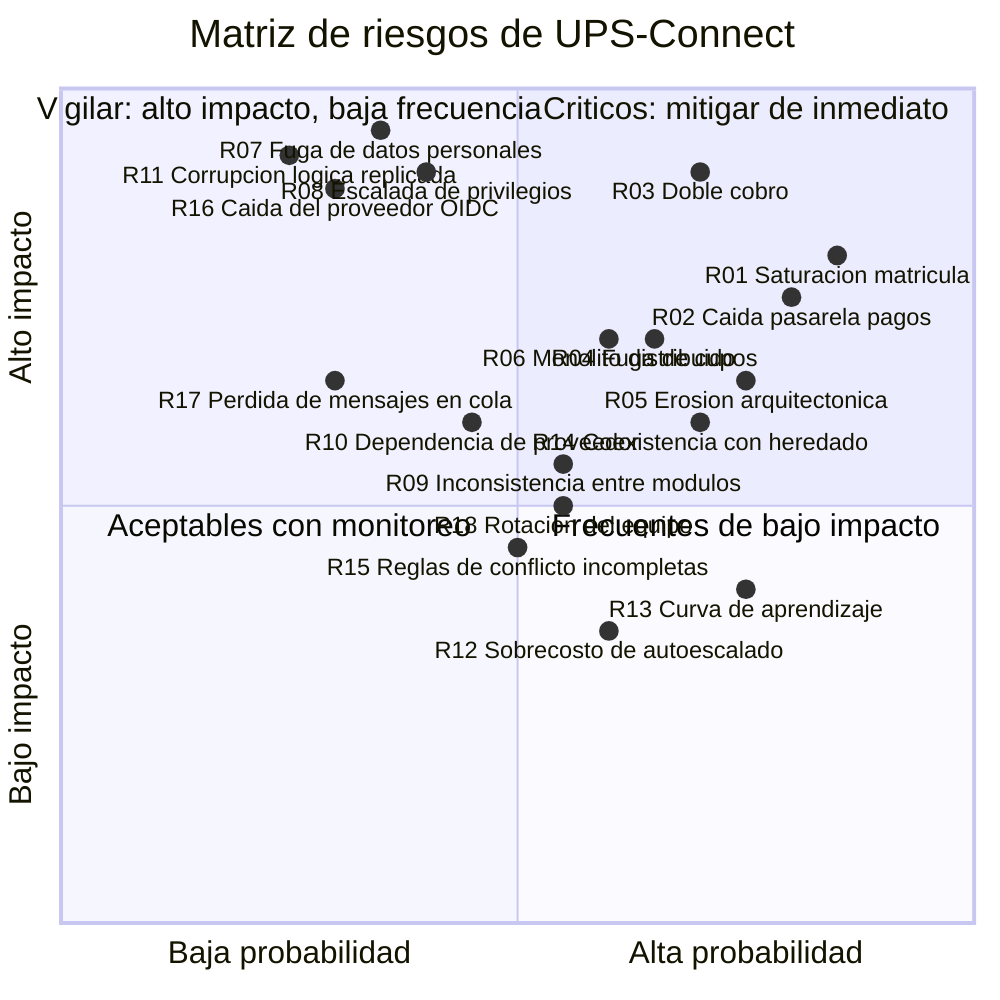
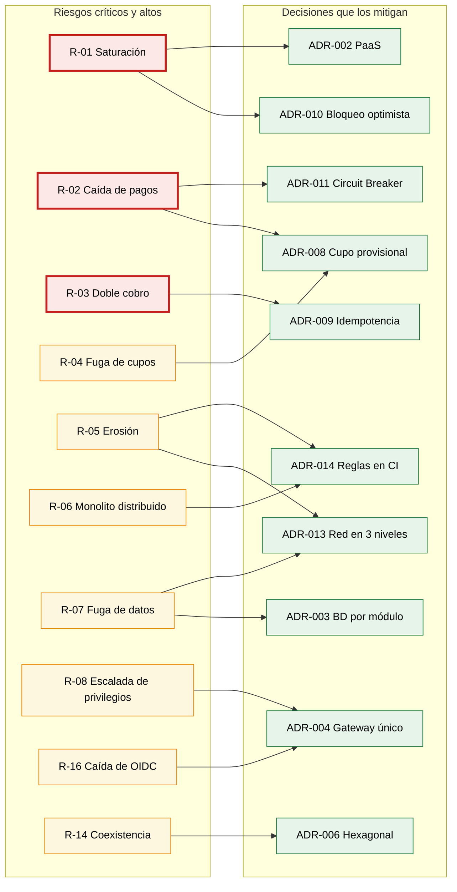
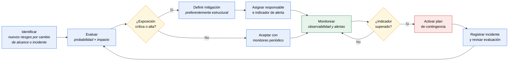

# Riesgos y Estrategias de Mitigación

> Identificación, evaluación y tratamiento de los riesgos que amenazan los objetivos de UPS-Connect. Cada riesgo se vincula con la decisión arquitectónica que lo mitiga y con el indicador que permite detectarlo antes de que se materialice.

**Cobertura:** 18 riesgos registrados · 6 categorías · matriz de exposición · plan de contingencia · riesgos residuales aceptados.

---

## 1. Metodología de evaluación

Se aplica el enfoque de exposición al riesgo, donde **Exposición = Probabilidad × Impacto**.

### Escala de probabilidad

| Nivel | Valor | Criterio |
|---|---|---|
| Muy baja | 1 | Improbable durante la vida del proyecto |
| Baja | 2 | Podría ocurrir una vez |
| Media | 3 | Probable al menos una vez por año académico |
| Alta | 4 | Probable en cada periodo de matrícula |
| Muy alta | 5 | Ocurrirá con certeza si no se mitiga |

### Escala de impacto

| Nivel | Valor | Criterio |
|---|---|---|
| Insignificante | 1 | Molestia menor, sin efecto en objetivos |
| Menor | 2 | Degradación perceptible, sin pérdida de servicio |
| Moderado | 3 | Pérdida parcial de servicio o incumplimiento de un RNF |
| Mayor | 4 | Pérdida de servicio crítico o de datos recuperables |
| Catastrófico | 5 | Pérdida de datos irrecuperable, sanción legal o pérdida de confianza institucional |

### Clasificación de la exposición

| Exposición | Rango | Tratamiento exigido |
|---|---|---|
| 🔴 **Crítica** | 16 – 25 | Mitigación obligatoria antes del despliegue en producción |
| 🟠 **Alta** | 10 – 15 | Mitigación planificada con responsable e indicador asignados |
| 🟡 **Media** | 5 – 9 | Mitigación recomendada, seguimiento periódico |
| 🟢 **Baja** | 1 – 4 | Aceptación consciente con monitoreo |

### Estrategias de tratamiento

| Estrategia | Cuándo aplicarla |
|---|---|
| **Evitar** | Se elimina la causa cambiando el diseño o el alcance |
| **Mitigar** | Se reduce la probabilidad, el impacto o ambos |
| **Transferir** | Se traslada a un tercero mediante contrato, seguro o servicio gestionado |
| **Aceptar** | El costo de mitigar supera la exposición; se monitorea |

---

## 2. Matriz de exposición

> **Nota de lectura.** El cuadrante superior derecho concentra los riesgos que exigen mitigación antes del despliegue. El superior izquierdo agrupa riesgos poco frecuentes pero de impacto severo, donde la inversión se dirige a la detección y al plan de contingencia más que a la prevención.

---

## 3. Registro de riesgos

### Categoría A · Riesgos de disponibilidad y rendimiento

---

#### R-01 · Saturación del módulo de Matrícula durante el pico

| | |
|---|---|
| **Categoría** | Rendimiento |
| **Probabilidad** | Alta (4) |
| **Impacto** | Mayor (4) |
| **Exposición** | 🔴 **16 — Crítica** |
| **Estrategia** | Mitigar |

**Descripción.** Más de 15.000 estudiantes acceden simultáneamente al módulo de Matrícula durante el primer día de inscripciones, superando la capacidad aprovisionada y degradando el tiempo de respuesta por encima del 20 % permitido por RNF-02.

**Causas.** Concentración estacional inherente al calendario académico; el autoescalado tarda decenas de segundos en aprovisionar instancias mientras el pico es instantáneo.

**Mitigación**

1. Limitación de tasa en el API Gateway, que actúa en milisegundos y protege desde el primer instante ([ADR-002](06-decisiones-arquitectonicas.md#adr-002--plataforma-paas-gestionada-en-lugar-de-orquestación-propia)).
2. Autoescalado con umbral agresivo de crecimiento: 70 % de CPU durante 2 minutos, hasta 40 instancias.
3. Aprovisionamiento previo programado: elevar el mínimo de instancias antes del inicio del periodo, sin esperar a que el autoescalado reaccione.
4. Bloqueo optimista para evitar serialización global ([ADR-010](06-decisiones-arquitectonicas.md#adr-010--bloqueo-optimista-para-el-control-de-cupos)).
5. Pruebas de carga con el doble de la concurrencia esperada antes de cada periodo.

**Indicador de alerta temprana.** Percentil 95 de latencia superior a 1,5 veces la línea base durante 60 segundos; profundidad de cola superior a 100 solicitudes.

**Plan de contingencia.** Activar sala de espera virtual con acceso por turnos; elevar manualmente el mínimo de instancias; comunicar a la comunidad universitaria mediante los canales institucionales.

**Responsable.** Equipo de Plataforma.

---

#### R-02 · Indisponibilidad prolongada de la pasarela de pagos

| | |
|---|---|
| **Categoría** | Dependencia de terceros |
| **Probabilidad** | Alta (4) |
| **Impacto** | Mayor (4) |
| **Exposición** | 🔴 **16 — Crítica** |
| **Estrategia** | Mitigar y transferir |

**Descripción.** El servicio de pagos externo deja de responder durante el periodo oficial de matrícula, bloqueando la verificación financiera obligatoria que [ADR-007](06-decisiones-arquitectonicas.md#adr-007--verificación-financiera-obligatoria-en-el-flujo-de-matrícula) introduce en el camino crítico.

**Causas.** Fallo del proveedor externo; saturación del proveedor por concentración de pagos institucionales; corte de conectividad.

**Mitigación**

1. Circuit Breaker con fail-fast: no se intenta la llamada cuando el circuito está abierto, evitando agotar el pool de conexiones ([ADR-011](06-decisiones-arquitectonicas.md#adr-011--circuit-breaker-centralizado-en-biblioteca-compartida)).
2. Modo degradado con cupo provisional de 72 horas y reconciliación asíncrona ([ADR-008](06-decisiones-arquitectonicas.md#adr-008--modo-degradado-con-cupo-provisional-ante-fallo-externo)).
3. Reintentos con retroceso exponencial y clave de idempotencia.
4. Acuerdo de nivel de servicio contractual con el proveedor, con penalizaciones asociadas.
5. Evaluación de un segundo proveedor de pagos como alternativa conmutable.

**Indicador de alerta temprana.** Tasa de error del adaptador de pagos superior al 5 % en ventana de 2 minutos; apertura del circuito.

**Plan de contingencia.** Continuar la matrícula en modo degradado; habilitar registro manual de comprobantes por tesorería; extender la ventana de reconciliación si la caída supera las 72 horas.

**Responsable.** Equipo de Plataforma y Personal de Tesorería.

---

#### R-16 · Indisponibilidad del proveedor de identidad OIDC

| | |
|---|---|
| **Categoría** | Dependencia de terceros |
| **Probabilidad** | Baja (2) |
| **Impacto** | Catastrófico (5) |
| **Exposición** | 🟠 **10 — Alta** |
| **Estrategia** | Mitigar |

**Descripción.** El proveedor de identidad externo deja de responder. Dado que [ADR-004](06-decisiones-arquitectonicas.md#adr-004--api-gateway-como-único-punto-de-autenticación) centraliza la autenticación, ningún usuario puede iniciar sesión y **la plataforma completa queda inaccesible**.

**Causas.** Fallo del proveedor; expiración no advertida de certificados o secretos de cliente; cambio no comunicado en el contrato de la API.

**Mitigación**

1. Caché de sesiones activas: los usuarios ya autenticados continúan operando durante la caída.
2. Tokens de refresco con vigencia extendida para reducir la dependencia de reautenticación.
3. Monitoreo activo del punto de descubrimiento OIDC con sondeo periódico.
4. Alerta automática 30 días antes del vencimiento de certificados y secretos.
5. Procedimiento documentado de autenticación de emergencia para personal crítico.

**Indicador de alerta temprana.** Latencia del proveedor OIDC superior a 2 segundos; tasa de fallo de intercambio de código superior al 2 %.

**Plan de contingencia.** Extender la vigencia de las sesiones activas; habilitar el mecanismo de emergencia para administradores; comunicar la interrupción.

**Responsable.** Administrador de Identidad y Seguridad.

---

#### R-17 · Pérdida de mensajes en la cola

| | |
|---|---|
| **Categoría** | Integridad de datos |
| **Probabilidad** | Baja (2) |
| **Impacto** | Mayor (4) |
| **Exposición** | 🟡 **8 — Media** |
| **Estrategia** | Mitigar |

**Descripción.** Un mensaje `ReconciliarPago` o `EventoNota` se pierde o queda permanentemente sin procesar, dejando una matrícula sin reconciliar o un estudiante sin notificar.

**Causas.** Mensaje mal formado que provoca fallo repetido del consumidor; agotamiento de reintentos; error de configuración de la cola.

**Mitigación**

1. Cola de mensajes fallidos donde se depositan los mensajes no procesables tras agotar reintentos.
2. Confirmación explícita del consumidor solo tras completar el procesamiento.
3. Proceso programado de expiración que actúa como red de seguridad: una matrícula en `PENDIENTE_PAGO` vencida se resuelve aunque su mensaje se haya perdido.
4. Alerta cuando la cola de mensajes fallidos recibe cualquier elemento.
5. Servicio de cola gestionado con replicación entre zonas ([ADR-012](06-decisiones-arquitectonicas.md#adr-012--despliegue-activo-activo-con-primaria-única-de-escritura)).

**Indicador de alerta temprana.** Cualquier mensaje en la cola de fallidos; antigüedad del mensaje más viejo superior a 15 minutos.

**Plan de contingencia.** Reprocesamiento manual desde la cola de fallidos; conciliación por lote contra el extracto de la pasarela.

**Responsable.** Equipo de Plataforma.

---

### Categoría B · Riesgos de integridad y consistencia

---

#### R-03 · Doble cobro por reintentos

| | |
|---|---|
| **Categoría** | Integridad financiera |
| **Probabilidad** | Media (3) |
| **Impacto** | Catastrófico (5) |
| **Exposición** | 🔴 **15 — Crítica** |
| **Estrategia** | Evitar |

**Descripción.** La política de reintentos con retroceso exponencial exigida por RNF-04 provoca que una transacción de pago se ejecute más de una vez, cobrando dos o más veces al estudiante. Es un caso donde **un requisito de resiliencia genera un defecto financiero**.

**Causas.** Reintento tras un tiempo de espera agotado en el que el cargo sí se aplicó; doble envío del formulario por parte del usuario; reprocesamiento de un mensaje de la cola.

**Mitigación**

1. Clave de idempotencia obligatoria en toda operación de escritura, verificada **antes** de crear cualquier registro ([ADR-009](06-decisiones-arquitectonicas.md#adr-009--idempotencia-obligatoria-en-operaciones-de-escritura)).
2. La misma clave se propaga en cada reintento hacia la pasarela externa.
3. Estado `INDETERMINADA` explícito en la máquina de estados de la transacción, resuelto por conciliación en lugar de por reintento ciego.
4. Conciliación diaria contra el extracto de la pasarela.
5. Pruebas específicas de reintento y de mensajes duplicados en el pipeline.

**Indicador de alerta temprana.** Dos transacciones con la misma clave de idempotencia; discrepancia en la conciliación diaria.

**Plan de contingencia.** Reverso automático del cargo duplicado; notificación proactiva al estudiante antes de que reclame; informe a tesorería.

**Responsable.** Equipo de Desarrollo del módulo de Integración y Personal de Tesorería.

---

#### R-04 · Fuga de cupos por matrículas no reconciliadas

| | |
|---|---|
| **Categoría** | Integridad de negocio |
| **Probabilidad** | Media (3) |
| **Impacto** | Mayor (4) |
| **Exposición** | 🟠 **12 — Alta** |
| **Estrategia** | Mitigar |

**Descripción.** Los cupos provisionales retenidos por [ADR-008](06-decisiones-arquitectonicas.md#adr-008--modo-degradado-con-cupo-provisional-ante-fallo-externo) nunca se liberan, reduciendo progresivamente la oferta real disponible mientras los grupos aparentan estar llenos.

**Causas.** Fallo del proceso de expiración; pérdida del mensaje de reconciliación; caída prolongada del servicio de pagos que supera la ventana de 72 horas.

**Mitigación**

1. Vencimiento obligatorio de 72 horas en toda reserva provisional.
2. Proceso programado de expiración independiente del flujo de reconciliación, que actúa aunque el mensaje se haya perdido.
3. El estado `PENDIENTE_PAGO` tiene tres salidas obligatorias: confirmar, expirar y cancelar. Un estado de espera con una sola salida feliz sería una fuga garantizada.
4. Panel operativo con el conteo de cupos provisionales por grupo.
5. Alerta cuando los cupos provisionales superan el 15 % del cupo total de un grupo.

**Indicador de alerta temprana.** Proporción de cupos provisionales sobre cupo total superior al 15 %; matrículas en `PENDIENTE_PAGO` con antigüedad superior a 48 horas.

**Plan de contingencia.** Liberación manual masiva de reservas vencidas; ampliación temporal del cupo del grupo si el aula lo permite.

**Responsable.** Coordinador Académico y Equipo de Plataforma.

---

#### R-09 · Inconsistencia entre módulos por comunicación asíncrona

| | |
|---|---|
| **Categoría** | Consistencia de datos |
| **Probabilidad** | Media (3) |
| **Impacto** | Moderado (3) |
| **Exposición** | 🟡 **9 — Media** |
| **Estrategia** | Mitigar y aceptar parcialmente |

**Descripción.** Las proyecciones de lectura y las notificaciones divergen del estado real por retraso, duplicación o llegada fuera de orden de los eventos. Un panel directivo muestra cifras que no coinciden con la operación.

**Causas.** Consistencia eventual inherente a [ADR-005](06-decisiones-arquitectonicas.md#adr-005--comunicación-híbrida-rest-síncrono-y-cola-asíncrona) y [ADR-015](06-decisiones-arquitectonicas.md#adr-015--proyecciones-de-lectura-dirigidas-por-eventos-para-analítica); reprocesamiento tras un fallo.

**Mitigación**

1. Los eventos incluyen marca temporal e identificador, permitiendo detectar duplicados y desorden.
2. Los consumidores son idempotentes: procesar dos veces el mismo evento no altera el resultado.
3. Los paneles muestran explícitamente la marca de última actualización.
4. Proceso de reconstrucción completa de proyecciones desde el histórico de eventos.
5. Conciliación periódica entre proyecciones y fuentes autoritativas.

**Riesgo residual aceptado.** Un retraso de segundos en los indicadores directivos es tolerable: no se toman decisiones operativas de segundo a segundo sobre estos paneles.

**Indicador de alerta temprana.** Diferencia superior al 2 % entre la proyección y la fuente autoritativa en la conciliación periódica.

**Plan de contingencia.** Reconstrucción de la proyección afectada; presentación temporal de datos consultados en línea con advertencia de rendimiento.

**Responsable.** Equipo de Desarrollo del módulo de Integración.

---

#### R-11 · Corrupción lógica replicada a las réplicas

| | |
|---|---|
| **Categoría** | Integridad de datos |
| **Probabilidad** | Muy baja (1) |
| **Impacto** | Catastrófico (5) |
| **Exposición** | 🟡 **5 — Media** |
| **Estrategia** | Mitigar |

**Descripción.** Una migración defectuosa o un error de aplicación corrompe datos en la instancia primaria. **La replicación síncrona copia fielmente el error a la réplica**, de modo que la conmutación de zona no protege contra este escenario.

**Causas.** Migración de esquema sin validación suficiente; defecto de aplicación que escribe datos inválidos; borrado accidental.

**Mitigación**

1. Respaldo con recuperación a punto en el tiempo mediante registro continuo de transacciones.
2. Copia geográfica en otra región con retención de 12 meses.
3. Migraciones de esquema ejecutadas primero en preproducción, que es espejo de producción.
4. Migraciones reversibles y aplicadas en despliegue azul-verde.
5. Verificaciones de integridad automáticas tras cada migración.

**Indicador de alerta temprana.** Fallo de las verificaciones de integridad posteriores a la migración; variación anómala en el conteo de registros.

**Plan de contingencia.** Restauración a punto en el tiempo previo a la corrupción; si la detección es tardía, restauración desde la copia geográfica con reconstrucción de los datos posteriores.

**Responsable.** Equipo de Plataforma.

---

### Categoría C · Riesgos de seguridad y cumplimiento

---

#### R-07 · Fuga de datos personales

| | |
|---|---|
| **Categoría** | Seguridad y cumplimiento |
| **Probabilidad** | Baja (2) |
| **Impacto** | Catastrófico (5) |
| **Exposición** | 🟠 **10 — Alta** |
| **Estrategia** | Mitigar |

**Descripción.** Exposición no autorizada de datos personales, académicos o financieros de la comunidad universitaria, con incumplimiento de la Ley 1581 de 2012 y exposición penal bajo la Ley 1273 de 2009.

**Causas.** Vulnerabilidad explotada en un módulo; error de configuración de red; credenciales comprometidas; endpoint publicado sin autenticación.

**Mitigación**

1. Segmentación de red en tres niveles: aunque se publicara un endpoint sin autenticación, no sería alcanzable desde Internet ([ADR-013](06-decisiones-arquitectonicas.md#adr-013--segmentación-de-red-en-tres-niveles)).
2. Base de datos por módulo: comprometer Evaluación no expone datos financieros ([ADR-003](06-decisiones-arquitectonicas.md#adr-003--una-base-de-datos-por-módulo)).
3. Solo el módulo de Integración tiene salida a Internet, reduciendo la superficie de exfiltración.
4. Cifrado en tránsito con TLS 1.2 o superior y cifrado en reposo de todas las bases.
5. Credenciales en gestor de secretos, nunca en artefactos ni en el repositorio.
6. WAF con reglas OWASP Top 10 y análisis de dependencias en el pipeline.
7. Auditoría automática de todo acceso, autorizado o denegado.

**Indicador de alerta temprana.** Volumen anómalo de consultas por usuario; accesos denegados repetidos desde un mismo origen; tráfico saliente inusual desde el módulo de Integración.

**Plan de contingencia.** Aislamiento del módulo comprometido; revocación masiva de sesiones; notificación a la autoridad de protección de datos dentro del plazo legal; comunicación a los titulares afectados.

**Responsable.** Administrador de Identidad y Seguridad.

---

#### R-08 · Escalada de privilegios por configuración RBAC incorrecta

| | |
|---|---|
| **Categoría** | Seguridad |
| **Probabilidad** | Baja (2) |
| **Impacto** | Catastrófico (5) |
| **Exposición** | 🟠 **10 — Alta** |
| **Estrategia** | Mitigar |

**Descripción.** Un usuario accede a funcionalidades o datos que no le corresponden por su rol. El escenario planteado en el documento fuente es concreto: un estudiante manipula una solicitud hacia un endpoint del módulo financiero reservado para tesorería.

**Causas.** Permiso asignado incorrectamente a un rol; endpoint nuevo desplegado sin declarar su requisito de autorización; herencia de permisos no prevista.

**Mitigación**

1. Autorización centralizada en el Gateway, con política única y auditable ([ADR-004](06-decisiones-arquitectonicas.md#adr-004--api-gateway-como-único-punto-de-autenticación)).
2. Denegación por omisión: un endpoint sin declaración explícita de permiso se rechaza.
3. Auditoría obligatoria como `<<include>>` de la autorización: todo intento queda registrado automáticamente.
4. Pruebas automatizadas de autorización por rol en el pipeline, para cada endpoint.
5. Revisión periódica de la matriz de roles y permisos por el oficial de seguridad.

**Indicador de alerta temprana.** Incremento de respuestas 403 sobre un mismo endpoint; intentos de acceso a recursos de otro rol desde una misma cuenta.

**Plan de contingencia.** Revocación inmediata de la sesión implicada; corrección de la matriz de permisos; auditoría retrospectiva del alcance del acceso indebido.

**Responsable.** Administrador de Identidad y Seguridad.

---

### Categoría D · Riesgos arquitectónicos y de mantenibilidad

---

#### R-05 · Erosión arquitectónica

| | |
|---|---|
| **Categoría** | Mantenibilidad |
| **Probabilidad** | Alta (4) |
| **Impacto** | Moderado (3) |
| **Exposición** | 🟠 **12 — Alta** |
| **Estrategia** | Evitar |

**Descripción.** Las restricciones estructurales se violan progresivamente mediante atajos razonables: una consulta cruzada "temporal" entre bases de datos, una dependencia directa entre módulos, una llamada HTTP que evita la biblioteca compartida. El sistema regresa gradualmente al acoplamiento del monolito heredado.

**Causas.** Presión de entrega, especialmente durante el periodo de matrícula; desconocimiento de las restricciones por parte de personal nuevo; ausencia de verificación automática.

**Mitigación**

1. Ocho reglas de dependencia ejecutadas como **pruebas automáticas** que fallan el build ([ADR-014](06-decisiones-arquitectonicas.md#adr-014--reglas-de-dependencia-verificadas-en-integración-continua)).
2. Verificación ubicada antes de las pruebas de integración, para retroalimentación temprana.
3. Reglas de red que hacen imposible el acceso cruzado a bases de datos, independientemente del código ([ADR-013](06-decisiones-arquitectonicas.md#adr-013--segmentación-de-red-en-tres-niveles)).
4. Este conjunto de vistas como documentación viva versionada junto al código.
5. Revisión arquitectónica obligatoria para cambios que afecten interfaces públicas.

**Indicador de alerta temprana.** Cualquier intento de excluir o desactivar una regla arquitectónica del pipeline; incremento del acoplamiento medido entre paquetes.

**Plan de contingencia.** Refactorización dirigida del acoplamiento introducido; si una regla resulta legítimamente demasiado estricta, modificarla mediante una nueva decisión registrada, nunca desactivándola de forma tácita.

**Responsable.** Equipo de Desarrollo y líder técnico.

---

#### R-06 · Monolito distribuido por crecimiento de la biblioteca compartida

| | |
|---|---|
| **Categoría** | Mantenibilidad |
| **Probabilidad** | Media (3) |
| **Impacto** | Mayor (4) |
| **Exposición** | 🟠 **12 — Alta** |
| **Estrategia** | Evitar |

**Descripción.** `ups.shared.contracts` crece hasta incorporar entidades de dominio y lógica de negocio. Los cinco módulos quedan acoplados a sus cambios y **se pierde el despliegue independiente**, obteniendo lo peor de ambos mundos: la complejidad de los sistemas distribuidos sin el beneficio de la autonomía.

**Causas.** Tentación de reutilizar una clase de dominio entre módulos; ausencia de una restricción explícita sobre el contenido de la biblioteca.

**Mitigación**

1. Regla R5 verificada en integración continua: `shared.contracts` no contiene clases con métodos de negocio.
2. Restricción documentada explícitamente en la [Vista de Desarrollo](04-vista-desarrollo.md): solo tipos de datos serializables, eventos e identificadores.
3. Versionado semántico de las bibliotecas compartidas, permitiendo que los módulos actualicen a distinto ritmo.
4. Revisión obligatoria de todo cambio en `shared/`.

**Indicador de alerta temprana.** Crecimiento del número de clases en `shared.contracts` superior al del sistema; aparición de métodos con lógica en la biblioteca; necesidad de actualizar los cinco módulos simultáneamente.

**Plan de contingencia.** Extracción de la lógica indebida hacia el módulo propietario; duplicación deliberada del contrato en los consumidores si resulta preferible al acoplamiento.

**Responsable.** Líder técnico.

---

#### R-15 · Reglas incompletas de detección de conflictos de programación

| | |
|---|---|
| **Categoría** | Corrección funcional |
| **Probabilidad** | Media (3) |
| **Impacto** | Moderado (3) |
| **Exposición** | 🟡 **9 — Media** |
| **Estrategia** | Mitigar |

**Descripción.** El motor de reservas no detecta un tipo de conflicto no contemplado —desplazamiento entre sedes, tiempo de traslado entre edificios, indisponibilidad temporal de un aula—, publicando una programación inviable en la práctica.

**Causas.** Combinatoria elevada de casos; reglas institucionales no formalizadas en el análisis inicial.

**Mitigación**

1. Los tres detectores —aula, docente y grupo— residen en el dominio y se prueban exhaustivamente sin infraestructura ([ADR-006](06-decisiones-arquitectonicas.md#adr-006--arquitectura-hexagonal-uniforme-en-los-cinco-módulos)).
2. Clasificación de conflictos por severidad: las advertencias no bloqueantes se registran y quedan visibles.
3. Validación de la programación por el coordinador antes de publicar la oferta.
4. Canal de retroalimentación para que docentes reporten conflictos no detectados, incorporados como nuevas reglas.

**Indicador de alerta temprana.** Reservas reprogramadas tras su confirmación; reportes de conflicto posteriores a la publicación de la oferta.

**Plan de contingencia.** Reprogramación mediante el flujo de `REPROGRAMADA`, que fuerza revalidación completa; incorporación de la regla faltante al motor.

**Responsable.** Coordinador Académico y Equipo de Desarrollo del módulo Académico.

---

### Categoría E · Riesgos de proyecto y organización

---

#### R-13 · Curva de aprendizaje del equipo

| | |
|---|---|
| **Categoría** | Proyecto |
| **Probabilidad** | Alta (4) |
| **Impacto** | Menor (2) |
| **Exposición** | 🟡 **8 — Media** |
| **Estrategia** | Mitigar |

**Descripción.** El equipo, acostumbrado al desarrollo monolítico en capas, requiere tiempo para asimilar la arquitectura hexagonal, la comunicación entre módulos y los patrones de resiliencia, retrasando las primeras entregas.

**Causas.** Cambio de paradigma respecto al sistema heredado; conceptos nuevos como puertos y adaptadores, idempotencia, Circuit Breaker y consistencia eventual.

**Mitigación**

1. Plantilla interna **idéntica en los cinco módulos**: aprender uno es aprender todos ([ADR-006](06-decisiones-arquitectonicas.md#adr-006--arquitectura-hexagonal-uniforme-en-los-cinco-módulos)).
2. Este conjunto de vistas como material de referencia y de incorporación.
3. Las reglas del pipeline enseñan la arquitectura mediante retroalimentación inmediata.
4. Desarrollo del primer módulo de forma conjunta, como referencia para los siguientes.
5. Registro de decisiones que explica el porqué, no solo el qué.

**Indicador de alerta temprana.** Violaciones recurrentes de las mismas reglas arquitectónicas; tiempo de entrega superior al estimado en las primeras iteraciones.

**Plan de contingencia.** Sesiones dirigidas sobre los conceptos con mayor incidencia de error; programación en pareja para las áreas críticas.

**Responsable.** Líder de proyecto.

---

#### R-14 · Coexistencia con el sistema heredado

| | |
|---|---|
| **Categoría** | Proyecto |
| **Probabilidad** | Alta (4) |
| **Impacto** | Moderado (3) |
| **Exposición** | 🟠 **12 — Alta** |
| **Estrategia** | Mitigar |

**Descripción.** Durante la transición, ambos sistemas operan simultáneamente. La migración histórica completa de información anterior a cinco años queda fuera del alcance de la primera fase, de modo que ciertos datos residen únicamente en el sistema antiguo.

**Causas.** Alcance deliberadamente acotado de la primera fase; imposibilidad de una migración instantánea sin interrumpir la operación académica.

**Mitigación**

1. Delimitación explícita del alcance: el documento fuente declara la migración histórica fuera de la primera fase.
2. Estrategia de migración por módulo, no simultánea, comenzando por Identidad.
3. Consulta de solo lectura al sistema heredado para información histórica, mediante un adaptador desacoplado.
4. Fecha de corte clara y comunicada por tipo de dato.
5. Verificación de integridad tras cada migración parcial.

**Indicador de alerta temprana.** Solicitudes de usuarios sobre datos no disponibles; discrepancias entre ambos sistemas en periodos solapados.

**Plan de contingencia.** Procedimiento manual de consulta al sistema heredado por parte de secretaría académica; priorización de la migración de los datos más solicitados.

**Responsable.** Líder de proyecto y Product Owner.

---

#### R-18 · Rotación del equipo de desarrollo

| | |
|---|---|
| **Categoría** | Proyecto |
| **Probabilidad** | Media (3) |
| **Impacto** | Moderado (3) |
| **Exposición** | 🟡 **9 — Media** |
| **Estrategia** | Mitigar |

**Descripción.** La salida de personal con conocimiento clave sobre un módulo ralentiza su evolución y aumenta el riesgo de decisiones incoherentes con la arquitectura establecida.

**Causas.** Contexto institucional público con vinculaciones temporales; participación de personal en formación.

**Mitigación**

1. Uniformidad estructural entre módulos, que reduce el costo de incorporación.
2. Registro de decisiones arquitectónicas que preserva el porqué de cada elección.
3. Reglas verificadas automáticamente que impiden desviaciones aunque el conocimiento tácito se pierda.
4. Documentación versionada junto al código, no en repositorios externos.
5. Evitar la propiedad exclusiva de un módulo por una sola persona.

**Indicador de alerta temprana.** Un módulo con un único contribuyente activo; concentración de conocimiento verificable en el historial del repositorio.

**Plan de contingencia.** Rotación planificada entre módulos; transferencia documentada antes de cada salida.

**Responsable.** Líder de proyecto.

---

### Categoría F · Riesgos económicos y de proveedor

---

#### R-10 · Dependencia del proveedor cloud

| | |
|---|---|
| **Categoría** | Proveedor |
| **Probabilidad** | Media (3) |
| **Impacto** | Moderado (3) |
| **Exposición** | 🟡 **9 — Media** |
| **Estrategia** | Aceptar con mitigación parcial |

**Descripción.** [ADR-002](06-decisiones-arquitectonicas.md#adr-002--plataforma-paas-gestionada-en-lugar-de-orquestación-propia) adopta servicios gestionados del proveedor cloud. Migrar a otro proveedor exigiría rediseñar el autoescalado, la replicación, la cola y la observabilidad.

**Causas.** Consecuencia directa y aceptada del modelo PaaS; cambios de precio o de condiciones contractuales del proveedor.

**Mitigación**

1. Uso de estándares abiertos donde no hay penalización: REST, OAuth2/OIDC, SQL estándar, contenedores estándar.
2. La lógica de negocio reside en `domain`, sin dependencia alguna de la plataforma ([ADR-006](06-decisiones-arquitectonicas.md#adr-006--arquitectura-hexagonal-uniforme-en-los-cinco-módulos)). Lo migrable es la infraestructura, no la aplicación.
3. Infraestructura como código versionada, que documenta la configuración de forma reproducible.
4. Contrato con condiciones de salida y portabilidad de datos.

**Riesgo residual aceptado.** La decisión es consciente: el beneficio de reducir la complejidad operativa supera el costo de la dependencia, dado el tamaño del equipo de plataforma disponible. Se acepta explícitamente en [ADR-002](06-decisiones-arquitectonicas.md#adr-002--plataforma-paas-gestionada-en-lugar-de-orquestación-propia).

**Indicador de alerta temprana.** Incremento de tarifas superior al presupuesto anual; cambios contractuales desfavorables.

**Plan de contingencia.** Evaluación de migración por módulo, aprovechando que el dominio es independiente de la plataforma.

**Responsable.** Alta Dirección y Equipo de Plataforma.

---

#### R-12 · Sobrecosto por autoescalado sin control

| | |
|---|---|
| **Categoría** | Económico |
| **Probabilidad** | Media (3) |
| **Impacto** | Menor (2) |
| **Exposición** | 🟡 **6 — Media** |
| **Estrategia** | Mitigar |

**Descripción.** El autoescalado crece sin límite ante un pico anómalo —tráfico malicioso, bucle defectuoso, prueba de carga no coordinada—, generando un costo muy superior al presupuestado. Uno de los objetivos del proyecto es precisamente reducir el sobrecosto de infraestructura.

**Causas.** Ausencia de límite superior; ataque de denegación de servicio; defecto que genera peticiones en bucle.

**Mitigación**

1. Límite máximo explícito por módulo: Matrícula 40 instancias, los demás entre 6 y 12.
2. Limitación de tasa en el Gateway, que reduce el tráfico antes de que dispare el escalado.
3. WAF y protección contra denegación de servicio en el borde.
4. Alertas de presupuesto con umbrales al 50 %, 80 % y 100 % del gasto previsto.
5. Escalado hacia adentro fuera de los periodos pico, aprovechando la elasticidad.

**Indicador de alerta temprana.** Gasto diario superior al 150 % de la media del periodo; instancias activas cercanas al límite superior fuera del periodo de matrícula.

**Plan de contingencia.** Reducción manual del límite máximo; activación de limitación de tasa más estricta; análisis del origen del tráfico anómalo.

**Responsable.** Equipo de Plataforma y Alta Dirección.

---

## 4. Resumen del registro

| ID | Riesgo | P | I | Exposición | Estrategia |
|---|---|---|---|---|---|
| R-01 | Saturación del módulo de Matrícula | 4 | 4 | 🔴 16 | Mitigar |
| R-02 | Indisponibilidad de la pasarela de pagos | 4 | 4 | 🔴 16 | Mitigar y transferir |
| R-03 | Doble cobro por reintentos | 3 | 5 | 🔴 15 | Evitar |
| R-04 | Fuga de cupos no reconciliados | 3 | 4 | 🟠 12 | Mitigar |
| R-05 | Erosión arquitectónica | 4 | 3 | 🟠 12 | Evitar |
| R-06 | Monolito distribuido | 3 | 4 | 🟠 12 | Evitar |
| R-14 | Coexistencia con el sistema heredado | 4 | 3 | 🟠 12 | Mitigar |
| R-07 | Fuga de datos personales | 2 | 5 | 🟠 10 | Mitigar |
| R-08 | Escalada de privilegios | 2 | 5 | 🟠 10 | Mitigar |
| R-16 | Indisponibilidad del proveedor OIDC | 2 | 5 | 🟠 10 | Mitigar |
| R-09 | Inconsistencia entre módulos | 3 | 3 | 🟡 9 | Mitigar y aceptar |
| R-10 | Dependencia del proveedor cloud | 3 | 3 | 🟡 9 | Aceptar con mitigación |
| R-15 | Reglas de conflicto incompletas | 3 | 3 | 🟡 9 | Mitigar |
| R-18 | Rotación del equipo | 3 | 3 | 🟡 9 | Mitigar |
| R-13 | Curva de aprendizaje | 4 | 2 | 🟡 8 | Mitigar |
| R-17 | Pérdida de mensajes en la cola | 2 | 4 | 🟡 8 | Mitigar |
| R-12 | Sobrecosto de autoescalado | 3 | 2 | 🟡 6 | Mitigar |
| R-11 | Corrupción lógica replicada | 1 | 5 | 🟡 5 | Mitigar |

**Distribución:** 3 riesgos críticos · 7 altos · 8 medios · 0 bajos.

Los tres riesgos críticos —R-01, R-02 y R-03— tienen mitigación estructural incorporada en la arquitectura y no dependen de acciones operativas posteriores al despliegue.

---

## 5. Mapa riesgo → decisión arquitectónica

**Verificación.** Los diez riesgos de exposición crítica y alta tienen al menos una decisión arquitectónica que los mitiga estructuralmente. Ningún riesgo de esta categoría depende exclusivamente de un procedimiento manual.

---

## 6. Proceso de gestión continua

**Principio rector.** Se prefiere siempre la **mitigación estructural** sobre la procedimental. Una restricción verificada por el pipeline o impuesta por la configuración de red sobrevive a la rotación de personal y a la presión de entrega; un procedimiento documentado depende de que alguien lo recuerde y lo ejecute.

Cada indicador de alerta temprana definido en este registro se implementa como alerta en la consola de observabilidad, cumpliendo el requisito de detección de incidentes en menos de cinco minutos.

---

## 7. Riesgos residuales aceptados

Se aceptan conscientemente los siguientes riesgos residuales tras aplicar las mitigaciones:

| Riesgo residual | Justificación de la aceptación |
|---|---|
| **Retraso de segundos en los indicadores directivos** | Consecuencia de las proyecciones por eventos. No se toman decisiones operativas de segundo a segundo sobre estos paneles. |
| **Dependencia del proveedor cloud** | El beneficio de reducir la complejidad operativa supera el costo de la dependencia, dado el tamaño del equipo disponible. |
| **Cupo real menor al mostrado durante una degradación** | Efecto de las reservas provisionales. Se prefiere a bloquear la matrícula o a permitir sobrecupo. |
| **Indisponibilidad de emisión de certificados durante una caída del servicio financiero** | Consecuencia deliberada de la asimetría de degradación. El costo de emitir un documento oficial indebido supera el de la espera. |
| **Latencia adicional de escritura entre zonas** | Del orden de milisegundos. Se acepta a cambio de un RPO cercano a cero. |
| **Reintentos ocasionales bajo contención extrema de cupo** | Inherente al bloqueo optimista. Preferible a la serialización global que impediría cumplir el requisito de concurrencia. |

Estos riesgos residuales están registrados para que futuras iteraciones no los interpreten como defectos, sino como consecuencias conocidas de decisiones documentadas.

---

## 8. Trazabilidad riesgo ↔ requisito

| Requisito amenazado | Riesgos asociados |
|---|---|
| **RF-01** Identidad y accesos | R-08, R-16 |
| **RF-02** Matrícula y expediente | R-01, R-02, R-04 |
| **RF-03** Gestión académica | R-15 |
| **RF-04** Evaluación y seguimiento | R-17 |
| **RF-05** Integración y analítica | R-02, R-03, R-09 |
| **RNF-01** Disponibilidad | R-01, R-02, R-16 |
| **RNF-02** Escalabilidad | R-01, R-12 |
| **RNF-03** Seguridad | R-07, R-08 |
| **RNF-04** Resiliencia | R-03, R-11, R-17 |
| **RNF-05** Observabilidad y mantenibilidad | R-05, R-06, R-13, R-18 |

---

| ← Anterior | Índice | Siguiente → |
|---|---|---|
| [Decisiones Arquitectónicas](06-decisiones-arquitectonicas.md) | [README](../README.md) | — |
